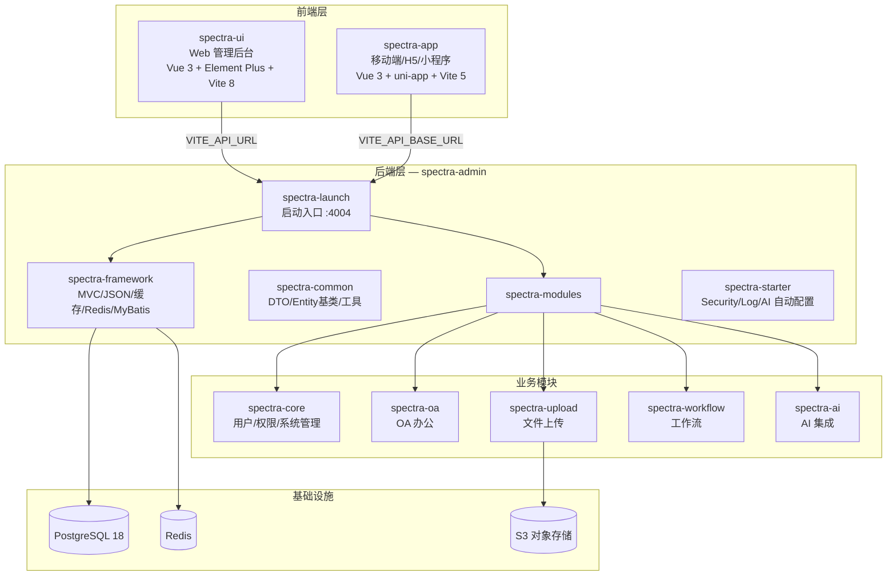

---
tags:
  - entry
  - overview
created: 2026-07-11
---

# Spectra 项目总览

> 光谱平台 — 一个后端 API 服务两个前端客户端的全栈系统。

## 系统架构



## 技术栈速览

| 层级 | 技术 | 版本 |
|---|---|---|
| 后端框架 | Spring Boot | 4.1.0 |
| JDK | Java (Temurin) | 25 |
| 构建 | Maven (wrapper) | 3.9.12 |
| ORM | MyBatis-Plus | 3.5.15 |
| 数据库 | PostgreSQL | 18 |
| 缓存 | Redis + JetCache | 2.7.8 |
| AI | LangChain4j | 1.16.3 |
| 工作流 | Flowable | — |
| 前端框架 | Vue 3 + Vite | 8 (ui) / 5 (app) |
| UI 库 | Element Plus | — |
| 包管理 | pnpm | 11.0.9 |
| 运行时管理 | mise | — |

## 目录结构

```
spectra/
├── spectra-admin/          ← 后端 API 服务
│   ├── spectra-common/     ← 公共模块（DTO/Entity基类/工具类）
│   ├── spectra-framework/  ← 框架层（MVC/JSON/缓存/Redis/MyBatis配置）
│   ├── spectra-modules/    ← 业务模块
│   │   ├── spectra-core/   ← 核心：用户/角色/权限/菜单/部门/字典/区域/日志
│   │   ├── spectra-oa/     ← OA：资产/考勤/日历/通讯录/合同/文档/会议/公告/报表
│   │   ├── spectra-upload/ ← 上传：本地+S3，分片上传
│   │   ├── spectra-workflow/ ← 工作流：Flowable 流程引擎
│   │   └── spectra-ai/     ← AI：LangChain4j + RAG
│   ├── spectra-starter/    ← 自动配置 Starter
│   └── spectra-launch/     ← 启动入口（Spring Boot Application）
├── spectra-ui/             ← Web 管理后台
└── spectra-app/            ← 移动端/H5/微信小程序
```

## 笔记导航

### 后端
- [[10-架构分层]] — Maven 多模块架构设计
- [[20-用户与权限]] — Account/User/Role/Authority/Permission
- [[30-系统管理]] — Department/Region/Dict/Menu/Config/Log
- [[40-OA模块]] — 办公自动化模块（9个子模块）
- [[50-文件上传]] — 分片上传/本地存储/S3
- [[60-工作流]] — Flowable 流程引擎集成
- [[70-AI模块]] — LangChain4j + RAG 检索增强生成
- [[80-基础设施]] — Redis/PostgreSQL/MyBatis-Plus/Cache/Security
- [[90-API总览]] — 全部 REST API 端点速查表

### 前端
- [[10-spectra-ui]] — Web 管理后台
- [[20-spectra-app]] — 移动端/H5/小程序

### 数据模型
- [[10-ER图]] — 实体关系总览
- [[20-实体清单]] — 25 个 Entity 完整字典
- [[30-数据库随笔]] — PostgreSQL 实用备忘（UUID v7/pg_dump）

### 开发
- [[10-环境搭建]] — JDK/Node/pnpm/mise/数据库
- [[12-Docker部署]] — Docker 构建与部署
- [[20-常见命令]] — Maven/npm 常用命令速查

### 规范与参考
- [[10-Git提交规范]] — Conventional Commits 完整规范
- [[20-前端命名规范]] — kebab-case/PascalCase 命名约定
- [[30-MapStruct命名规范]] — Converter 命名与方法约定
- [[40-数据库命名规范]] — 表/字段/索引命名规范
- [[50-Redis使用规范]] — Key 设计/TTL/缓存策略
- [[60-行政区域编码]] — 省级行政代码参考表

### 后端基础设施
- [[52-SSL证书配置]] — 本地开发 SSL 证书生成
- [[82-数据库连接池]] — HikariCP / Druid 配置

### 外部文档
- [VitePress 文档站](https://www.devops00.com/spectra-admin/) — 项目官方文档

## 开发端口

| 服务 | 端口 |
|---|---|
| spectra-admin (API) | 4004 |
| spectra-ui (Web) | 5173 |
| PostgreSQL | 5432 |
| Redis | 6379 |
