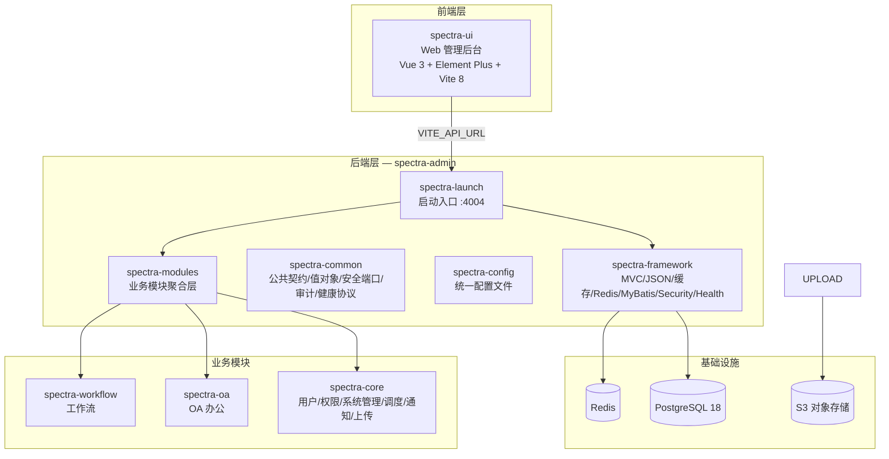

---
tags:
  - entry
  - overview
created: 2026-07-11
---

# Spectra 项目总览

> 光谱平台 — 一个后端 API 服务和一个 Web 管理后台，并配套流程建模插件的全栈系统。

> 后端当前基线为单体多模块、单租户、非 SaaS：`spectra-launch` 是唯一 Spring Boot 组合根，`spectra-core` 是始终装配的核心能力，包含系统管理、统一通知和文件上传；OA、Workflow 是可选业务模块。应用层不提供租户上下文、租户切换或租户隔离；Flowable 表中的 `tenant_id_` 仅属于引擎兼容字段。

## 新克隆入口

- 首次配置和启动：[[10-环境搭建]]
- 日常构建与检查：[[20-常见命令]]
- 环境变量完整分级：[[70-AI速查/05-配置清单]]

仓库相对路径、mise 版本文件、Maven Wrapper、pnpm 脚本和默认开发端口可以直接复用。`.mise.local.toml`、`.env.development`、数据库/Redis 密码、证书、S3 Provider 以及个人工具安装路径必须按机器或环境配置，不能从其他开发者机器复制。

## 系统架构


```mermaid
graph TB
    subgraph "前端层"
        UI["spectra-ui<br/>Web 管理后台<br/>Vue 3 + Element Plus + Vite 8"]
    end

    subgraph "后端层 — spectra-admin"
        LAUNCH["spectra-launch<br/>启动入口 :4004"]
        FW["spectra-framework<br/>MVC/JSON/缓存/Redis/MyBatis/Security/Health"]
        COMMON["spectra-common<br/>公共契约/值对象/安全端口/审计/健康协议"]
        CONFIG["spectra-config<br/>统一配置文件"]
        MODULES["spectra-modules<br/>业务模块聚合层"]
    end

    subgraph "业务模块"
        CORE["spectra-core<br/>用户/权限/系统管理/调度/通知/上传"]
        OA["spectra-oa<br/>OA 办公"]
        WF["spectra-workflow<br/>工作流"]
    end

    subgraph "基础设施"
        PG[("PostgreSQL 18")]
        REDIS[("Redis")]
        S3[("S3 对象存储")]
    end

UI -->|"VITE_API_URL"| LAUNCH
    LAUNCH --> FW
    LAUNCH --> MODULES
    MODULES --> CORE
    MODULES --> OA
    MODULES --> WF
    FW --> PG
    FW --> REDIS
UPLOAD --> S3
```

模块装配由 `spectra-launch` 显式完成。`spectra.modules.oa.enabled` 和 `spectra.modules.workflow.enabled` 只控制可选业务模块是否装配，`spectra-core` 始终启用；`spectra.notification.enabled` 仅控制通知业务功能，不控制 Core 模块装配；模块之间不通过服务注册、远程配置或服务发现连接。

## 技术栈速览

| 层级 | 技术 | 版本 |
|---|---|---|
| 后端框架 | Spring Boot | 4.1.0 |
| JDK | Java (Temurin) | 25 |
| 构建 | Maven (wrapper) | 3.9.12 |
| ORM | MyBatis-Plus | 3.5.15 |
| 数据库 | PostgreSQL | 18 |
| 缓存 | Redis + JetCache | 2.7.8 |
| 工作流 | Flowable | — |
| 前端框架 | Vue 3 + Vite | 8 |
| UI 库 | Element Plus | — |
| 包管理 | pnpm | 11.0.9 |
| 运行时管理 | mise | — |

## 目录结构

```
spectra/
├── spectra-admin/          ← 后端 API 服务
│   ├── spectra-config/     ← 统一配置文件（所有 application-*.yml）
│   ├── spectra-common/     ← 公共契约、值对象、安全端口、审计/健康协议（保留少量历史技术桥接）
│   ├── spectra-framework/  ← 框架与安全技术层（MVC/JSON/缓存/Redis/MyBatis配置）
│   ├── spectra-modules/    ← 业务模块聚合层
│   │   ├── spectra-core/   ← 必选核心：用户/权限/系统/调度/监控/审计/通知/上传
│   │   ├── spectra-oa/     ← OA：申请/请假/协同/报销/采购/资产/考勤/日历/通讯录/合同/文档/会议/公告/报表
│   │   ├── spectra-workflow/ ← 工作流：Flowable 流程引擎
│   └── spectra-launch/     ← 启动入口（Spring Boot Application）
├── spectra-ui/             ← Web 管理后台
└── logicflow-plugin-flowable/     ← LogicFlow BPMN 2.0 流程建模插件
```

## 笔记导航

### 后端

- [[10-架构分层]] — Maven 多模块架构设计
- [[15-spectra-core模块]] — 核心模块详情
- [[20-用户与权限]] — AuthenticationIdentity/User/RoleAssignment/Permission/Boundary
- [[25-数据权限设计]] — 二维数据权限过滤（@DataScope + 拦截器）
- [[30-系统管理]] — Department/Region/Dict/Menu/Config/Log
- [[35-单体调度内核]] — 单体应用统一调度、LOOP 会话和运维管理
- [[75-统一通知模块]] — Core 内置的通知请求、模板、投递、消息中心与偏好
- [[40-OA模块]] — 办公自动化模块（基础子模块 + 通用申请/请假/协同办公/报销/采购/资产 MVP）
- [[50-文件上传]] — Core 内置的分片上传/本地存储/S3
- [[60-工作流]] — Flowable 流程引擎集成
- [[80-基础设施]] — Redis/PostgreSQL/MyBatis-Plus/Cache/Security
- [[82-数据库连接池]] — HikariCP 连接池配置
- [[85-接口加解密方案]] — RSA+AES-GCM 前后端接口数据加密
- [[90-API总览]] — 全部 REST API 端点速查表

### 前端

- [[00-前端总览]] — 前端架构总览
- [[10-spectra-ui]] — Web 管理后台
- [[30-流程建模插件]] — LogicFlow + Flowable BPMN 2.0 插件
- [[40-流程设计器]] — 独立流程设计器使用与开发说明

### 数据模型

- [[10-ER图]] — 实体关系总览
- [[20-实体清单]] — 84 个 Entity 完整字典
- [[30-数据库随笔]] — PostgreSQL/Flyway 迁移与备份备忘

### 开发

- [[10-环境搭建]] — JDK/Node/pnpm/mise/数据库
- [[20-常见命令]] — Maven/npm 常用命令速查
- [[20-脚本工具]] — toml2env / SSL 脚本

### 规范与参考

- [[10-Git提交规范]] — Conventional Commits 完整规范
- [[15-后端开发规范]] — Controller/Service 分层、VO 响应、方法命名
- [[20-前端命名规范]] — kebab-case/PascalCase 命名约定
- [[30-MapStruct命名规范]] — Converter 命名与方法约定
- [[40-数据库命名规范]] — 表/字段/索引命名规范
- [[50-Redis使用规范]] — Key 设计/TTL/缓存策略
- [[60-行政区域编码]] — 省级行政代码参考表

### 部署运维

- [[10-Docker部署]] — Docker 构建与部署
- [[20-Nginx配置]] — Nginx 反向代理配置
- [[30-DockerCompose]] — 容器编排配置
- [[40-SSL证书配置]] — 本地开发 SSL 证书生成
- [[50-生产部署说明]] — 1.0.0 发布与生产安全运维门禁

### 当前能力边界

流程建模插件的已落地能力、Web 宿主集成和后续增强边界见 [[30-流程建模插件]]；独立流程设计器的使用与开发说明见 [[40-流程设计器]]。

通知中心、统一通知、Workflow、OA 和数据权限的当前能力分别记录在对应后端、前端、数据模型和配置文档中；源码与领域文档共同作为事实来源。

### AI Agent 速查

- [[70-AI速查/01-架构概览]] — 系统架构、技术栈、端口
- [[70-AI速查/02-模块清单]] — 所有模块职责
- [[70-AI速查/03-实体字典]] — 84 个 Entity 字段速查
- [[70-AI速查/04-API端点]] — 54 个 Controller 端点
- [[70-AI速查/05-配置清单]] — 环境变量、配置项
- [[70-AI速查/06-依赖版本]] — 关键依赖版本号

## 开发端口

| 服务 | 端口 |
|---|---|
| spectra-admin (API) | 4004 |
| spectra-ui (Web) | 5173 |
| PostgreSQL | 5432 |
| Redis | 6379 |

首次启动模板默认后端地址为 `https://127.0.0.1:4004/api`，后端和 Web 管理后台共用本机 P12 证书配置；Web 的本机 API URL 必须与后端协议和端口一致。

## 按任务查找

| 任务 | 推荐入口 |
|---|---|
| 新增后端接口 | [[90-API总览]] → [[10-架构分层]] |
| 新增前端页面 | [[10-spectra-ui]] → [[20-前端命名规范]] |
| 修改数据库 | [[10-ER图]] → [[20-实体清单]] → [[40-数据库命名规范]] |
| 配置加解密 | [[85-接口加解密方案]] |
| 部署上线 | [[10-Docker部署]] → [[20-Nginx配置]] → [[30-DockerCompose]] |

## 外部文档

- [VitePress 文档站](https://www.devops00.com/spectra-admin/) — 项目官方文档
