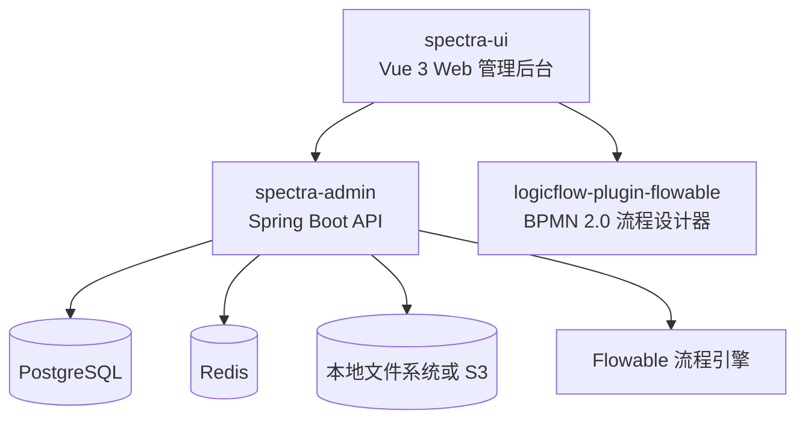

---
tags:
  - overview
  - project
---

# 项目总览

Spectra（光谱全栈平台）是一个面向组织内部管理和流程协作的全栈项目工作区。项目由 Spring Boot 后端、Vue Web 管理后台和 LogicFlow BPMN 流程设计器组成，围绕认证授权、系统管理、办公自动化、通知、文件、调度和工作流提供完整的代码与文档入口。

## 项目适合解决什么问题

Spectra 适合需要在统一 Web 后台中管理用户和组织、配置角色权限、处理办公申请、维护文件和发布流程的单体应用场景。项目使用 PostgreSQL 保存业务数据，使用 Redis 保存会话及安全运行态，使用本地文件系统或 S3 兼容对象存储保存文件。

当前项目是单体多模块、单租户、非 SaaS 形态。应用支持组织、角色和数据范围配置，但不提供租户上下文、租户切换或租户隔离。Flowable 表中的 `tenant_id_` 是引擎兼容字段，不代表应用提供租户能力。

当前后端源码包含 80 个 Entity 和 56 个 Controller；实体清单、接口清单和配置说明分别在后端文档和参考文档中维护。

## 项目组成


```mermaid
flowchart TB
    UI["spectra-ui<br/>Vue 3 Web 管理后台"] --> API["spectra-admin<br/>Spring Boot API"]
    UI --> PLUGIN["logicflow-plugin-flowable<br/>BPMN 2.0 流程设计器"]
    API --> PG[(PostgreSQL)]
    API --> REDIS[(Redis)]
    API --> STORAGE[(本地文件系统或 S3)]
    API --> FLOW["Flowable 流程引擎"]
```

| 组件 | 职责 | 入口 |
|---|---|---|
| `spectra-admin` | 后端 API、认证授权、业务模块、数据访问和运行时基础设施 | `spectra-admin/spectra-launch` |
| `spectra-ui` | 登录、系统管理、OA、通知、文件、监控和流程管理等 Web 页面 | `spectra-ui/src` |
| `logicflow-plugin-flowable` | BPMN 节点、拖拽面板、属性面板、导入导出和宿主集成 | `logicflow-plugin-flowable/src` |
| `docs` | 面向使用者、开发者、运维者和贡献者的项目文档 | 当前目录 |
| `scripts` | 文档事实检查、模块边界检查和网站同步 | `scripts/` |

后端以 `spectra-launch` 作为组合根和 Spring Boot 启动模块。`spectra-core` 提供用户权限、系统管理、通知、文件、调度、安全审计和基础设施等核心能力；`spectra-oa` 和 `spectra-workflow` 是可选业务模块，由启动模块显式装配。

## 能力地图

### 身份与安全

登录、验证码、密码凭证、Opaque Token、Session、刷新 Cookie、CSRF、接口加解密、登录失败锁定、安全审计和密钥管理属于后端安全域。普通操作与安全审计统一写入按 `occurred_at` 分区的 `spectra_core.sys_audit_event`；分区维护由 DBA 负责。前端只负责展示和请求编排，权限、会话、数据范围和安全 Redis 状态由后端最终判定。

### 组织与系统管理

系统管理页面提供用户、角色、授权配置、部门、字典、菜单和行政区划等入口。角色通过 RoleAssignment 授予用户，菜单用于导航和页面展示，后端仍会独立检查 Permission、角色边界、用户状态和 Session。

### 办公自动化

OA 页面包含申请类型、请假申请、费用报销、采购申请、资产管理、办公用品、日历、通讯录、合同、文档、会议、公告通知和报表等入口。需要审批的业务通过 Workflow 模块连接流程定义、流程实例和任务中心。

### 通知与文件

统一通知模块提供通知请求、模板、渠道、受控发送、消息中心和通知运行概览。文件模块提供文件类型策略、分片上传、上传任务、文件资产、业务引用、本地存储和 S3 存储；文件读取必须经过业务引用或管理员权限校验。

### 调度与可观测性

Quartz 负责应用内定时任务和执行记录，系统提供服务监控、缓存监控、应用健康检查、安全上下文、安全审计和在线用户等运维入口。安全 Redis 连接或命令失败时，认证、刷新、验证码、防重放和登录失败锁定相关操作保持 fail-closed。

### 流程建模

流程设计器插件支持 BPMN 2.0 常用事件、任务、网关、子流程、调用活动和序列流，支持属性 Schema、Flowable 扩展属性、Picker 事件、BPMN XML 导入导出。插件只负责流程建模和宿主事件，不负责业务用户、表单、用户组或后端接口实现。

## 技术基线

下面的版本来自当前仓库配置，表示当前开发基线；根工作区不承诺超出这些文件所表达范围的兼容矩阵。

| 领域 | 基线 |
|---|---|
| Java | Temurin 25.0.2，由 `spectra-admin/mise.toml` 固定 |
| Spring Boot | 4.1.0 |
| Maven | 3.9.12，使用 `spectra-admin/mvnw` |
| Node.js | 24.14.0，由 Node 子项目的 `mise.toml` 固定 |
| pnpm | 11.0.9，由 Node 子项目的 `mise.toml` 固定 |
| PostgreSQL | 18 |
| Redis | 7.4.x，当前连接配置要求密码认证 |
| 前端 | Vue 3、Vite 8、Element Plus |
| 流程插件 | `@yangxj96/logicflow-plugin-flowable` 0.1.2 |
| API 契约 | 1.0.0 |

## 文档入口

| 读者 | 从这里开始 |
|---|---|
| 第一次了解项目 | [[01-快速开始|快速开始]] |
| 系统业务使用者 | [[使用指南/00-使用指南|使用指南]] |
| 前端开发者 | [[前端/00-前端总览|前端总览]] |
| 后端开发者 | [[后端/10-后端模块/00-架构分层|后端架构分层]] |
| 流程开发者 | [[流程设计器/00-流程设计器|流程设计器总览]] |
| 部署和运维人员 | [[部署运维/00-容器部署|容器部署]] |
| 贡献者 | [[参与贡献/00-贡献指南|贡献指南]] |
| 查找接口和配置 | [[参考文档/00-版本与支持范围|参考文档]] |

## 仓库与运行地址

首次克隆使用：

```bash
git clone --recurse-submodules https://github.com/yangxj96/spectra-docs.git spectra
cd spectra
```

默认开发地址为后端 `https://127.0.0.1:4004/api`、Web `https://localhost:5173`、PostgreSQL `127.0.0.1:5432` 和 Redis `127.0.0.1:6379`。这些地址只适用于服务和客户端位于同一台机器的默认开发拓扑；容器、局域网或远程服务必须使用实际可访问地址。

## 当前能力边界

- 根工作区没有独立发布版本；各子项目的构建文件和发布记录是对应组件版本的事实来源。
- 后端 API 版本统一为 `1.0.0`，当前仓库不保留旧入口、别名或回退读取路径。
- 业务模块是否装配由 `spectra-launch` 的模块配置决定，模块之间不通过服务注册中心或远程配置中心连接。
- 流程设计器导出的 BPMN XML 可以交给后端流程定义接口部署，但插件本身不包含业务审批规则和业务数据存储。
- AI速查资料仅用于源码仓库内的 Agent 上下文建立，不属于网站发布内容。

## 许可证与安全

根工作区和三个代码子项目使用 Apache License 2.0，许可证全文见根目录 `LICENSE`，子项目也分别保留自己的 `LICENSE` 文件。第三方依赖的许可证以各依赖项目的发布说明为准。

安全问题请阅读 [[参与贡献/03-安全问题报告|安全问题报告]]，不要在公开 Issue 中发布密码、Token、Cookie、密钥、证书私钥、生产数据或完整利用细节。

## 下一步

- 按 [[01-快速开始|快速开始]] 完成本机服务启动。
- 按 [[使用指南/00-使用指南|使用指南]] 了解系统操作路径。
- 修改代码前阅读对应的 [[前端/00-前端总览|前端]]、[[后端/10-后端模块/00-架构分层|后端]] 或 [[流程设计器/00-流程设计器|流程设计器]] 文档。
- 准备贡献时阅读 [[参与贡献/00-贡献指南|参与贡献]] 和根目录的 `CONTRIBUTING.md`。
