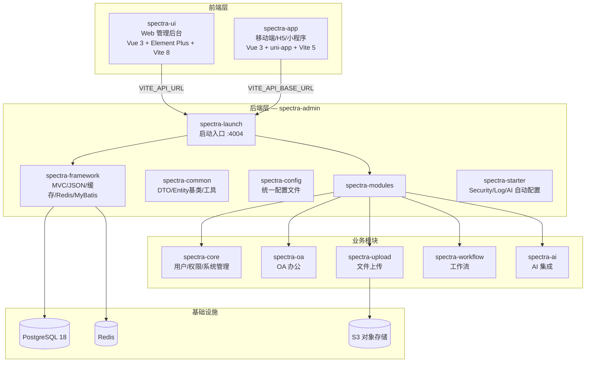

---
tags:
  - entry
  - overview
created: 2026-07-11
---

# Spectra 项目总览

> 光谱平台 — 一个后端 API 服务两个前端客户端的全栈系统。

## 系统架构


```mermaid
graph TB
    subgraph "前端层"
        UI["spectra-ui<br/>Web 管理后台<br/>Vue 3 + Element Plus + Vite 8"]
        APP["spectra-app<br/>移动端/H5/小程序<br/>Vue 3 + uni-app + Vite 5"]
    end

    subgraph "后端层 — spectra-admin"
        LAUNCH["spectra-launch<br/>启动入口 :4004"]
        FW["spectra-framework<br/>MVC/JSON/缓存/Redis/MyBatis"]
        COMMON["spectra-common<br/>DTO/Entity基类/工具"]
        CONFIG["spectra-config<br/>统一配置文件"]
        MODULES["spectra-modules"]
        STARTER["spectra-starter<br/>Security/Log/AI 自动配置"]
    end

    subgraph "业务模块"
        CORE["spectra-core<br/>用户/权限/系统管理"]
        OA["spectra-oa<br/>OA 办公"]
        UPLOAD["spectra-upload<br/>文件上传"]
        WF["spectra-workflow<br/>工作流"]
        AI["spectra-ai<br/>AI 集成"]
    end

    subgraph "基础设施"
        PG[("PostgreSQL 18")]
        REDIS[("Redis")]
        S3[("S3 对象存储")]
    end

    UI -->|"VITE_API_URL"| LAUNCH
    APP -->|"VITE_API_BASE_URL"| LAUNCH
    LAUNCH --> FW
    LAUNCH --> MODULES
    MODULES --> CORE
    MODULES --> OA
    MODULES --> UPLOAD
    MODULES --> WF
    MODULES --> AI
    FW --> PG
    FW --> REDIS
    UPLOAD --> S3
```

## 技术栈速览

| 层级 | 技术 | 版本 |
|---|---|---|
| 后端框架 | Spring Boot | 4.1.0 |
| JDK | Java (Temurin) | 25 |
| 构建 | Maven (wrapper) | 3.9.12 |
| ORM | MyBatis-Plus | 3.5.15 |
| 数据库 | PostgreSQL | 18 |
| 缓存 | Redis + JetCache | 2.7.8 |
| AI | LangChain4j | 1.16.3 |
| 工作流 | Flowable | — |
| 前端框架 | Vue 3 + Vite | 8 (ui) / 5 (app) |
| UI 库 | Element Plus | — |
| 包管理 | pnpm | 11.0.9 |
| 运行时管理 | mise | — |

## 目录结构

```
spectra/
├── spectra-admin/          ← 后端 API 服务
│   ├── spectra-config/     ← 统一配置文件（所有 application-*.yml）
│   ├── spectra-common/     ← 公共模块（DTO/Entity基类/工具类）
│   ├── spectra-framework/  ← 框架层（MVC/JSON/缓存/Redis/MyBatis配置）
│   ├── spectra-modules/    ← 业务模块
│   │   ├── spectra-core/   ← 核心：用户/角色/权限/菜单/部门/字典/区域/日志
│   │   ├── spectra-oa/     ← OA：资产/考勤/日历/通讯录/合同/文档/会议/公告/报表
│   │   ├── spectra-upload/ ← 上传：本地+S3，分片上传
│   │   ├── spectra-workflow/ ← 工作流：Flowable 流程引擎
│   │   └── spectra-ai/     ← AI：LangChain4j + RAG
│   ├── spectra-starter/    ← 自动配置 Starter
│   └── spectra-launch/     ← 启动入口（Spring Boot Application）
├── spectra-ui/             ← Web 管理后台
├── spectra-app/            ← 移动端/H5/微信小程序
└── logicflow-plugin-flowable/     ← LogicFlow BPMN 2.0 流程建模插件
```

## 笔记导航

### 后端

- [[10-架构分层]] — Maven 多模块架构设计
- [[15-spectra-core模块]] — 核心模块详情
- [[20-用户与权限]] — Account/User/Role/Authority/Permission
- [[25-数据权限设计]] — 二维数据权限过滤（@DataScope + 拦截器）
- [[30-系统管理]] — Department/Region/Dict/Menu/Config/Log
- [[40-OA模块]] — 办公自动化模块（基础子模块 + 通用申请/请假/协同办公/报销/采购/资产 MVP）
- [[50-文件上传]] — 分片上传/本地存储/S3
- [[60-工作流]] — Flowable 流程引擎集成
- [[70-AI模块]] — LangChain4j + RAG 检索增强生成
- [[80-基础设施]] — Redis/PostgreSQL/MyBatis-Plus/Cache/Security
- [[82-数据库连接池]] — HikariCP 连接池配置
- [[85-接口加解密方案]] — RSA+AES-GCM 前后端接口数据加密
- [[90-API总览]] — 全部 REST API 端点速查表

### 前端

- [[00-前端总览]] — 前端架构总览
- [[10-spectra-ui]] — Web 管理后台
- [[20-spectra-app]] — 移动端/H5/小程序
- [[30-流程建模插件]] — LogicFlow + Flowable BPMN 2.0 插件

### 数据模型

- [[10-ER图]] — 实体关系总览
- [[20-实体清单]] — 58 个 Entity 完整字典
- [[31-OA建表SQL.sql]] — OA 模块建表语句
- [[30-数据库随笔]] — PostgreSQL 实用备忘（UUID v7/pg_dump）

### 开发

- [[10-环境搭建]] — JDK/Node/pnpm/mise/数据库
- [[20-常见命令]] — Maven/npm 常用命令速查
- [[20-脚本工具]] — toml2env / SSL 脚本

### 规范与参考

- [[10-Git提交规范]] — Conventional Commits 完整规范
- [[15-后端开发规范]] — Controller/Service 分层、VO 响应、方法命名
- [[20-前端命名规范]] — kebab-case/PascalCase 命名约定
- [[30-MapStruct命名规范]] — Converter 命名与方法约定
- [[40-数据库命名规范]] — 表/字段/索引命名规范
- [[50-Redis使用规范]] — Key 设计/TTL/缓存策略
- [[60-行政区域编码]] — 省级行政代码参考表

### 部署运维

- [[10-Docker部署]] — Docker 构建与部署
- [[20-Nginx配置]] — Nginx 反向代理配置
- [[30-DockerCompose]] — 容器编排配置
- [[40-SSL证书配置]] — 本地开发 SSL 证书生成

### 执行计划

- [[90-计划/spectra-admin/P-账号绑定接口实现计划]] — 账号绑定/解绑接口（手机、邮箱等多种登录方式）
- [[90-计划/spectra-admin/P-后端开发规范整改计划]] — 后端开发规范整改（异常/权限/命名/注解）
- [[90-计划/logicflow-plugin-flowable/P-子流程标准化修复计划]] — 子流程标准化修复
- [[90-计划/spectra-admin/P-工作流模块完整实现计划]] — 工作流模块完整实现（总控计划，整合表单/流程/任务）
- [[90-计划/logicflow-plugin-flowable/P-LogicFlow插件完善计划]] — LogicFlow插件完善（流程设计器开发路线）
- [[90-计划/logicflow-plugin-flowable/P-Picker选择弹框实现计划]] — Picker 选择器机制与选择弹框实现
- [[90-计划/spectra-admin/P-通用OA业务建设总计划]] — 通用 OA 模块设计、业务闭环与分期建设总计划
- [[90-计划/spectra-admin/P-OA模块对标分析与开发计划]] — OA 旧版对标分析（已被总计划整合）
- [[90-计划/spectra-admin/P-Workflow审批流完善计划]] — Workflow审批流完善（OA开发前置任务）
- [[90-计划/spectra-admin/P-数据库Schema拆分计划]] — 按模块拆分 PostgreSQL Schema（spectra_core/oa/upload/workflow/ai）
- [[90-计划/spectra-admin/P-数据权限与数据隔离重构计划]] — 统一数据范围策略、自动 SQL 隔离、写入归属与受控手动扩展
- [[90-计划/spectra-admin/P-AI对话历史持久化计划]] — AI 对话历史持久化
- [[90-计划/spectra-admin/P-Controller路径参数UUID类型统一计划]] — Controller 路径参数 UUID 类型统一
- [[90-计划/spectra-admin/P-消息中心后端实现计划]] — 消息中心后端实现
- [[90-计划/spectra-admin/P-修改密码功能实现计划]] — 修改密码功能实现
- [[90-计划/spectra-admin/P-个人中心页面接口对接计划]] — 个人中心页面接口对接
- [[90-计划/P-全栈架构修复计划]] — 全栈架构审查修复（分层/类型/依赖/规范）
- [[90-计划/P-菜单路由权限解耦计划]] — 菜单导航、静态路由与角色权限分阶段解耦

### AI Agent 速查

- [[70-AI速查/01-架构概览]] — 系统架构、技术栈、端口
- [[70-AI速查/02-模块清单]] — 所有模块职责
- [[70-AI速查/03-实体字典]] — 58 个 Entity 字段速查
- [[70-AI速查/04-API端点]] — 40 个 Controller 端点
- [[70-AI速查/05-配置清单]] — 环境变量、配置项
- [[70-AI速查/06-依赖版本]] — 关键依赖版本号

## 开发端口

| 服务 | 端口 |
|---|---|
| spectra-admin (API) | 4004 |
| spectra-ui (Web) | 5173 |
| PostgreSQL | 5432 |
| Redis | 6379 |

## 按任务查找

| 任务 | 推荐入口 |
|---|---|
| 新增后端接口 | [[90-API总览]] → [[10-架构分层]] |
| 新增前端页面 | [[10-spectra-ui]] → [[20-前端命名规范]] |
| 修改数据库 | [[10-ER图]] → [[20-实体清单]] → [[40-数据库命名规范]] |
| 配置加解密 | [[85-接口加解密方案]] |
| 部署上线 | [[10-Docker部署]] → [[20-Nginx配置]] → [[30-DockerCompose]] |
| AI 集成 | [[70-AI模块]] |

## 外部文档

- [VitePress 文档站](https://www.devops00.com/spectra-admin/) — 项目官方文档
