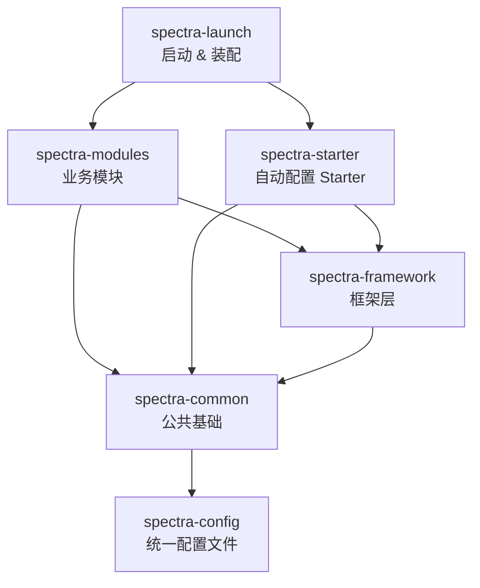

---
tags:
  - backend
  - architecture
---

# 架构分层

> spectra-admin 采用标准 Maven 多模块分层架构，依赖方向严格自上而下。

## 分层概览

依赖方向：`launch → modules/starter → framework → common → config`

## 各层职责

### spectra-common（公共基础层）

> 路径：`spectra-admin/spectra-common/`

被所有模块依赖的最底层，不依赖任何业务模块。

| 内容 | 说明 |
|---|---|
| `BaseEntity` | 所有实体的公共父类（UUID主键 + 审计字段 + 软删除 + 乐观锁） |
| `Constants` | 全局常量定义 |
| `SystemProperties` | 系统属性配置类 |
| DTO/BO/VO | 通用数据传输对象 |

**BaseEntity 字段**：
- `id` — UUID v7 主键
- `createdBy` / `createdAt` — 创建人/时间
- `updatedBy` / `updatedAt` — 更新人/时间
- `deleted` — 软删除标记（null = 未删除）
- `version` — 乐观锁版本号

### spectra-config（统一配置层）

> 路径：`spectra-admin/spectra-config/`

纯配置模块，无任何 Java 代码和外部依赖。所有模块的 `application-*.yml` 集中管理于此。

- 被 `spectra-common` 依赖（compile scope），通过传递依赖对所有模块可见
- 14 个配置文件：`application-dev/prod.yml` 入口 + 6 个模块的 `application-{module}-dev/prod.yml`
- 运行时访问方式：`spectra-launch` 通过 `spring.config.import` 聚合
- 测试时访问方式：各模块通过已存在的 test classpath 直接 import

### spectra-framework（框架层）

> 路径：`spectra-admin/spectra-framework/`

平台级能力封装，为业务模块提供基础设施。

| 配置类 | 说明 |
|---|---|
| `MvcConfiguration` | CORS + API 版本控制 |
| `PasswordEncoderConfiguration` | 密码编码器（BCrypt） |
| `JacksonConfiguration` | JSON 序列化（Java8 时间/Long→String） |
| `KaptchaConfiguration` | 图形验证码生成 |
| `CacheConfiguration` | JetCache 缓存抽象配置 |
| `RedisConfiguration` | Redis 连接与序列化配置 |
| `MyBatisPlusConfiguration` | MyBatis-Plus 插件/分页/乐观锁配置 |
| `ResponseEncryptAdvice` | 响应加密（AES-GCM + RSA-OAEP + RSA 签名） |
| `RequestDecryptAdvice` | 请求解密（验签 + 防重放） |

**异常处理**（`@RestControllerAdvice`）：
- `CommonExceptionAdvice` — 通用业务异常
- `KaptchaExceptionAdvice` — 验证码异常
- `SqlExceptionAdvice` — 数据库异常
- `EncryptException` — 加解密异常

### spectra-modules（业务模块层）

> 路径：`spectra-admin/spectra-modules/`

5 个独立业务模块，通过 Spring Boot AutoConfiguration 或 ComponentScan 自动装配。

| 模块 | 职责 | 详情 |
|---|---|---|
| `spectra-core` | 用户/角色/权限/菜单/部门/字典/区域/日志 | [[20-用户与权限]]、[[30-系统管理]] |
| `spectra-oa` | OA 办公自动化 | [[40-OA模块]] |
| `spectra-upload` | 文件上传（本地+S3，分片） | [[50-文件上传]] |
| `spectra-workflow` | Flowable 工作流引擎 | [[60-工作流]] |
| `spectra-ai` | AI 集成 + RAG | [[70-AI模块]] |

### spectra-starter（自动配置 Starter 层）

> 路径：`spectra-admin/spectra-starter/`

提供开箱即用的 Spring Boot Starter，可通过 `spring-boot-autoconfigure` 自动装配。

| Starter | 说明 |
|---|---|
| `spectra-security-spring-boot-starter` | 安全认证（AuthController + AuthService + Token） |
| `spectra-log-spring-boot-starter` | 操作日志记录 |

### spectra-launch（启动层）

> 路径：`spectra-admin/spectra-launch/`

极简模块，仅包含：
- `LaunchApplication.java` — `@SpringBootApplication` 启动类（强制 UTC 时区）
- `banner.txt` — 启动横幅

## 相关笔记

- [[00-项目总览]]
- [[20-用户与权限]]
- [[80-基础设施]]
- [[85-接口加解密方案]]
- [[20-常见命令]]
