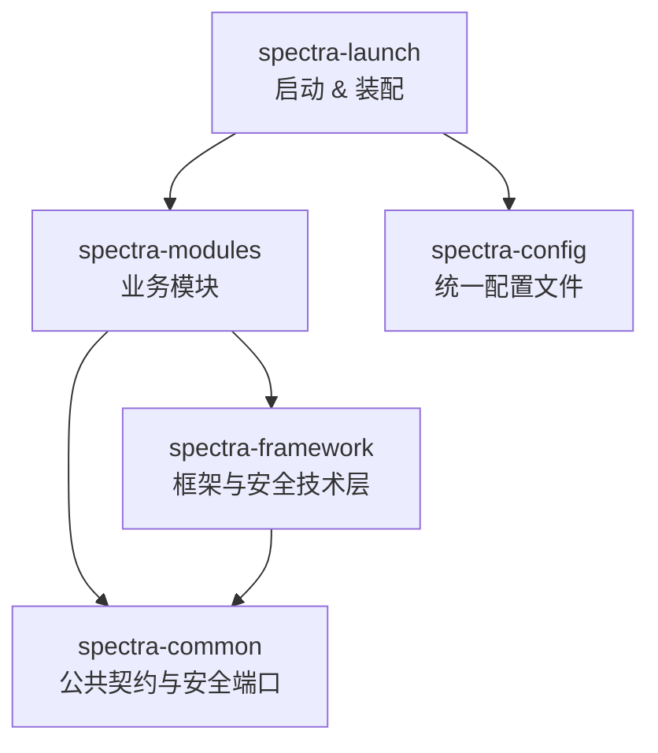

---
tags:
  - backend
  - architecture
---

# 架构分层

> spectra-admin 采用单体多模块架构：由 `spectra-launch` 统一装配到一个 Spring Boot 进程内，依赖方向严格自上而下。系统是单租户、非 SaaS，不引入租户上下文或租户隔离层。

## 分层概览

```mermaid
graph TB
    LAUNCH["spectra-launch<br/>启动 & 装配"]
    MODULES["spectra-modules<br/>业务模块"]
    FW["spectra-framework<br/>框架与安全技术层"]
    COMMON["spectra-common<br/>公共契约与安全端口"]
    CONFIG["spectra-config<br/>统一配置文件"]

    LAUNCH --> MODULES
    LAUNCH --> CONFIG
    MODULES --> FW
    MODULES --> COMMON
    FW --> COMMON
```

依赖方向：`launch → modules → framework → common`；`spectra-launch` 直接加载 `spectra-config` 的配置资源。安全能力不再拆成独立 Starter：安全领域编排归 `spectra-core`，安全公共端口归 `spectra-common`，Spring Security、过滤器和安全 Redis 适配归 `spectra-framework`。

## 各层职责

### spectra-common（公共契约层）

> 路径：`spectra-admin/spectra-common/`

被所有模块依赖的公共层，不依赖任何业务模块或框架实现。纯基础能力位于 `common.foundation`，集中安全算法位于 `common.security.crypto`；本层只保留跨模块契约、值对象、API 注解和日志门面，不再承载 Spring Web、MyBatis-Plus、PostgreSQL 或 Servlet 适配。本层不得新增业务反向依赖。

| 内容 | 说明 |
|---|---|
| `Constants` | 全局常量定义 |
| `common.audit` | `Audit`、`AuditService`、事件值对象和脱敏契约；不依赖具体日志表 |
| `common.health` | `DependencyHealthContributor` 及统一健康快照协议；不依赖 Actuator |
| `common.event` | `FileUploadFinishEvent` 等纯事件数据；不继承 Spring Event 类型 |
| `common.scheduler` | 调度处理器、描述、执行/循环上下文和结果等跨模块公共契约 |
| `common.port.file` | 文件资产、文件引用和文件流的跨模块端口与值对象；不包含存储实现 |
| `common.port.audit` | 安全审计归档后端、回执和完整性校验的跨模块契约；不包含对象存储实现 |
| `common.port.security` | 认证主体、Token、Session、验证码、初始化令牌和安全用户/上下文端口；不包含 Spring Security 或 Redis 实现 |
| `common.security.authorization` / `common.security.policy` | 数据权限上下文、授权快照和安全策略契约；不包含 Web、Redis 或业务持久化实现 |
| `common.foundation.lang` / `common.foundation.collection` | 无状态字符串、集合和对象基础操作；只依赖 JDK，不承载领域语义 |
| `common.foundation.tree` | 树构建和树节点压缩；明确输入复制、缺失父节点和重复构树契约 |
| `common.security.crypto` | AES-GCM、RSA-OAEP/签名和 SHA-256/HMAC/Nonce 唯一算法实现；业务模块通过 feature-owned adapter 使用 |
| DTO/BO/VO | 通用数据传输对象 |

### spectra-config（统一配置层）

> 路径：`spectra-admin/spectra-config/`

纯配置模块，无任何 Java 代码和外部依赖。所有 `application-*.yml` 集中管理于此。

- 由 `spectra-launch` 直接装配，配置资源通过启动模块的 classpath 生效
- 2 个配置文件：`application-dev.yml` + `application-prod.yml`
- 测试时访问方式：各模块通过 test classpath 直接 import

### spectra-framework（框架层）

> 路径：`spectra-admin/spectra-framework/`

平台级能力封装，为业务模块提供基础设施。`FrameworkModule` 是唯一的 framework 自动配置入口，使用 `@ComponentScan(basePackageClasses = FrameworkModule.class)` 扫描自身根包；各能力配置和组件按职责放在对应子包中自动装配。

| 配置类 | 说明 |
|---|---|
| `framework.web` | `configuration`、`advice.exception`、`advice.crypto`、`filter`、`crypto`、`security`；CORS、API 版本、异常、加解密和 Cookie 技术适配 |
| `framework.security` | `configuration`、`advice`、`authentication`、`authorization`、`session`、`redis`、`ratelimit`、`properties`；Spring Security、Token、Session 和安全 Redis fail-closed 机制 |
| `framework.serialization` | `jackson`、`mapper`；JSON 和 MapStruct 序列化配置 |
| `framework.captcha` | `configuration`、`generator`；验证码配置、生成器和类型 |
| `framework.cache` | `configuration` 与缓存运行时类型；缓存和通用 Redis 配置 |
| `framework.persistence` | `configuration`、`base`、`pagination`、`mybatis`、`scope`；MyBatis-Plus、实体/Service 基类、分页适配、JSONB/UUID Handler、数据权限组件和持久化拦截器 |
| `framework.properties` | `SystemProperties`；Web 和文件运行参数的配置绑定 |
| `framework.web.response` | `R`；统一 HTTP 响应包装和状态码映射 |
| `framework.assembler` | `converter` 与名称填充类型；通用 DTO/实体装配支持 |
| `framework.health` | 健康贡献者；数据源、Redis 和统一依赖健康适配 |

**`framework.persistence.base.BaseEntity` 字段**：
- `id` — UUID v7 主键
- `createdBy` / `createdAt` — 创建人/时间
- `updatedBy` / `updatedAt` — 更新人/时间
- `deleted` — 软删除标记（null = 未删除）
- `version` — 乐观锁版本号

**异常处理**（`@RestControllerAdvice`）：
- `CommonExceptionAdvice` — 通用业务异常
- `KaptchaExceptionAdvice` — 验证码异常
- `SqlExceptionAdvice` — 数据库异常
- `EncryptException` — 加解密异常

`BaseEntity`、`BaseService`、`BaseServiceImpl` 及 `PageFrom` 属于 framework 的持久化技术基类；业务模块通过 framework 依赖使用它们。`ConfiguredValueType`、`RegionLevel` 和 `SystemConfigValueWriter` 属于 `spectra-core.system`，因为它们描述系统配置/区域业务或由 Core 提供业务写入实现。

### spectra-modules（业务模块层）

> 路径：`spectra-admin/spectra-modules/`

3 个业务模块（1 个必选 Core + 2 个可选业务模块），通过 Spring Boot AutoConfiguration 自动装配；通知和文件上传作为 Core 内置能力随 Core 一起提供。

| 模块 | 职责 | 详情 |
|---|---|---|
| `spectra-core` | 用户/认证/权限/组织/系统配置/统一审计/健康聚合/单体调度/统一通知/文件上传 | [[20-用户与权限]]、[[30-系统管理]]、[[35-单体调度内核]]、[[75-统一通知模块]]、[[50-文件上传]] |
| `spectra-oa` | OA 办公自动化 | [[40-OA模块]] |
| `spectra-workflow` | Flowable 工作流引擎 | [[60-工作流]] |

### spectra-launch（启动层）

> 路径：`spectra-admin/spectra-launch/`

极简模块，仅包含：
- `LaunchApplication.java` — `@SpringBootApplication` 启动类；调度 Cron 使用系统配置时区，不依赖 JVM 默认时区
- `banner.txt` — 启动横幅

`spectra-launch` 只负责显式模块装配和启动校验，不承载 Controller、Entity、Mapper 或业务 Service。可选模块缺少必需 adapter 时在启动阶段明确失败；不使用隐藏组件扫描、服务发现或空实现降级。

### 聚合层与叶子模块约束

`spectra-modules` 只是 Maven 聚合层，不是业务运行时层；业务依赖必须落在实际叶子模块的 POM 中，不能为了“方便引用”重复添加聚合层依赖。`core` 不依赖 OA、Workflow 或未来 ERP 的业务实现；通知和文件上传的实现已直接归入 Core。未来 ERP 由 launch 作为新的可选模块装配。

## 相关笔记

- [[00-项目总览]]
- [[20-用户与权限]]
- [[80-基础设施]]
- [[35-单体调度内核]]
- [[85-接口加解密方案]]
- [[20-常见命令]]
