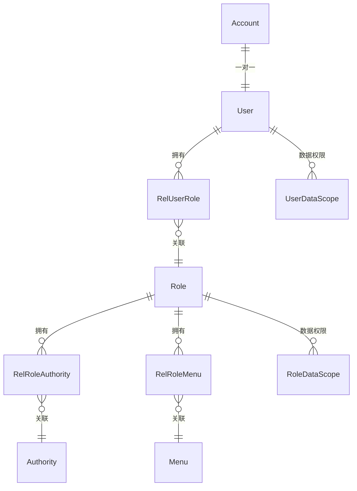

---
tags:
  - backend
  - security
  - domain
---

# 用户与权限

> 基于 RBAC 模型的完整用户认证与权限管理体系，模块路径：`spectra-core`。

## 领域模型

## 核心实体

### Account（账户）

| 字段 | 类型 | 说明 |
|---|---|---|
| `id` | UUID | 主键，与 User 共享 |
| `username` | String | 登录用户名 |
| `password` | String | BCrypt 加密密码 |
| `email` | String | 邮箱 |
| `phone` | String | 手机号 |
| `enabled` | Boolean | 是否启用 |
| `accountNonExpired` | Boolean | 账号未过期 |
| `credentialsNonExpired` | Boolean | 凭证未过期 |
| `accountNonLocked` | Boolean | 账号未锁定 |

### User（用户）

| 字段 | 类型 | 说明 |
|---|---|---|
| `id` | UUID | 主键 |
| `nickname` | String | 昵称 |
| `avatar` | String | 头像 URL |
| `gender` | Integer | 性别 |
| `departmentId` | UUID | 所属部门 |
| `remark` | String | 备注 |

### Role（角色）

| 字段 | 类型 | 说明 |
|---|---|---|
| `id` | UUID | 主键 |
| `name` | String | 角色名称 |
| `code` | String | 角色编码（ROLE_xxx） |
| `sort` | Integer | 排序 |
| `dataScope` | Integer | 数据权限范围 |
| `status` | Integer | 状态 |

### Authority（权限）

| 字段 | 类型 | 说明 |
|---|---|---|
| `id` | UUID | 主键 |
| `name` | String | 权限名称 |
| `code` | String | 权限编码 |
| `type` | Integer | 类型（菜单/按钮/接口） |
| `parentId` | UUID | 父权限 ID |

### RelUserRole / RelRoleAuthority / RelRoleMenu

关联表，分别表示「用户-角色」「角色-权限」「角色-菜单」多对多关系。

## 认证流程

支持 **三种登录方式**：

| Provider | 类名 | 说明 |
|---|---|---|
| 用户名密码 | `LoginUsernamePasswordProvider` | 标准账号密码登录 |
| 邮箱验证码 | `LoginEmailProvider` | 邮箱验证码登录 |
| 短信验证码 | `LoginSmsProvider` | 手机短信验证码登录 |

认证入口：`AuthController` → `AuthServiceImpl` → Provider 策略

## Controller

| 类 | 路径 |
|---|---|
| `AuthController` | `spectra-starter/.../security/.../AuthController.java` |
| `UserController` | `spectra-core/.../user/controller/UserController.java` |
| `RoleController` | `spectra-core/.../user/controller/RoleController.java` |
| `AuthorityController` | `spectra-core/.../user/controller/AuthorityController.java` |

## Service

| 类 | 路径 |
|---|---|
| `AccountServiceImpl` | `core/auth/service/impl/AccountServiceImpl.java` |
| `UserServiceImpl` | `core/user/service/impl/UserServiceImpl.java` |
| `RoleServiceImpl` | `core/user/service/impl/RoleServiceImpl.java` |
| `AuthorityServiceImpl` | `core/user/service/impl/AuthorityServiceImpl.java` |
| `PermissionServiceImpl` | `core/user/service/impl/PermissionServiceImpl.java` |

## 关键文件路径

| 文件 | 路径 |
|---|---|
| AuthController | `spectra-starter/spectra-security-spring-boot-starter/src/main/java/com/devops00/spectra/security/web/controller/AuthController.java` |
| User 实体 | `spectra-modules/spectra-core/src/main/java/com/devops00/spectra/core/user/javabean/entity/User.java` |
| Account 实体 | `spectra-modules/spectra-core/src/main/java/com/devops00/spectra/core/auth/javabean/entity/Account.java` |
| Role 实体 | `spectra-modules/spectra-core/src/main/java/com/devops00/spectra/core/user/javabean/entity/Role.java` |
| Authority 实体 | `spectra-modules/spectra-core/src/main/java/com/devops00/spectra/core/user/javabean/entity/Authority.java` |

## 相关笔记

- [[30-系统管理]] — 菜单、部门管理
- [[80-基础设施]] — Spring Security 集成
- [[90-API总览]] — 认证相关 API
- [[10-ER图]] — 完整 ER 关系
- [[25-数据权限设计]] — 二维数据权限过滤框架
- [[40-数据库命名规范]] — SYS_ 表约定
