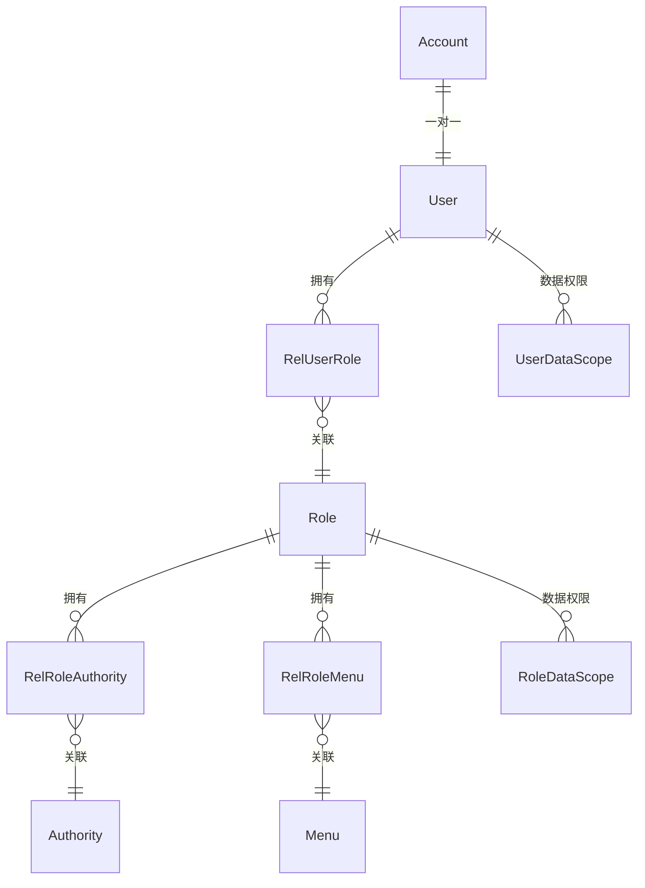

---
tags:
  - backend
  - security
  - domain
---

# 用户与权限

> 基于 RBAC 模型的完整用户认证与权限管理体系，模块路径：`spectra-core`。

## 领域模型

```mermaid
erDiagram
    Account ||--|| User : "一对一"
    User ||--o{ RelUserRole : "拥有"
    RelUserRole }o--|| Role : "关联"
    Role ||--o{ RelRoleAuthority : "拥有"
    RelRoleAuthority }o--|| Authority : "关联"
    Role ||--o{ RelRoleMenu : "拥有"
    RelRoleMenu }o--|| Menu : "关联"
    Role ||--o{ RoleDataScope : "数据权限"
    User ||--o{ UserDataScope : "数据权限"
```

## 核心实体

### Account（账户）

| 字段 | 类型 | 说明 |
|---|---|---|
| `id` | UUID | 主键，与 User 共享 |
| `username` | String | 登录用户名 |
| `password` | String | BCrypt 加密密码 |
| `email` | String | 邮箱 |
| `phone` | String | 手机号 |
| `enabled` | Boolean | 是否启用 |
| `accountNonExpired` | Boolean | 账号未过期 |
| `credentialsNonExpired` | Boolean | 凭证未过期 |
| `accountNonLocked` | Boolean | 账号未锁定 |

### User（用户）

| 字段 | 类型 | 说明 |
|---|---|---|
| `id` | UUID | 主键 |
| `nickname` | String | 昵称 |
| `avatar` | String | 头像 URL |
| `gender` | Integer | 性别 |
| `departmentId` | UUID | 所属部门 |
| `remark` | String | 备注 |

### Role（角色）

| 字段 | 类型 | 说明 |
|---|---|---|
| `id` | UUID | 主键 |
| `name` | String | 角色名称 |
| `code` | String | 角色编码（ROLE_xxx） |
| `sort` | Integer | 排序 |
| `dataScope` | Integer | 数据权限范围 |
| `status` | Integer | 状态 |

### Authority（权限）

| 字段 | 类型 | 说明 |
|---|---|---|
| `id` | UUID | 主键 |
| `name` | String | 权限名称 |
| `code` | String | 权限编码 |
| `type` | Integer | 类型（菜单/按钮/接口） |
| `parentId` | UUID | 父权限 ID |

### RelUserRole / RelRoleAuthority / RelRoleMenu

关联表，分别表示「用户-角色」「角色-权限」「角色-菜单」多对多关系。

`RelRoleMenu` 只持久化未删除的 `MENU` 叶子节点。保存授权时后端过滤目录、拒绝未知或软删除菜单，清空菜单使用空列表；查询当前用户菜单时仅使用未删除的用户角色关系和未删除且启用的角色，合并菜单并集并自动补齐祖先 `DIRECTORY` 供导航展示。菜单导航权限不替代接口上的 `@PreAuthorize` 安全校验。

## 内置角色权限基线

权限编码采用树形 `MODULE:*` + 动作叶子节点 `MODULE:QUERY/INSERT/UPDATE/DELETE`。权限判断使用叶子节点，父节点仅用于管理树展示。目标契约是 `security.administrators` 配置的超级运维角色无需维护角色权限关系，即可在后端权限判断、Token、前端按钮和菜单树中获得一致的全量权限；实现收口见 [[90-计划/P-运维管理中心建设计划]]。

| 角色 | 权限边界 |
|---|---|
| `ROLE_DEV_OPS` 运维管理员 | 默认管理员角色；目标为隐式 `*` 全权限和全部有效菜单，可执行系统配置、密钥、监控、密码重置、文件信息、权限树和消息发送等运维专属接口 |
| `ROLE_ADMIN_SYSTEM` 系统管理员 | 用户/角色/菜单/部门/字典等系统管理 CRUD、OA 基础 CRUD、工作流业务操作；不可执行运维专属接口 |
| `ROLE_USER` 用户 | 本人数据范围内的 OA 查询/新增/修改、流程办理、消息、AI、文件上传等业务操作；不含系统管理和删除权限 |
| `ROLE_AUDIT` 审计员 | 跨模块只读查询，不含任何写权限 |

角色菜单树按权限边界同步：`ROLE_DEV_OPS` 应隐式显示完整导航，新菜单无需逐项授权；`ROLE_ADMIN_SYSTEM` 显示系统管理、OA、工作流和示例菜单，但隐藏监控、系统配置、文件信息等运维菜单；`ROLE_USER` 显示首页、OA 业务和示例菜单；`ROLE_AUDIT` 显示首页及审计所需的只读菜单。关联表只保存普通角色的 `MENU` 叶子节点，当前用户菜单接口自动补齐父级目录。

截至 2026-08-14，后端 `SpectraPermissionEvaluator` 已按管理员角色或 `*` 放行 `hasPermission(...)`，但当前菜单接口仍依赖 `RelRoleMenu`，Token 也未保证对管理员角色隐式返回 `*`。因此“全部权限、全部菜单、全部前端操作”尚未完全一致，列为 [[90-计划/P-运维管理中心建设计划]] 第一期阻塞项。在该阶段完成前，不应把文档中的完整导航语义视为已全部落地。

## OA P0 权限点

通用申请与请假接口使用独立权限域，保持与既有 `MODULE:ACTION` 约定一致：

| 权限 | 用途 |
|---|---|
| `OA_APPLICATION:QUERY` | 申请分页、详情、类型和工作台摘要查询 |
| `OA_APPLICATION:UPDATE` | 通用申请撤回、取消 |
| `OA_LEAVE:QUERY` | 请假分页与详情 |
| `OA_LEAVE:INSERT` | 新建请假草稿 |
| `OA_LEAVE:UPDATE` | 修改、提交、撤回、取消请假 |
| `OA_WORKBENCH:QUERY` | Dashboard 工作台摘要 |
| `OA_NOTICE:QUERY` | 公告分页、详情和可见范围查询 |
| `OA_NOTICE:INSERT` | 创建公告草稿 |
| `OA_NOTICE:UPDATE` | 发布、撤回、标记已读 |
| `OA_CALENDAR:QUERY` | 查询本人及共享日程 |
| `OA_CALENDAR:INSERT` | 创建个人日程 |
| `OA_CALENDAR:UPDATE` | 修改个人日程 |
| `OA_CALENDAR:DELETE` | 删除个人日程 |
| `OA_MEETING:QUERY` | 查询会议 |
| `OA_MEETING:INSERT` | 创建会议和参会邀请 |
| `OA_MEETING:UPDATE` | 参会响应、签到和纪要 |
| `OA_REIMBURSEMENT:QUERY` | 报销分页、详情和状态查询 |
| `OA_REIMBURSEMENT:INSERT` | 新建报销草稿 |
| `OA_REIMBURSEMENT:UPDATE` | 修改、提交、撤回和取消报销 |
| `OA_REIMBURSEMENT:PAYMENT` | 审批通过后登记付款 |

报销、采购权限树和内置角色授权已经完成迁移，并包含在全库备份 `docs/sql/db.dump` 的 `spectra_core` schema 中，不再保留或重复执行独立迁移 SQL；未从数据基线初始化的环境如缺少菜单节点，应通过菜单和角色管理功能补齐授权。

敏感接口统一使用 `hasRole('ROLE_DEV_OPS')`：服务监控、系统配置、RSA 密钥读写、用户密码重置、权限树增删改、文件信息删除、内部消息发送和区域基础数据写入。普通接口按模块动作权限校验，个人资料/菜单当前用户等自服务接口仅要求已认证。

## 认证流程

支持 **三种登录方式**：

| Provider | 类名 | 说明 |
|---|---|---|
| 用户名密码 | `LoginUsernamePasswordProvider` | 标准账号密码登录 |
| 邮箱验证码 | `LoginEmailProvider` | 邮箱验证码登录 |
| 短信验证码 | `LoginSmsProvider` | 手机短信验证码登录 |

认证入口：`AuthController` → `AuthServiceImpl` → Provider 策略

## Controller

| 类 | 路径 |
|---|---|
| `AuthController` | `spectra-starter/.../security/.../AuthController.java` |
| `UserController` | `spectra-core/.../user/controller/UserController.java` |
| `RoleController` | `spectra-core/.../user/controller/RoleController.java` |
| `AuthorityController` | `spectra-core/.../user/controller/AuthorityController.java` |

## Service

| 类 | 路径 |
|---|---|
| `AccountServiceImpl` | `core/auth/service/impl/AccountServiceImpl.java` |
| `UserServiceImpl` | `core/user/service/impl/UserServiceImpl.java` |
| `RoleServiceImpl` | `core/user/service/impl/RoleServiceImpl.java` |
| `AuthorityServiceImpl` | `core/user/service/impl/AuthorityServiceImpl.java` |
| `PermissionServiceImpl` | `core/user/service/impl/PermissionServiceImpl.java` |

## 关键文件路径

| 文件 | 路径 |
|---|---|
| AuthController | `spectra-starter/spectra-security-spring-boot-starter/src/main/java/com/devops00/spectra/security/web/controller/AuthController.java` |
| User 实体 | `spectra-modules/spectra-core/src/main/java/com/devops00/spectra/core/user/javabean/entity/User.java` |
| Account 实体 | `spectra-modules/spectra-core/src/main/java/com/devops00/spectra/core/auth/javabean/entity/Account.java` |
| Role 实体 | `spectra-modules/spectra-core/src/main/java/com/devops00/spectra/core/user/javabean/entity/Role.java` |
| Authority 实体 | `spectra-modules/spectra-core/src/main/java/com/devops00/spectra/core/user/javabean/entity/Authority.java` |

## 相关笔记

- [[30-系统管理]] — 菜单、部门管理
- [[80-基础设施]] — Spring Security 集成
- [[90-API总览]] — 认证相关 API
- [[10-ER图]] — 完整 ER 关系
- [[25-数据权限设计]] — 二维数据权限过滤框架
- [[40-数据库命名规范]] — SYS_ 表约定
