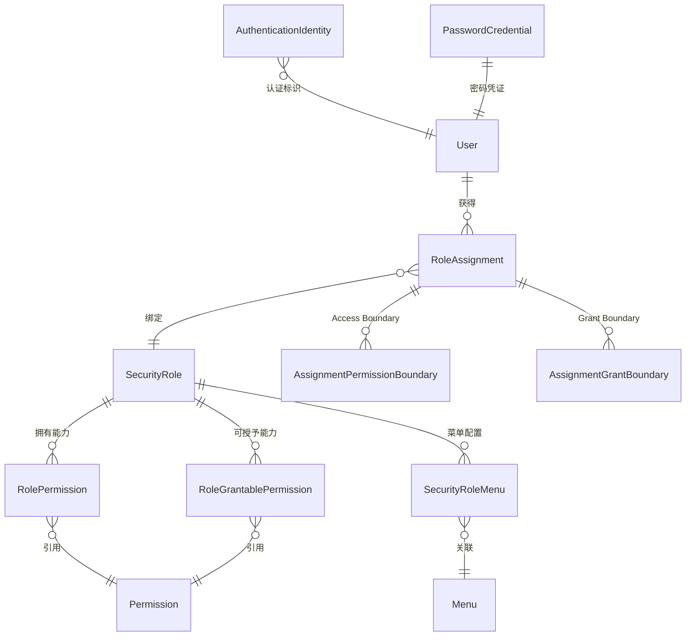

---
tags:
  - backend
  - security
  - domain
---

# 用户与权限

> 基于目标 Role/Permission/RoleAssignment 模型的用户认证与授权体系，模块路径：`spectra-core`。

## 领域模型

```mermaid
erDiagram
    AuthenticationIdentity }o--|| User : "认证标识"
    PasswordCredential ||--|| User : "密码凭证"
    User ||--o{ RoleAssignment : "获得"
    RoleAssignment }o--|| SecurityRole : "绑定"
    SecurityRole ||--o{ RolePermission : "拥有能力"
    RolePermission }o--|| Permission : "引用"
    SecurityRole ||--o{ RoleGrantablePermission : "可授予能力"
    RoleGrantablePermission }o--|| Permission : "引用"
    RoleAssignment ||--o{ AssignmentPermissionBoundary : "Access Boundary"
    RoleAssignment ||--o{ AssignmentGrantBoundary : "Grant Boundary"
    SecurityRole ||--o{ SecurityRoleMenu : "菜单配置"
    SecurityRoleMenu }o--|| Menu : "关联"
```

## 核心实体

### AuthenticationIdentity / PasswordCredential（认证身份与凭证）

| 字段 | 类型 | 说明 |
|---|---|---|
| `identifierHash` | String | 规范化登录标识摘要，不保存原始标识 |
| `methodCode` / `providerCode` | String | 认证因子与提供方；密码为 `PASSWORD` / `LOCAL` |
| `state` | String | 身份状态 |
| `passwordHash` | String | 密码哈希 |
| `mustChange` | Boolean | 是否必须修改密码 |
| `failedAttempts` / `lockedUntil` | Integer / Instant | 凭证失败锁定信息 |

旧 `Account/sys_account` 仅作为一次性迁移输入，目标 V1 运行时不再读取。

### User（用户）

| 字段 | 类型 | 说明 |
|---|---|---|
| `id` | UUID | 主键 |
| `username` | String | 用户名 |
| `avatar` | String | 头像 URL |
| `status` | UserStatus | `ACTIVE`、`LOCKED`、`DISABLED`、`DEPARTED` |
| `gender` | Short | 性别 |
| `primaryDepartmentId` | UUID | 主部门；组织 membership 与 DataScope 正交 |
| `securityVersion` | Long | 安全相关变化版本 |

只有 `ACTIVE` 用户可以创建新的认证 Session。`LOCKED` 是安全策略临时锁定，`DISABLED` 是管理员停用，`DEPARTED` 是离职终态；重新入职不自动恢复历史授权。

### SecurityRole（目标角色）

| 字段 | 类型 | 说明 |
|---|---|---|
| `id` | UUID | 主键 |
| `name` | String | 角色名称 |
| `code` | String | 稳定角色编码（ROLE_xxx） |
| `authorityLevel` | Integer | 授权等级 |
| `roleKind` | String | 角色种类 |
| `systemManaged` | Boolean | 是否系统托管 |
| `version` | Long | 并发版本 |

### Permission（Permission Catalog）

| 字段 | 类型 | 说明 |
|---|---|---|
| `id` | UUID | 主键 |
| `resource` | String | 资源标识 |
| `action` | String | 动作标识 |
| `code` | String | 稳定权限编码 |
| `allowedScopeModes` | Set | 该 Permission 允许的 Scope 模式 |

### RoleAssignment / Boundary

`RoleAssignment` 是用户获得角色和权限的唯一运行时授权入口。角色能力、可授予能力、Access Boundary 和 Grant Boundary 分开维护；授权写入必须经过 Impact Preview/Apply、版本校验和安全变更审计。

`SecurityRoleMenu` 只负责菜单 UX 配置，不代替接口上的 `@PreAuthorize` 与 Permission 校验。当前用户菜单从活动 RoleAssignment 和角色菜单关系合并，并自动补齐导航所需祖先目录。

## 内置角色权限基线

权限编码采用树形 `MODULE:*` + 动作叶子节点 `MODULE:QUERY/INSERT/UPDATE/DELETE`。权限判断使用叶子节点，父节点仅用于管理树展示。目标契约是 `security.administrators` 配置的超级运维角色无需维护角色权限关系，即可在后端权限判断、Token、前端按钮和菜单树中获得一致的全量权限；实现收口见 [[90-计划/P-运维管理中心建设计划]]。

| 角色 | 权限边界 |
|---|---|
| `ROLE_DEV_OPS` 运维管理员 | 默认管理员角色；目标为隐式 `*` 全权限和全部有效菜单，可执行系统配置、密钥、监控、密码重置、文件信息、权限树和消息发送等运维专属接口 |
| `ROLE_ADMIN_SYSTEM` 系统管理员 | 用户/角色/菜单/部门/字典等系统管理 CRUD、OA 基础 CRUD、工作流业务操作；不可执行运维专属接口 |
| `ROLE_USER` 用户 | 本人数据范围内的 OA 查询/新增/修改、流程办理、消息、AI、文件上传等业务操作；不含系统管理和删除权限 |
| `ROLE_AUDIT` 审计员 | 跨模块只读查询，不含任何写权限 |

角色菜单树按权限边界同步：`ROLE_DEV_OPS` 应隐式显示完整导航，新菜单无需逐项授权；`ROLE_ADMIN_SYSTEM` 显示系统管理、OA、工作流和示例菜单，但隐藏监控、系统配置、文件信息等运维菜单；`ROLE_USER` 显示首页、OA 业务和示例菜单；`ROLE_AUDIT` 显示首页及审计所需的只读菜单。关联表只保存普通角色的 `MENU` 叶子节点，当前用户菜单接口自动补齐父级目录。

当前后端已将 Permission Catalog、RoleAssignment、菜单 UX 和 `/security/context` 接到目标授权模型；接口权限仍以 Permission-specific AuthorizationSnapshot 和 `@PreAuthorize` 为准，菜单仅用于导航和按钮展示。

## OA P0 权限点

通用申请与请假接口使用独立权限域，保持与既有 `MODULE:ACTION` 约定一致：

| 权限 | 用途 |
|---|---|
| `OA_APPLICATION:QUERY` | 申请分页、详情、类型和工作台摘要查询 |
| `OA_APPLICATION:UPDATE` | 通用申请撤回、取消 |
| `OA_LEAVE:QUERY` | 请假分页与详情 |
| `OA_LEAVE:INSERT` | 新建请假草稿 |
| `OA_LEAVE:UPDATE` | 修改、提交、撤回、取消请假 |
| `OA_WORKBENCH:QUERY` | Dashboard 工作台摘要 |
| `OA_NOTICE:QUERY` | 公告分页、详情和可见范围查询 |
| `OA_NOTICE:INSERT` | 创建公告草稿 |
| `OA_NOTICE:UPDATE` | 发布、撤回、标记已读 |
| `OA_CALENDAR:QUERY` | 查询本人及共享日程 |
| `OA_CALENDAR:INSERT` | 创建个人日程 |
| `OA_CALENDAR:UPDATE` | 修改个人日程 |
| `OA_CALENDAR:DELETE` | 删除个人日程 |
| `OA_MEETING:QUERY` | 查询会议 |
| `OA_MEETING:INSERT` | 创建会议和参会邀请 |
| `OA_MEETING:UPDATE` | 参会响应、签到和纪要 |
| `OA_REIMBURSEMENT:QUERY` | 报销分页、详情和状态查询 |
| `OA_REIMBURSEMENT:INSERT` | 新建报销草稿 |
| `OA_REIMBURSEMENT:UPDATE` | 修改、提交、撤回和取消报销 |
| `OA_REIMBURSEMENT:PAYMENT` | 审批通过后登记付款 |

报销、采购权限树和内置角色授权已经完成迁移，并包含在全库备份 `docs/sql/db.dump` 的 `spectra_core` schema 中，不再保留或重复执行独立迁移 SQL；未从数据基线初始化的环境如缺少菜单节点，应通过菜单和角色管理功能补齐授权。

敏感接口统一使用 `hasRole('ROLE_DEV_OPS')`：服务监控、系统配置、RSA 密钥读写、用户密码重置、权限树增删改、文件信息删除、内部消息发送和区域基础数据写入。普通接口按模块动作权限校验，个人资料/菜单当前用户等自服务接口仅要求已认证。

## 认证流程

支持 **三种登录方式**：

| Provider | 类名 | 说明 |
|---|---|---|
| 用户名密码 | `LoginUsernamePasswordProvider` | 标准账号密码登录 |
| 邮箱验证码 | `LoginEmailProvider` | 邮箱验证码登录 |
| 短信验证码 | `LoginSmsProvider` | 手机短信验证码登录 |

认证入口：`AuthController` → `AuthServiceImpl` → Provider 策略

## Controller

| 类 | 路径 |
|---|---|
| `AuthController` | `spectra-starter/.../security/.../AuthController.java` |
| `UserController` | `spectra-core/.../user/controller/UserController.java` |
| `RoleController` | `spectra-core/.../user/controller/RoleController.java` |
| `AuthenticationIdentityController` | `spectra-core/.../auth/controller/AuthenticationIdentityController.java` |
| `AuthorizationController` | `spectra-core/.../authorization/controller/AuthorizationController.java` |
| `SecurityContextController` | `spectra-core/.../authorization/controller/SecurityContextController.java` |
| `AuthorityController` | `spectra-core/.../user/controller/AuthorityController.java`（Permission Catalog 只读树） |

## Service

| 类 | 路径 |
|---|---|
| `AuthenticationIdentityServiceImpl` | `core/auth/service/impl/AuthenticationIdentityServiceImpl.java` |
| `AuthenticationIdentityBindingServiceImpl` | `core/auth/service/impl/AuthenticationIdentityBindingServiceImpl.java` |
| `PasswordCredentialServiceImpl` | `core/auth/service/impl/PasswordCredentialServiceImpl.java` |
| `UserServiceImpl` | `core/user/service/impl/UserServiceImpl.java` |
| `RoleServiceImpl` | `core/user/service/impl/RoleServiceImpl.java`（目标 Role 目录） |
| `RoleAuthorizationChangeServiceImpl` | `core/authorization/service/impl/RoleAuthorizationChangeServiceImpl.java` |
| `AuthorizationAssignmentChangeServiceImpl` | `core/authorization/service/impl/AuthorizationAssignmentChangeServiceImpl.java` |
| `PermissionCatalogServiceImpl` | `core/authorization/service/impl/PermissionCatalogServiceImpl.java` |

## 关键文件路径

| 文件 | 路径 |
|---|---|
| AuthController | `spectra-starter/spectra-security-spring-boot-starter/src/main/java/com/devops00/spectra/security/web/controller/AuthController.java` |
| User 实体 | `spectra-modules/spectra-core/src/main/java/com/devops00/spectra/core/user/javabean/entity/User.java` |
| AuthenticationIdentity 实体 | `spectra-modules/spectra-core/src/main/java/com/devops00/spectra/core/auth/javabean/entity/AuthenticationIdentity.java` |
| PasswordCredential 实体 | `spectra-modules/spectra-core/src/main/java/com/devops00/spectra/core/auth/javabean/entity/PasswordCredential.java` |
| SecurityRole 实体 | `spectra-modules/spectra-core/src/main/java/com/devops00/spectra/core/authorization/entity/SecurityRole.java` |
| RoleAssignment 实体 | `spectra-modules/spectra-core/src/main/java/com/devops00/spectra/core/authorization/entity/RoleAssignment.java` |
| Permission 实体 | `spectra-modules/spectra-core/src/main/java/com/devops00/spectra/core/authorization/entity/Permission.java` |

## 相关笔记

- [[30-系统管理]] — 菜单、部门管理
- [[80-基础设施]] — Spring Security 集成
- [[90-API总览]] — 认证相关 API
- [[10-ER图]] — 完整 ER 关系
- [[25-数据权限设计]] — 二维数据权限过滤框架
- [[40-数据库命名规范]] — SYS_ 表约定
