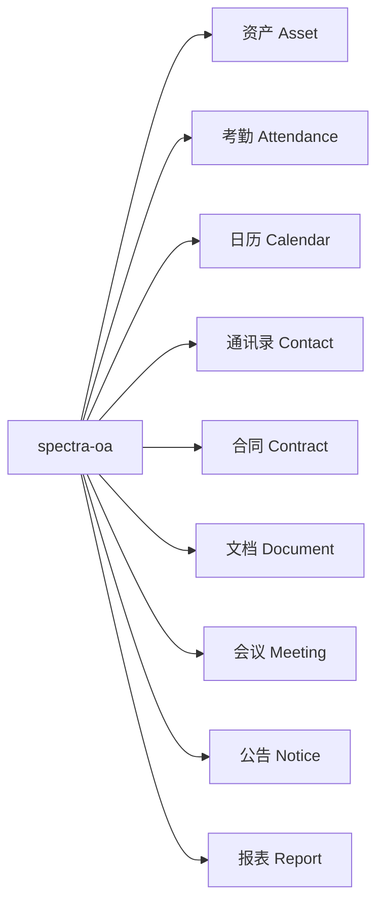

---
tags:
  - backend
  - domain
---

# OA 模块

> 办公自动化（Office Automation），涵盖 9 个子模块。路径：`spectra-oa`。

## 子模块一览



## 各模块详情

### Asset（资产管理）

| 项目 | 内容 |
|---|---|
| Controller | `AssetController` |
| Service | `AssetServiceImpl` |
| Entity | `Asset` |

### Attendance（考勤）

| 项目 | 内容 |
|---|---|
| Controller | `AttendanceController` |
| Service | `AttendanceServiceImpl` |
| Entity | `Attendance` |

### Calendar（日历）

| 项目 | 内容 |
|---|---|
| Controller | `CalendarController` |
| Service | `CalendarServiceImpl` |
| Entity | `Calendar` |

### Contact（通讯录）

| 项目 | 内容 |
|---|---|
| Controller | `ContactController` |
| Service | `ContactServiceImpl` |
| Entity | `Contact` |

### Contract（合同管理）

| 项目 | 内容 |
|---|---|
| Controller | `ContractController` |
| Service | `ContractServiceImpl` |
| Entity | `Contract` |

### Document（文档管理）

| 项目 | 内容 |
|---|---|
| Controller | `DocumentController` |
| Service | `DocumentServiceImpl` |
| Entity | `Document` |

### Meeting（会议管理）

最复杂的 OA 子模块，涉及三个实体。

| 项目 | 内容 |
|---|---|
| Controller | `MeetingController` |
| Service | `MeetingServiceImpl` |
| Entity | `Meeting` — 会议基本信息 |
| Entity | `MeetingParticipant` — 参会人员 |
| Entity | `MeetingRecord` — 会议纪要 |

### Notice（公告通知）

| 项目 | 内容 |
|---|---|
| Controller | `NoticeController` |
| Service | `NoticeServiceImpl` |
| Entity | `Notice` |

### Report（报表）

| 项目 | 内容 |
|---|---|
| Controller | `ReportController` |
| Service | `ReportServiceImpl` |
| Entity | `Report` |

## 包结构

```
spectra-modules/spectra-oa/
└── src/main/java/com/devops00/spectra/oa/
    ├── asset/
    │   ├── controller/AssetController.java
    │   ├── service/AssetService.java
    │   ├── service/impl/AssetServiceImpl.java
    │   ├── javabean/entity/Asset.java
    │   ├── javabean/dto/
    │   └── mapper/AssetMapper.java
    ├── attendance/
    ├── calendar/
    ├── contact/
    ├── contract/
    ├── document/
    ├── meeting/
    ├── notice/
    └── report/
```

每个子模块遵循统一的 Controller → Service → Mapper → Entity 分层。

## 相关笔记

- [[10-架构分层]]
- [[90-API总览]]
- [[10-ER图]]
- [[20-实体清单]]

## 相关计划

- [[98-计划/spectra-admin/P-OA模块对标分析与开发计划]] — OA模块对标分析与开发路线图
- [[98-计划/spectra-admin/P-Workflow审批流完善计划]] — Workflow审批流完善（OA开发前置任务）
