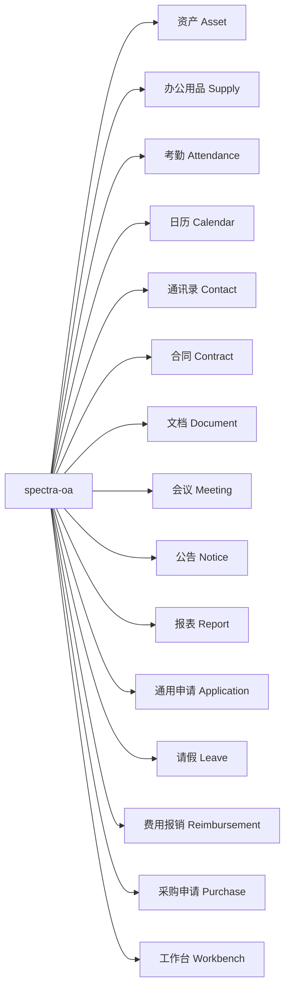

---
tags:
  - backend
  - domain
---

# OA 模块

> 办公自动化（Office Automation），路径：`spectra-oa`。当前保留 9 个既有基础子模块，并已补齐通用申请、请假、协同办公、费用报销、采购申请、资产和办公用品库存首版纵切。

## 子模块一览


```mermaid
graph LR
    OA["spectra-oa"]
    OA --> Asset["资产 Asset"]
    OA --> Supply["办公用品 Supply"]
    OA --> Attendance["考勤 Attendance"]
    OA --> Calendar["日历 Calendar"]
    OA --> Contact["通讯录 Contact"]
    OA --> Contract["合同 Contract"]
    OA --> Document["文档 Document"]
    OA --> Meeting["会议 Meeting"]
    OA --> Notice["公告 Notice"]
    OA --> Report["报表 Report"]
    OA --> Application["通用申请 Application"]
    OA --> Leave["请假 Leave"]
    OA --> Reimbursement["费用报销 Reimbursement"]
    OA --> Purchase["采购申请 Purchase"]
    OA --> Workbench["工作台 Workbench"]
```

## 各模块详情

### Asset（资产管理，P1 首版）

| 项目 | 内容 |
|---|---|
| Controller | `AssetController` |
| Service | `AssetServiceImpl` |
| Entity | `Asset`、`AssetCategory`、`AssetOperation` |
| API | `/oa/assets/page`、`/oa/assets/{id}`、`/oa/assets/categories`、`/oa/assets/{id}/assign`、`return`、`transfer`、`maintenance`、`scrap`、`/oa/assets/from-purchase` |
| MVP 能力 | 资产分类、台账、采购收货转草稿、入库履历、领用、归还、调拨、维修、报废及生命周期记录 |

### Supply（办公用品库存，P1 首版）

办公用品与固定资产分开建模，围绕 SKU、库存数量和领用记录形成轻量库存闭环。首版支持手工建档、入库、领用、退库、库存调整和最低库存查询；数量变动统一写入操作流水，避免直接修改历史记录。

| 项目 | 内容 |
|---|---|
| Controller | `SupplyController` |
| Service | `SupplyServiceImpl` |
| Entity | `SupplyItem`、`SupplyOperation` |
| API | `/oa/supplies/page`、`/{id}`、`/{id}/inbound`、`/{id}/issue`、`/{id}/return`、`/{id}/adjust`、`/low-stock` |
| 权限 | 首版复用 `OA_ASSET:QUERY/INSERT/UPDATE`，后续可拆分独立库存权限 |
| MVP 能力 | SKU 台账、当前库存、最低库存提醒、入库、领用、退库、盘点调整和库存流水 |

### Attendance（考勤）

| 项目 | 内容 |
|---|---|
| Controller | `AttendanceController` |
| Service | `AttendanceServiceImpl` |
| Entity | `Attendance` |

### Calendar（日历）

| 项目 | 内容 |
|---|---|
| Controller | `CalendarController` |
| Service | `CalendarServiceImpl` |
| Entity | `Calendar` |
| API | `/oa/calendar/page`、`/oa/calendar`、`/{id}` |
| MVP 能力 | 个人日程、全员/部门共享、时间范围查询、创建/更新/删除 |

### Contact（通讯录）

| 项目 | 内容 |
|---|---|
| Controller | `ContactController` |
| Service | `ContactServiceImpl` |
| Entity | `Contact` |

### Contract（合同管理）

| 项目 | 内容 |
|---|---|
| Controller | `ContractController` |
| Service | `ContractServiceImpl` |
| Entity | `Contract` |

### Document（文档管理）

| 项目 | 内容 |
|---|---|
| Controller | `DocumentController` |
| Service | `DocumentServiceImpl` |
| Entity | `Document` |

### Meeting（会议管理）

最复杂的 OA 子模块，涉及三个实体。

| 项目 | 内容 |
|---|---|
| Controller | `MeetingController` |
| Service | `MeetingServiceImpl` |
| Entity | `Meeting` — 会议基本信息 |
| Entity | `MeetingParticipant` — 参会人员 |
| Entity | `MeetingRecord` — 会议纪要 |
| API | `/oa/meeting/page`、`/{id}/response`、`/{id}/check-in`、`/{id}/record` |
| MVP 能力 | 以地点作为会议室键进行时间重叠校验、邀请响应、签到、纪要 |

### Notice（公告通知）

| 项目 | 内容 |
|---|---|
| Controller | `NoticeController` |
| Service | `NoticeServiceImpl` |
| Entity | `Notice` |
| Entity | `NoticeReader` — 阅读回执 |
| API | `/oa/notice/page`、`/`、`/{id}/publish`、`/{id}/revoke`、`/{id}/read` |
| MVP 能力 | 全员/部门范围、发布/撤回、站内通知、已读回执 |

### Report（报表）

| 项目 | 内容 |
|---|---|
| Controller | `ReportController` |
| Service | `ReportServiceImpl` |
| Entity | `Report` |

### Application（通用申请内核，P0）

统一承载 OA 申请单的编号、类型、业务明细、申请人、组织归属、工作流实例和生命周期状态。

| 项目 | 内容 |
|---|---|
| Controller | `ApplicationController` |
| Service | `ApplicationServiceImpl` |
| Entity | `Application`、`ApplicationType` |
| 状态 | `DRAFT` → `IN_REVIEW` → `APPROVED` / `REJECTED`；支持 `WITHDRAWN`、`CANCELLED` |
| API | `/oa/applications/page`、`/{id}`、`/types`、`/{id}/withdraw`、`/{id}/cancel` |

申请主表只保存通用字段，业务字段进入类型明细表；流程 `businessKey` 固定使用 `oa_application.id`。

### Leave（请假闭环，P0）

首个端到端业务纵切。请假明细按固定班次（09:00-12:00、13:00-18:00）计算工作时长，周末不计入；若配置了年度额度，则提交时预占、审批通过转已用、驳回/撤回/取消释放。审批通过后按工作日写入 `oa_attendance_record`，回调按申请状态保证幂等。

| 项目 | 内容 |
|---|---|
| Controller | `LeaveController` |
| Service | `LeaveServiceImpl` |
| Entity | `LeaveType`、`LeaveApplication`、`LeaveBalance`、`AttendanceRecord` |
| API | `/oa/leave`、`/oa/leave/page`、`/{id}`、`/{id}/submit`、`/{id}/withdraw`、`/{id}/cancel` |
| 流程 KEY | `oa_leave_approval` |

### Reimbursement（费用报销闭环，P1 首版）

费用报销复用通用申请外壳，业务明细和付款执行状态独立持久化。首版支持草稿、费用明细、发票/收据附件、提交审批、撤回/取消、审批回调和登记付款；审批状态与付款状态分离，金额统一使用 `BigDecimal`。

| 项目 | 内容 |
|---|---|
| Controller | `ReimbursementController` |
| Service | `ReimbursementServiceImpl` |
| Entity | `Reimbursement`、`ReimbursementItem` |
| API | `/oa/reimbursements`、`/oa/reimbursements/page`、`/{id}`、`/{id}/submit`、`/{id}/withdraw`、`/{id}/cancel`、`/{id}/payment` |
| 流程 KEY | `oa_reimbursement_approval` |
| 附件 | 复用 `oa_application_attachment`，文件上传接口返回 `file_id` |
| 后续增强 | 财务多级审核、预算校验、发票查重/OCR、付款失败重试、统计导出 |

### Purchase（采购申请闭环，P1 首版）

采购申请复用通用申请外壳，采购明细、执行单和收货批次独立持久化。首版支持草稿、物品/服务明细、审批、采购执行登记、订单号、分批收货、验收差异和执行状态回写；不扩展完整供应链、库存成本或应付账款。

| 项目 | 内容 |
|---|---|
| Controller | `PurchaseController` |
| Service | `PurchaseServiceImpl` |
| Entity | `Purchase`、`PurchaseItem`、`PurchaseReceipt`、`PurchaseReceiptItem` |
| API | `/oa/purchases`、`/oa/purchases/page`、`/{id}`、`/{id}/submit`、`/{id}/withdraw`、`/{id}/cancel`、`/{id}/execute`、`/{id}/receipts` |
| 流程 KEY | `oa_purchase_approval` |
| 执行状态 | `NOT_STARTED`、`ORDERED`、`PARTIAL_RECEIVED`、`RECEIVED`、`CANCELLED` |
| 后续增强 | 固定资产入库草稿、费用类关联报销、供应商统计、附件和 Excel 导出 |

### Workbench（工作台摘要，P0-P1）

不新增 `/oa/workbench` 前端页面，复用现有 Dashboard；后端提供 `GET /oa/workbench/summary`，聚合待办、申请、未读通知、公告、今日日程和会议摘要。

摘要接口按卡片隔离数据源异常：待办、消息、申请统计、公告、日程或会议任一依赖不可用时记录告警并返回其余摘要，避免单个数据源故障导致整个工作台返回 500。

## 包结构

```
spectra-modules/spectra-oa/
└── src/main/java/com/devops00/spectra/oa/
    ├── asset/
    │   ├── controller/AssetController.java
    │   ├── service/AssetService.java
    │   ├── service/impl/AssetServiceImpl.java
    │   ├── javabean/entity/Asset.java、AssetCategory.java、AssetOperation.java
    │   ├── javabean/from/、vo/、converter/
    │   └── mapper/AssetMapper.java、AssetCategoryMapper.java、AssetOperationMapper.java
    ├── supply/
    │   ├── controller/SupplyController.java
    │   ├── service/SupplyService.java
    │   ├── service/impl/SupplyServiceImpl.java
    │   ├── javabean/entity/SupplyItem.java、SupplyOperation.java
    │   ├── javabean/from/、vo/、converter/
    │   └── mapper/SupplyItemMapper.java、SupplyOperationMapper.java
    ├── attendance/
    ├── calendar/
    ├── contact/
    ├── contract/
    ├── document/
    ├── meeting/
    ├── notice/
    ├── report/
    ├── application/
    ├── leave/
    ├── reimbursement/
    ├── purchase/
    └── workbench/
```

每个子模块遵循统一的 Controller → Service → Mapper → Entity 分层。

## 相关笔记

- [[10-架构分层]]
- [[90-API总览]]
- [[10-ER图]]
- [[20-实体清单]]

## 相关计划

- [[90-计划/spectra-admin/P-通用OA业务建设总计划]] — 通用 OA 模块设计、业务闭环与分期建设总计划
- [[90-计划/spectra-admin/P-OA模块对标分析与开发计划]] — 旧版对标分析，已被总计划整合
- [[90-计划/spectra-admin/P-Workflow审批流完善计划]] — Workflow审批流完善（OA开发前置任务）
