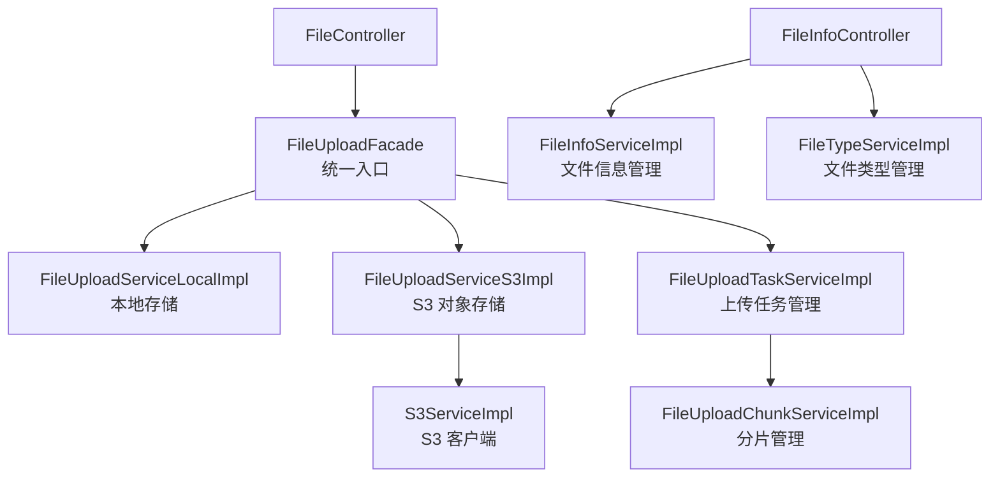

---
tags:
  - backend
  - upload
---

# 文件上传

> 支持本地存储和 S3 对象存储的文件上传模块，支持分片上传。路径：`spectra-upload`。

## 上传架构

## 核心实体

### FileInfo（文件信息）

| 字段 | 类型 | 说明 |
|---|---|---|
| `id` | UUID | 主键 |
| `originalName` | String | 原始文件名 |
| `storageName` | String | 存储文件名 |
| `path` | String | 存储路径 |
| `size` | Long | 文件大小（字节） |
| `typeId` | UUID | 文件类型 ID |
| `md5` | String | 文件 MD5 校验 |
| `storageType` | String | 存储类型（local/s3） |
| `url` | String | 访问 URL |

### FileType（文件类型）

| 字段 | 类型 | 说明 |
|---|---|---|
| `id` | UUID | 主键 |
| `name` | String | 类型名称 |
| `extensions` | String | 允许的扩展名 |
| `maxSize` | Long | 最大大小 |
| `mimeType` | String | MIME 类型 |

### FileUploadTask（上传任务）

| 字段 | 类型 | 说明 |
|---|---|---|
| `id` | UUID | 主键 |
| `status` | String | 任务状态 |
| `totalChunks` | Integer | 总分片数 |
| `completedChunks` | Integer | 已完成分片数 |

### FileUploadChunk（分片记录）

| 字段 | 类型 | 说明 |
|---|---|---|
| `id` | UUID | 主键 |
| `taskId` | UUID | 所属任务 |
| `chunkIndex` | Integer | 分片序号 |
| `chunkSize` | Long | 分片大小 |
| `status` | String | 分片状态 |

## 上传流程

1. 前端发起上传，`FileController` 接收请求
2. `FileUploadFacade` 根据配置选择 `LocalImpl` 或 `S3Impl`
3. 大文件自动分片：
   - `FileUploadTaskServiceImpl` 创建上传任务
   - `FileUploadChunkServiceImpl` 管理每个分片
   - 全部分片完成后合并
4. `FileInfoServiceImpl` 记录文件元信息
5. 返回文件访问 URL

## Controller

| Controller | 说明 |
|---|---|
| `FileController` | 文件上传/下载/删除 |
| `FileInfoController` | 文件信息管理（CRUD + 类型管理） |

## Service

| Service | 说明 |
|---|---|
| `FileUploadFacade` | 上传统一入口（策略选择） |
| `FileUploadServiceLocalImpl` | 本地存储实现 |
| `FileUploadServiceS3Impl` | S3 存储实现 |
| `S3ServiceImpl` | S3 客户端封装 |
| `FileInfoServiceImpl` | 文件元信息管理 |
| `FileTypeServiceImpl` | 文件类型管理 |
| `FileUploadTaskServiceImpl` | 上传任务管理 |
| `FileUploadChunkServiceImpl` | 分片管理 |

## 配置

| 配置类 | 说明 |
|---|---|
| `FileUploadConfiguration` | 上传总配置（存储类型选择） |
| `LocalConfiguration` | 本地存储路径配置 |
| `S3Configuration` | S3 连接配置（endpoint/accessKey/secretKey/bucket） |

## 关键文件路径

| 文件 | 路径 |
|---|---|
| FileUploadFacade | `spectra-modules/spectra-upload/src/main/java/com/devops00/spectra/upload/service/impl/FileUploadFacade.java` |
| FileController | `spectra-modules/spectra-upload/src/main/java/com/devops00/spectra/upload/controller/FileController.java` |
| S3Configuration | `spectra-modules/spectra-upload/src/main/java/com/devops00/spectra/upload/configure/S3Configuration.java` |

## 相关笔记

- [[80-基础设施]] — S3 对象存储
- [[90-API总览]]
- [[20-实体清单]]
