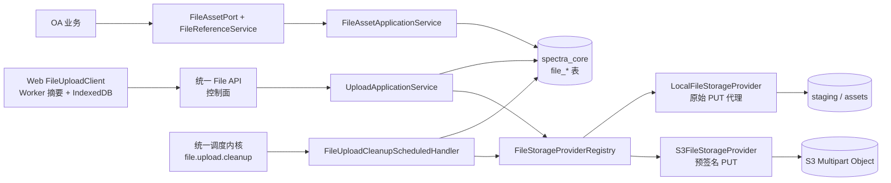

---
tags:
  - backend
  - upload
---

# 文件上传

`spectra-upload` 提供统一的文件控制面，支持 Local 代理上传和 S3 预签名分片上传。当前协议版本为 `1.0.0`，本次重构直接替换旧上传模型，不保留旧入口、旧实体、旧字段或兼容读取。

该模块是可选业务能力，由 `spectra-launch` 根据 `spectra.modules.upload.enabled` 在启动期装配。Upload 通过 `common.port.file`、`common.port.audit` 和 framework 的技术适配接入，不依赖 Core 内部 Entity、Mapper 或 Service；本系统不提供租户级文件隔离。

## 设计边界

- 不引入租户概念。
- 上传任务由创建任务的用户拥有；查询、获取分片目标、上传、确认、完成和取消都必须通过任务所有权校验。
- 已完成文件通过 `file_asset_id` 被业务引用；业务引用的业务权限决定预览和下载权限。
- `file_asset` 只记录 READY 文件的元数据和存储定位，业务表不复制物理路径、URL 或摘要以外的存储信息。
- 业务 JSON 请求继续遵循全局加密/统一响应处理；原始文件分片 PUT 是独立的二进制边界，不进入 JSON 加密信封、不读入内存、不包装成统一 JSON 响应。

## 总体架构


```mermaid
flowchart LR
    UI[Web FileUploadClient\nWorker 摘要 + IndexedDB] --> API[统一 File API\n控制面]
    API --> APP[UploadApplicationService]
    APP --> DB[(spectra_core\nfile_* 表)]
    APP --> REG[FileStorageProviderRegistry]
    REG --> LOCAL[LocalFileStorageProvider\n原始 PUT 代理]
    REG --> S3[S3FileStorageProvider\n预签名 PUT]
    LOCAL --> FS[(staging / assets)]
    S3 --> OBJ[(S3 Multipart Object)]
    OA[OA 业务] --> PORT[FileAssetPort + FileReferenceService]
    PORT --> ASSET[FileAssetApplicationService]
    ASSET --> DB
    SCHED[统一调度内核<br/>file.upload.cleanup] --> CLEAN[FileUploadCleanupScheduledHandler]
    CLEAN --> DB
    CLEAN --> REG
```

控制面只负责任务、分片声明、确认、完成和权限；文件内容只在 Local provider 或 S3 中传输。最终文件摘要由服务端从已完成对象流式计算，客户端摘要只用于秒传和恢复匹配，服务端结果是唯一权威结果。

## 统一 API

所有端点使用 `Api-Version: 1.0.0`。

| 方法 | 路径 | 权限/用途 |
|---|---|---|
| `POST` | `/file/uploads` | 创建或恢复当前用户的上传会话；如果 READY 资产按 `(content_sha256, size)` 命中则直接返回秒传结果 |
| `GET` | `/file/uploads/{uploadId}` | 查询当前用户自己的会话和服务端已确认分片 |
| `POST` | `/file/uploads/{uploadId}/parts/{partNumber}/target` | 获取分片传输目标；Local 返回应用内 PUT 地址，S3 返回预签名 PUT 地址 |
| `PUT` | `/file/uploads/{uploadId}/parts/{partNumber}/content` | 仅 Local 使用的 `application/octet-stream` 原始二进制上传 |
| `POST` | `/file/uploads/{uploadId}/parts/{partNumber}/confirm` | 确认分片大小、摘要、尝试次数和 S3 ETag |
| `POST` | `/file/uploads/{uploadId}/complete` | 所有分片确认后进入 VERIFYING |
| `DELETE` | `/file/uploads/{uploadId}` | 取消尚处于 UPLOADING 的会话 |
| `GET` | `/file/uploads/page` | 文件上传任务分页查询，管理员能力 |
| `GET` | `/file/uploads/{uploadId}/admin-detail` | 查看上传任务安全详情和分片状态，管理员能力 |
| `POST` | `/file/uploads/{uploadId}/admin-cancel` | 管理员取消上传任务，清理由统一调度任务异步完成 |
| `GET` | `/file/assets/page` | 文件资产管理页分页查询，管理员能力 |
| `GET` | `/file/assets/{fileAssetId}/preview` | 按业务引用或管理员权限流式预览，支持 Range |
| `GET` | `/file/assets/{fileAssetId}/download` | 按业务引用或管理员权限流式下载，支持 Range |
| `DELETE` | `/file/assets/{fileAssetId}` | 无业务引用时管理员删除文件资产 |
| `POST` | `/file/references` | 在业务权限允许时登记 CONTENT 引用 |
| `DELETE` | `/file/references/{referenceId}` | 按业务权限删除引用 |
| `GET` | `/file/references/page` | 文件业务引用只读分页查询，管理员能力 |
| `GET` | `/file/types/page` | 文件类型策略分页查询，管理员能力 |
| `GET` | `/file/types/{id}` | 文件类型策略详情，管理员能力 |
| `POST` | `/file/types` | 创建文件类型策略，管理员能力 |
| `PUT` | `/file/types/{id}` | 修改文件类型策略，管理员能力 |
| `POST` | `/file/types/{id}/enable` | 启用文件类型策略，管理员能力 |
| `POST` | `/file/types/{id}/disable` | 停用文件类型策略，管理员能力 |

### 二进制边界

Local 原始 PUT 的认证、会话所有权和权限仍由应用处理，并额外由 `FileUploadBinarySecurityFilter` 校验 CSRF；过滤器只检查请求元数据，不读取请求体。Local 目标地址由控制器按当前 servlet context path 拼接（开发和生产默认是 `/api`），S3 的绝对预签名 URL 原样返回。S3 预签名 PUT 只使用 provider 返回的 URL 和 headers，不携带应用 Cookie、应用认证头、API 版本头或 XSRF 头。

`RequestDecryptAdvice` 先判断 Content-Type，只有 JSON 或 `+json` 请求才读取请求体；二进制请求原样放行。`ResponseEncryptAdvice` 和 `ResponseModifyAdvice` 对 Resource、字节数组和资源型 ResponseEntity 放行，预览/下载不会被加密或包裹。

### 响应时间字段

文件上传实体和数据库时间字段继续使用 UTC 语义的 `Instant`，但所有文件上传 HTTP 响应 VO 的时间字段统一使用 `LocalDateTime`。`FileUploadConverter` 必须声明 `uses = TimeMapper.class`，由 MapStruct 在响应边界按当前用户时区转换；禁止在 Service 中直接把实体 `Instant` 赋值给 VO，也禁止手工拼接时区。Jackson 再按全局 `yyyy-MM-dd HH:mm:ss` 规则序列化，前端统一通过 `formatDateTime` 展示。

该约定适用于文件资产、上传会话、上传任务、分片目标、分片详情、文件引用和文件类型策略响应，避免将带 `Z` 的 UTC 字符串直接暴露给管理页面。

## 上传流程与状态

1. Web Worker 以增量 SHA-256 分块分析文件，报告 `analysis_progress`；分析完成前不创建服务端任务。
2. `POST /file/uploads` 校验文件类型、扩展名、Content-Type、文件大小和声明摘要。
3. READY 资产按 `(content_sha256, size)` 严格唯一匹配，命中即返回 `DEDUPLICATED` 和 `file_asset_id`。
4. 未命中时创建会话和固定分片清单。默认分片 8 MiB，允许 5 MiB 至 64 MiB，最多 10,000 片；对应 YAML 配置绑定为 `Long` 字节数，不能写成带单位的字符串。
5. Web 只上传服务端状态中尚未 CONFIRMED 的分片。每片先计算 SHA-256，再获取目标、传输和确认；确认成功后更新 IndexedDB 元数据。
6. 所有分片确认后调用 complete，会话原子进入 VERIFYING；后台任务合并/完成 provider 对象并流式计算最终摘要和大小，报告 `verification_progress`。
7. 最终摘要、大小与创建时声明完全一致时生成 READY `file_asset`；并发完成通过 `(content_sha256, size)` 唯一约束收敛到同一资产。否则删除对象并将任务置为 FAILED。

状态：

```text
UPLOADING -> VERIFYING -> READY
UPLOADING -> CANCELED | EXPIRED | FAILED
VERIFYING -> READY | FAILED | EXPIRED
FAILED/CANCELED/EXPIRED -> CLEANED
```

客户端状态额外包含 `ANALYZING`、`CREATING`，并分别展示文件分析、分片上传和服务端最终复核三个进度。

## 秒传、恢复和时间限制

- 秒传只接受数据库中 `status = READY` 且未删除的资产；不能以文件名、客户端声明或未完成任务作为秒传依据。
- IndexedDB 只保存任务元数据，不保存 File 对象或文件内容。用户重新选择文件后，客户端重新计算完整 SHA-256 和大小，必须与恢复记录严格一致。
- 服务端是断点续传事实源，客户端使用 `completed_parts` 计算缺口；客户端本地记录丢失不会破坏服务端任务。
- 会话绝对有效期默认 24 小时；连续 2 小时没有成功上传或确认分片则视为空闲任务。
- 清理由统一调度内核中的 `file.upload.cleanup` 系统任务执行，默认每 5 分钟触发一次；处理器按有限批次 claim 上传会话和资产，过期/空闲任务停止接收、abort provider Multipart，任务记录保留 7 天；无业务引用的 READY 资产保留 7 天后清理。清理处理器运行在调度 tick 之外，外部存储失败只更新上传行的 `next_cleanup_at` 并等待下一轮重试，不阻塞调度入口。
- 上传会话的空闲超时只适用于 `UPLOADING`；`VERIFYING` 使用绝对有效期，避免服务端复核期间被空闲清理误删。claim、外部存储操作和最终数据库删除分离，进程中断后可由租约和下一轮清理恢复。
- 预签名分片目标默认 15 分钟有效，目标过期通过重新获取目标和递增 attempt 重试。

## 存储 provider

`FileStorageProvider` 是 Local/S3 的统一接口。

| Provider | 传输模式 | 暂存与完成 |
|---|---|---|
| `LOCAL` | `LOCAL_PROXY` | 每片流式写入 staging 临时文件，校验大小和摘要后原子替换；完成时按分片顺序合并到 `assets/{uploadId}/content.bin`；分片状态为 `PENDING -> UPLOADED -> CONFIRMED` |
| `S3` | `PRESIGNED` | 应用创建 S3 Multipart，Web 直接 PUT 到短时预签名目标；确认保存 ETag，完成时提交 Multipart；分片状态为 `PENDING -> CONFIRMED` |

Local 存储路径必须通过 `StoragePaths` 解析相对 key，禁止绝对路径、`..` 越界和用户输入直接拼接文件系统路径。最终对象读取支持全量流式读取和 Range；删除失败由清理任务重试。

## 文件类型与安全校验

`file_type` 是文件类型策略事实源，创建会话时执行启用状态、扩展名、声明 Content-Type、危险类型和大小限制校验。最终服务端复核至少验证对象大小和 SHA-256；业务可在类型策略中维护 `magic_rules`。

文件名只作为显示名，服务端替换 NUL 字符，不参与存储 key。原始文件不经过 JSON 加密协议；Local PUT 必须校验 CSRF，S3 PUT 不携带应用安全上下文，且 S3 bucket CORS 必须暴露 `ETag` 响应头供控制面确认分片。

## 权限模型

- `file:create`：创建和操作当前用户自己的上传会话。
- `file:read`：进入文件读取边界；没有业务引用参数时必须同时具备管理员读取权限。
- `file:reference`：进入引用 API 的基础权限；服务层还必须通过对应业务 `FileReferencePermissionChecker`。
- `file:admin:read`：资产、上传任务、业务引用和文件类型策略管理页的只读能力，以及管理员预览/下载。
- `file:admin:delete`：无业务引用时删除 READY 文件资产。
- `file:admin:manage`：取消上传任务、创建/修改/启停文件类型策略等管理写操作。
- 业务引用采用 `reference_type + reference_id + purpose` 标识，并以 `(file_asset_id, reference_type, reference_id, purpose)` 唯一。OA 的合同版本、文档版本、申请附件和报销附件分别登记 CONTENT 引用。

`com.devops00.spectra.common.port.file.FileAssetPort` 供 OA 等业务获取 READY 快照，`FileReferenceService` 负责引用登记和撤销；这些是 `spectra-common` 的跨模块端口，不包含上传模块的存储实现。文件流服务在业务引用路径上重新执行业务可见范围校验，不能仅凭 `file_asset_id` 下载。

## 数据表

所有上传表位于 `spectra_core`，表名统一以 `file_` 开头：

| 表 | 职责 | 关键字段 |
|---|---|---|
| `file_type` | 文件类型策略 | `code`, `allowed_extensions`, `allowed_content_types`, `magic_rules`, `max_size`, `preview_enabled`, `download_enabled`, `dangerous` |
| `file_asset` | READY 文件资产 | `file_type_id`, `original_name`, `content_sha256`, `size`, `content_type`, `storage_provider`, `storage_container`, `storage_key`, `status` |
| `file_upload_session` | 时间受限上传会话 | `owner_user_id`, `content_sha256`, `size`, `chunk_size`, `total_parts`, `provider_upload_id`, `expires_at`, `last_activity_at`, `status`, `file_asset_id` |
| `file_upload_part` | 分片声明和确认事实 | `upload_session_id`, `part_number`, `expected_size`, `expected_sha256`, `uploaded_size`, `actual_sha256`, `provider_etag`, `status`, `upload_attempt` |
| `file_reference` | 业务引用 | `file_asset_id`, `reference_type`, `reference_id`, `purpose`, `display_name` |

迁移链为 `V7__rebuild_file_upload_domain.sql`、`V8__add_file_upload_menu.sql`、`V9__repair_file_upload_metadata.sql`、`V10__register_file_upload_cleanup_scheduler_job.sql` 和 `V11__complete_file_upload_management.sql`。V7 一次性删除旧上传表和旧数据模型，重建上述五张表，并把 OA 附件字段统一切换为 `file_asset_id`；不迁移旧文件数据。V9 只修复现有 XLSX 类型策略，并为五张 `file_*` 表及全部字段补齐注释；V10 将上传清理接入统一调度内核，不再由上传模块独立维护 Spring 定时任务；V11 补齐文件管理后台权限、菜单目录、上传任务、文件引用和文件类型策略入口。

## 前端实现

- `src/services/file-upload-client.ts`：上传状态机、并发分片、重试、暂停/继续、取消和服务端复核轮询。
- `src/workers/file-hash.worker.ts`：无第三方依赖的增量 SHA-256 Worker，持续发送分析进度。
- `src/services/file-upload-store.ts`：IndexedDB 任务元数据存储和损坏记录清理。
- `src/plugin/request/http.ts`：统一 JSON/二进制请求适配，Local/S3 传输边界由 options 控制。
- `src/plugin/request/upload.ts`：业务唯一的二进制上传入口。
- `src/api/system/file-api.ts`：统一控制面、资产和引用 API。
- `src/views/Devops/File/Upload/index.vue`：文件选择、三阶段进度、暂停/继续、取消和恢复任务。
- `src/views/Devops/File/Assets/index.vue`：文件资产摘要、存储、状态和业务引用管理。
- `src/views/Devops/File/UploadTask/index.vue`：上传任务分页、分片详情和管理员取消。
- `src/views/Devops/File/Reference/index.vue`：业务文件引用只读查询。
- `src/views/Devops/File/Type/index.vue`：文件类型策略的创建、修改、启用和停用。

业务组件不得直接调用 `fetch`、`XMLHttpRequest` 或自行拼接旧上传 URL；OA 业务只提交 `file_asset_id`，文件流访问必须带业务引用上下文或使用管理员资产接口。

## 关键实现路径

| 文件 | 路径 |
|---|---|
| 上传应用服务 | `spectra-modules/spectra-upload/src/main/java/com/devops00/spectra/upload/service/UploadApplicationService.java` |
| 资产应用服务 | `spectra-modules/spectra-upload/src/main/java/com/devops00/spectra/upload/service/FileAssetApplicationService.java` |
| 引用应用服务 | `spectra-modules/spectra-upload/src/main/java/com/devops00/spectra/upload/service/FileReferenceApplicationService.java` |
| Local provider | `spectra-modules/spectra-upload/src/main/java/com/devops00/spectra/upload/storage/local/LocalFileStorageProvider.java` |
| S3 provider | `spectra-modules/spectra-upload/src/main/java/com/devops00/spectra/upload/storage/s3/S3FileStorageProvider.java` |
| 清理服务 | `spectra-modules/spectra-upload/src/main/java/com/devops00/spectra/upload/service/FileUploadCleanupService.java` |
| 清理调度适配器 | `spectra-modules/spectra-upload/src/main/java/com/devops00/spectra/upload/service/scheduler/FileUploadCleanupScheduledHandler.java` |
| 清理事务边界 | `spectra-modules/spectra-upload/src/main/java/com/devops00/spectra/upload/service/FileUploadCleanupTransactionService.java` |
| 数据迁移 | `spectra-config/src/main/resources/db/migration/V7__rebuild_file_upload_domain.sql`、`V8__add_file_upload_menu.sql`、`V9__repair_file_upload_metadata.sql`、`V10__register_file_upload_cleanup_scheduler_job.sql` |

## 相关笔记

- [[80-基础设施]] — 存储 provider、二进制响应和数据库 schema
- [[90-API总览]] — 模块 API 索引
- [[20-实体清单]] — 实体字段和 OA 引用
