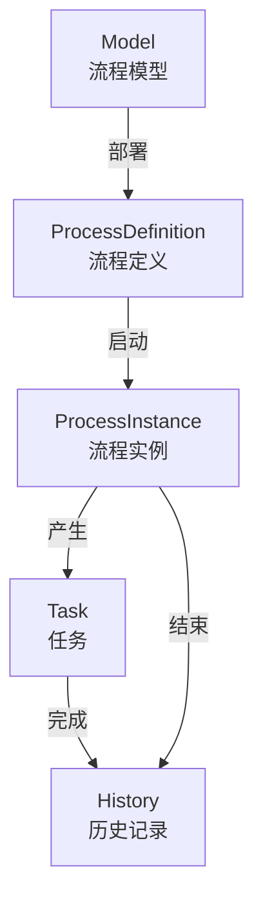

---
tags:
  - backend
  - workflow
---

# 工作流

> 基于 Flowable 流程引擎的工作流管理模块。路径：`spectra-workflow`。

## 核心概念

## Controller

| Controller | 路径 | 说明 |
|---|---|---|
| `FormDefinitionController` | `/workflow/form-definitions/**` | 表单定义管理（CRUD + 版本管理） |
| `ModelController` | `/workflow/model/**` | 流程模型管理（CRUD + 部署） |
| `ProcessDefinitionController` | `/workflow/process-definitions/**` | 流程定义管理（查询/挂起/激活/获取资源/部署） |
| `ProcessInstanceController` | `/workflow/process-instances/**` | 流程实例管理（启动/查询/终止） |
| `TaskController` | `/workflow/task/**` | 任务管理（待办/已办/签收/完成/转办） |
| `RuntimeController` | `/workflow/runtime/**` | 运行时查询 |
| `HistoryController` | `/workflow/history/**` | 历史记录查询 |

## Service

| Service | 实现类 | 说明 |
|---|---|---|
| `FormDefinitionService` | `FormDefinitionServiceImpl` | 表单定义管理（CRUD + 版本管理） |
| `WorkflowService` | `WorkflowServiceImpl` | 流程核心操作（部署/启动/挂起） |
| `ProcessInstanceService` | `ProcessInstanceServiceImpl` | 流程实例管理 |

## 配置

| 配置类 | 说明 |
|---|---|
| `WorkflowConfiguration` | Flowable 引擎配置（数据源/自动部署/字体等） |

## 关键文件路径

| 文件 | 路径 |
|---|---|
| FormDefinition | `spectra-modules/spectra-workflow/src/main/java/com/devops00/spectra/workflow/javabean/entity/FormDefinition.java` |
| FormVersion | `spectra-modules/spectra-workflow/src/main/java/com/devops00/spectra/workflow/javabean/entity/FormVersion.java` |
| FormDefinitionMapper | `spectra-modules/spectra-workflow/src/main/java/com/devops00/spectra/workflow/mapper/FormDefinitionMapper.java` |
| FormVersionMapper | `spectra-modules/spectra-workflow/src/main/java/com/devops00/spectra/workflow/mapper/FormVersionMapper.java` |
| FormDefinitionController | `spectra-modules/spectra-workflow/src/main/java/com/devops00/spectra/workflow/controller/FormDefinitionController.java` |
| ProcessDefinitionController | `spectra-modules/spectra-workflow/src/main/java/com/devops00/spectra/workflow/controller/ProcessDefinitionController.java` |
| ProcessInstanceController | `spectra-modules/spectra-workflow/src/main/java/com/devops00/spectra/workflow/controller/ProcessInstanceController.java` |
| FormDefinitionService | `spectra-modules/spectra-workflow/src/main/java/com/devops00/spectra/workflow/service/FormDefinitionService.java` |
| FormDefinitionServiceImpl | `spectra-modules/spectra-workflow/src/main/java/com/devops00/spectra/workflow/service/impl/FormDefinitionServiceImpl.java` |
| FormDefinitionSaveFrom | `spectra-modules/spectra-workflow/src/main/java/com/devops00/spectra/workflow/javabean/from/FormDefinitionSaveFrom.java` |
| FormVersionSaveFrom | `spectra-modules/spectra-workflow/src/main/java/com/devops00/spectra/workflow/javabean/from/FormVersionSaveFrom.java` |
| DeployProcessFrom | `spectra-modules/spectra-workflow/src/main/java/com/devops00/spectra/workflow/javabean/from/DeployProcessFrom.java` |
| FormDefinitionVO | `spectra-modules/spectra-workflow/src/main/java/com/devops00/spectra/workflow/javabean/vo/FormDefinitionVO.java` |
| FormVersionVO | `spectra-modules/spectra-workflow/src/main/java/com/devops00/spectra/workflow/javabean/vo/FormVersionVO.java` |
| ProcessDefinitionResourceVO | `spectra-modules/spectra-workflow/src/main/java/com/devops00/spectra/workflow/javabean/vo/ProcessDefinitionResourceVO.java` |
| WorkflowConfiguration | `spectra-modules/spectra-workflow/src/main/java/com/devops00/spectra/workflow/configure/WorkflowConfiguration.java` |
| TaskController | `spectra-modules/spectra-workflow/src/main/java/com/devops00/spectra/workflow/controller/TaskController.java` |
| WorkflowServiceImpl | `spectra-modules/spectra-workflow/src/main/java/com/devops00/spectra/workflow/service/impl/WorkflowServiceImpl.java` |

## 相关笔记

- [[10-架构分层]]
- [[90-API总览]]

## 相关计划

- [[98-计划/spectra-admin/P-工作流模块完整实现计划]] — 工作流模块完整实现（总控计划）
- [[98-计划/spectra-admin/P-Workflow审批流完善计划]] — Workflow审批流完善（OA开发前置任务）
- [[98-计划/spectra-admin/P-OA模块对标分析与开发计划]] — OA模块对标分析与开发路线图
