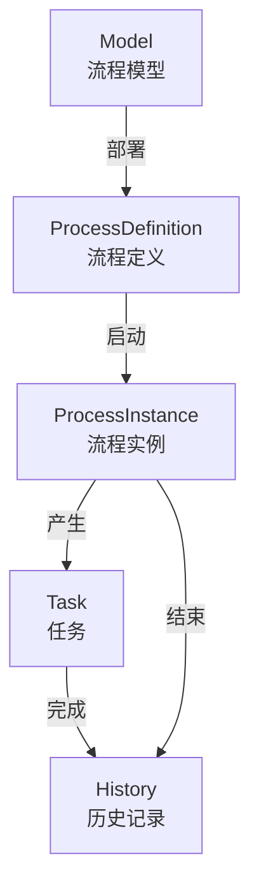

---
tags:
  - backend
  - workflow
---

# 工作流

> 基于 Flowable 流程引擎的工作流管理模块。路径：`spectra-workflow`。

## 核心概念

## Controller

| Controller | 路径 | 说明 |
|---|---|---|
| `ModelController` | `/workflow/model/**` | 流程模型管理（CRUD + 部署） |
| `ProcessDefinitionController` | `/workflow/definition/**` | 流程定义管理（查询/挂起/激活） |
| `ProcessInstanceController` | `/workflow/instance/**` | 流程实例管理（启动/查询/终止） |
| `TaskController` | `/workflow/task/**` | 任务管理（待办/已办/签收/完成/转办） |
| `RuntimeController` | `/workflow/runtime/**` | 运行时查询 |
| `HistoryController` | `/workflow/history/**` | 历史记录查询 |

## Service

| Service | 实现类 | 说明 |
|---|---|---|
| `WorkflowService` | `WorkflowServiceImpl` | 流程核心操作（部署/启动/挂起） |
| `ProcessInstanceService` | `ProcessInstanceServiceImpl` | 流程实例管理 |

## 配置

| 配置类 | 说明 |
|---|---|
| `WorkflowConfiguration` | Flowable 引擎配置（数据源/自动部署/字体等） |

## 关键文件路径

| 文件 | 路径 |
|---|---|
| WorkflowConfiguration | `spectra-modules/spectra-workflow/src/main/java/com/devops00/spectra/workflow/configure/WorkflowConfiguration.java` |
| TaskController | `spectra-modules/spectra-workflow/src/main/java/com/devops00/spectra/workflow/controller/TaskController.java` |
| ProcessInstanceController | `spectra-modules/spectra-workflow/src/main/java/com/devops00/spectra/workflow/controller/ProcessInstanceController.java` |
| WorkflowServiceImpl | `spectra-modules/spectra-workflow/src/main/java/com/devops00/spectra/workflow/service/impl/WorkflowServiceImpl.java` |

## 相关笔记

- [[10-架构分层]]
- [[90-API总览]]
