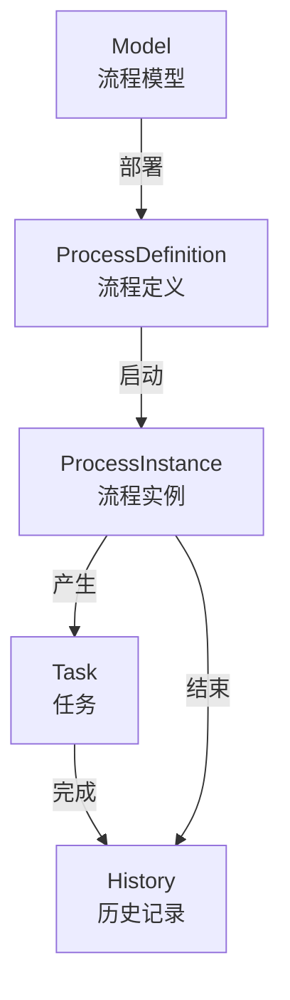

---
tags:
  - backend
  - workflow
---

# 工作流

> 基于 Flowable 流程引擎的工作流管理模块。路径：`spectra-workflow`。

## 核心概念

```mermaid
graph TB
    MD["Model<br/>流程模型"]
    PD["ProcessDefinition<br/>流程定义"]
    PI["ProcessInstance<br/>流程实例"]
    TASK["Task<br/>任务"]
    HIST["History<br/>历史记录"]

    MD -->|"部署"| PD
    PD -->|"启动"| PI
    PI -->|"产生"| TASK
    TASK -->|"完成"| HIST
    PI -->|"结束"| HIST
```

## Controller

| Controller | 路径 | 说明 |
|---|---|---|
| `FormDefinitionController` | `/workflow/form-definitions/**` | 表单定义管理（CRUD + 版本管理） |
| `ModelController` | `/workflow/model/**` | 流程模型管理（CRUD + 部署） |
| `ProcessDefinitionController` | `/workflow/process-definitions/**` | 流程定义管理（查询/挂起/激活/获取资源/部署） |
| `ProcessInstanceController` | `/workflow/process-instances/**` | 流程实例管理（启动/查询/终止） |
| `TaskController` | `/workflow/tasks/**` | 任务管理（待办/已办/审批/驳回/签收/转办/委派） |
| `RuntimeController` | `/workflow/runtime/**` | 运行时查询 |
| `HistoryController` | `/workflow/history/**` | 历史记录查询 |

## Service

| Service | 实现类 | 说明 |
|---|---|---|
| `FormDefinitionService` | `FormDefinitionServiceImpl` | 表单定义管理（CRUD + 版本管理） |
| `WorkflowService` | `WorkflowServiceImpl` | 流程核心操作（部署/启动/挂起） |
| `ProcessInstanceService` | `ProcessInstanceServiceImpl` | 流程实例管理 |

## OA 业务回调（P0）

业务流程启动时将 `businessKey` 统一设置为通用申请主表 `oa_application.id`。`WorkflowService` 维护“流程定义 KEY → `ApprovalCallback`”注册表；任务完成且 Flowable 流程进入历史结束态后，`TaskServiceImpl` 分发 `onApproved` / `onRejected`，终止流程时由 `ProcessInstanceServiceImpl` 分发 `onTerminated`。

回调实现必须按业务状态做幂等保护。当前请假流程注册 KEY 为 `oa_leave_approval`：通过回写 `oa_attendance_record`，驳回/撤回/取消释放预占额度，并向申请人写入 OA 消息。费用报销流程注册 KEY 为 `oa_reimbursement_approval`：审批回写申请状态，付款状态独立保持 `PENDING`，登记付款后转为 `PAID`。采购流程注册 KEY 为 `oa_purchase_approval`：审批回写申请状态，审批通过后进入 `NOT_STARTED` 执行状态，执行登记转为 `ORDERED`，收货按批次累计数量并转为 `PARTIAL_RECEIVED` 或 `RECEIVED`。

任务查询 VO 返回 `processDefinitionKey`、`businessKey`，供 Web/移动端审批中心定位 OA 业务详情。审批、驳回、转办和委派等写操作均从认证上下文取得当前用户名，并校验任务办理人所有权，不能只凭任务 ID 越权办理。OA 详情可见范围同时包含申请人、同部门用户、当前办理人和历史办理人。

流程终止采用幂等语义：业务撤回已经终止实例后，再执行业务取消只记录“实例已结束”并继续完成状态迁移，不因重复终止返回 404。旧 `leaveProcess` BPMN 已停止部署，数据库中的历史定义保持挂起；未被任何业务引用的 `oaSingleApproval`、`oaMultiApproval` 示例资源也已移除。当前自动部署并由 OA 使用的流程 KEY 仅为 `oa_leave_approval`、`oa_reimbursement_approval`、`oa_purchase_approval`。

Web 与移动端均提供审批中心，直接复用 `/workflow/tasks/todo`、`/workflow/tasks/done` 和任务动作端点，不另建 OA 审批任务表。2026-08-08 真实接口验收覆盖请假同意/撤回取消、报销驳回取消/同意付款、采购同意执行收货；所有流程进入历史结束态且运行中任务归零。

## 配置

| 配置类 | 说明 |
|---|---|
| `WorkflowConfiguration` | Flowable 引擎配置（数据源/自动部署/字体等） |

## 关键文件路径

| 文件 | 路径 |
|---|---|
| FormDefinition | `spectra-modules/spectra-workflow/src/main/java/com/devops00/spectra/workflow/javabean/entity/FormDefinition.java` |
| FormVersion | `spectra-modules/spectra-workflow/src/main/java/com/devops00/spectra/workflow/javabean/entity/FormVersion.java` |
| FormDefinitionMapper | `spectra-modules/spectra-workflow/src/main/java/com/devops00/spectra/workflow/mapper/FormDefinitionMapper.java` |
| FormVersionMapper | `spectra-modules/spectra-workflow/src/main/java/com/devops00/spectra/workflow/mapper/FormVersionMapper.java` |
| FormDefinitionController | `spectra-modules/spectra-workflow/src/main/java/com/devops00/spectra/workflow/controller/FormDefinitionController.java` |
| ProcessDefinitionController | `spectra-modules/spectra-workflow/src/main/java/com/devops00/spectra/workflow/controller/ProcessDefinitionController.java` |
| ProcessInstanceController | `spectra-modules/spectra-workflow/src/main/java/com/devops00/spectra/workflow/controller/ProcessInstanceController.java` |
| FormDefinitionService | `spectra-modules/spectra-workflow/src/main/java/com/devops00/spectra/workflow/service/FormDefinitionService.java` |
| FormDefinitionServiceImpl | `spectra-modules/spectra-workflow/src/main/java/com/devops00/spectra/workflow/service/impl/FormDefinitionServiceImpl.java` |
| FormDefinitionSaveFrom | `spectra-modules/spectra-workflow/src/main/java/com/devops00/spectra/workflow/javabean/from/FormDefinitionSaveFrom.java` |
| FormVersionSaveFrom | `spectra-modules/spectra-workflow/src/main/java/com/devops00/spectra/workflow/javabean/from/FormVersionSaveFrom.java` |
| DeployProcessFrom | `spectra-modules/spectra-workflow/src/main/java/com/devops00/spectra/workflow/javabean/from/DeployProcessFrom.java` |
| FormDefinitionVO | `spectra-modules/spectra-workflow/src/main/java/com/devops00/spectra/workflow/javabean/vo/FormDefinitionVO.java` |
| FormVersionVO | `spectra-modules/spectra-workflow/src/main/java/com/devops00/spectra/workflow/javabean/vo/FormVersionVO.java` |
| ProcessDefinitionResourceVO | `spectra-modules/spectra-workflow/src/main/java/com/devops00/spectra/workflow/javabean/vo/ProcessDefinitionResourceVO.java` |
| WorkflowConfiguration | `spectra-modules/spectra-workflow/src/main/java/com/devops00/spectra/workflow/configure/WorkflowConfiguration.java` |
| TaskController | `spectra-modules/spectra-workflow/src/main/java/com/devops00/spectra/workflow/controller/TaskController.java` |
| WorkflowServiceImpl | `spectra-modules/spectra-workflow/src/main/java/com/devops00/spectra/workflow/service/impl/WorkflowServiceImpl.java` |

## 相关笔记

- [[10-架构分层]]
- [[90-API总览]]

## 相关计划

- [[90-计划/spectra-admin/P-工作流模块完整实现计划]] — 工作流模块完整实现（总控计划）
- [[90-计划/spectra-admin/P-Workflow审批流完善计划]] — Workflow审批流完善（OA开发前置任务）
- [[90-计划/spectra-admin/P-OA模块对标分析与开发计划]] — OA模块对标分析与开发路线图
