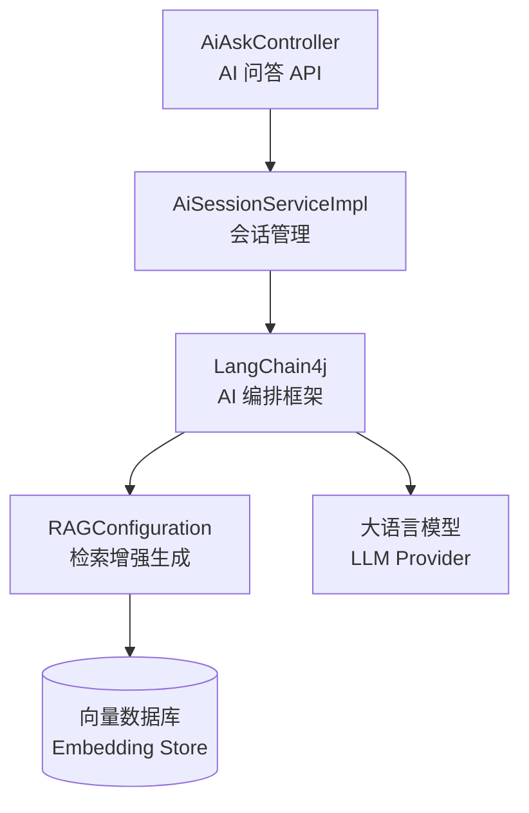

---
tags:
  - backend
  - ai
---

# AI 模块

> 基于 LangChain4j 的 AI 集成模块，支持 RAG 检索增强生成。路径：`spectra-ai`。

## 技术架构

## 核心组件

### AiSession（AI 会话）

| 字段 | 类型 | 说明 |
|---|---|---|
| `id` | UUID | 主键 |
| `userId` | UUID | 用户 ID |
| `title` | String | 会话标题 |
| `status` | String | 会话状态 |

### AiAskController

AI 问答接口入口，处理用户 AI 提问请求。

### RAGConfiguration

检索增强生成配置，负责：
- 文档向量化（Embedding）
- 向量数据库检索
- 上下文增强 Prompt 组装

## 配置

| 配置类 | 说明 |
|---|---|
| `AiConfiguration` | AI 总配置（模型选择/API Key/参数） |
| `RAGConfiguration` | RAG 配置（向量化模型/数据库/检索策略） |

## 关键文件路径

| 文件 | 路径 |
|---|---|
| AiAskController | `spectra-modules/spectra-ai/src/main/java/com/devops00/spectra/ai/controller/AiAskController.java` |
| AiConfiguration | `spectra-modules/spectra-ai/src/main/java/com/devops00/spectra/ai/configuration/AiConfiguration.java` |
| RAGConfiguration | `spectra-modules/spectra-ai/src/main/java/com/devops00/spectra/ai/configuration/rag/RAGConfiguration.java` |
| AiSessionServiceImpl | `spectra-modules/spectra-ai/src/main/java/com/devops00/spectra/ai/service/impl/AiSessionServiceImpl.java` |
| AiSession 实体 | `spectra-modules/spectra-ai/src/main/java/com/devops00/spectra/ai/javabean/entity/AiSession.java` |

## 相关笔记

- [[10-架构分层]]
- [[80-基础设施]]
- [[90-API总览]]
- [[20-实体清单]]
