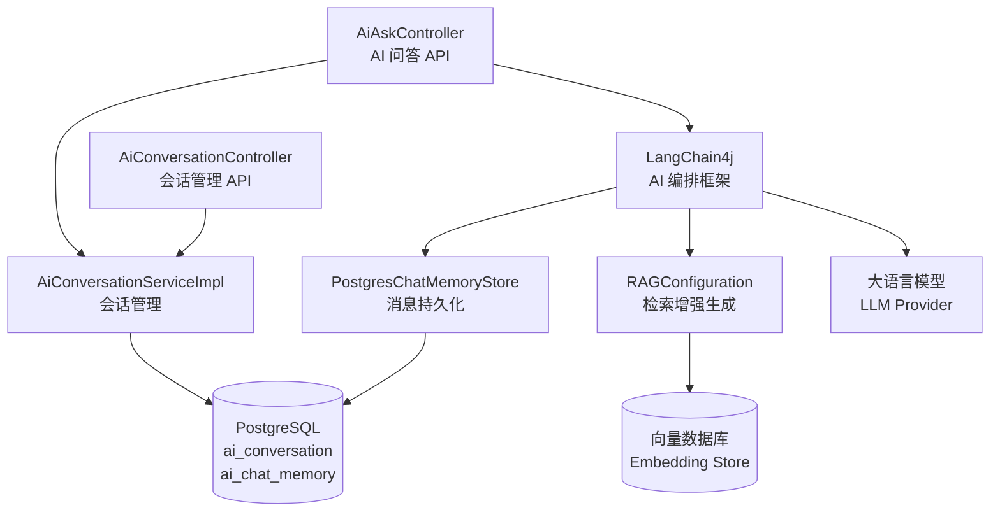

---
tags:
  - backend
  - ai
---

# AI 模块

> **归档标记**：本文仅适用于 `spectra-admin` 的 `archive/ai` 分支。`master` 已移除 `spectra-ai`、`spectra-ai-base`、AI 配置、AI 数据库 Schema 和相关 API；本文中的路径、依赖、接口和表结构不代表当前主分支。

> 基于 LangChain4j 的 AI 集成模块，支持 RAG 检索增强生成和对话历史持久化。路径：`spectra-ai`。

## 技术架构

```mermaid
graph TB
    AC["AiAskController<br/>AI 问答 API"]
    CC["AiConversationController<br/>会话管理 API"]
    CS["AiConversationServiceImpl<br/>会话管理"]
    LANG["LangChain4j<br/>AI 编排框架"]
    CMS["PostgresChatMemoryStore<br/>消息持久化"]
    RAG["RAGConfiguration<br/>检索增强生成"]
    LLM["大语言模型<br/>LLM Provider"]
    VS[("向量数据库<br/>Embedding Store")]
    PG[("PostgreSQL<br/>ai_conversation<br/>ai_chat_memory")]

    AC --> CS
    AC --> LANG
    CC --> CS
    CS --> PG
    LANG --> CMS
    CMS --> PG
    LANG --> RAG
    LANG --> LLM
    RAG --> VS
```

## 核心组件

### AiMemoryId（复合记忆标识）

位于 `spectra-ai-base`，解决 MemoryId 与工具认证的耦合问题：

| 字段 | 用途 |
|---|---|
| `conversationId` | ChatMemory 缓存 key + 数据库存储 key |
| `token` | 工具执行时设置 SecurityContext |

equals/hashCode 仅比较 conversationId，token 变化不影响记忆复用。

### AiConversation（AI 会话）

| 字段 | 类型 | 说明 |
|---|---|---|
| `id` | UUID | 主键 |
| `userId` | UUID | 所属用户 ID |
| `title` | String | 会话标题（首条消息前 30 字） |
| `status` | String | 状态：active / archived |

### AiChatMemory（消息持久化）

| 字段 | 类型 | 说明 |
|---|---|---|
| `memoryId` | String | 会话 ID（= conversation.id::text） |
| `messages` | Text | ChatMessageSerializer 序列化的 JSON |

### PostgresChatMemoryStore

实现 LangChain4j `ChatMemoryStore` 接口，将对话消息持久化到 `ai_chat_memory` 表。

### AiAskController

AI 问答接口入口，处理用户 AI 提问请求。支持传入 `conversationId` 续接历史对话。

### RAGConfiguration

检索增强生成配置，负责：
- 文档向量化（Embedding）
- 向量数据库检索
- 上下文增强 Prompt 组装

## API 端点

| 方法 | 路径 | 说明 |
|---|---|---|
| POST | `/ai/ask/stream` | 流式问答（SSE） |
| GET | `/ai/conversation/list` | 会话列表 |
| PUT | `/ai/conversation/{id}/title` | 重命名会话 |
| DELETE | `/ai/conversation/{id}` | 删除会话 |
| GET | `/ai/conversation/{id}/messages` | 获取对话历史 |

## 配置

| 配置类 | 说明 |
|---|---|
| `AiConfiguration` | AI 总配置（模型/工具/ChatMemoryProvider + PostgresChatMemoryStore） |
| `RAGConfiguration` | RAG 配置（向量化模型/数据库/检索策略） |

## 关键文件路径

| 文件 | 路径 |
|---|---|
| AiAskController | `spectra-modules/spectra-ai/src/main/java/com/devops00/spectra/ai/controller/AiAskController.java` |
| AiConversationController | `spectra-modules/spectra-ai/src/main/java/com/devops00/spectra/ai/controller/AiConversationController.java` |
| AiConfiguration | `spectra-modules/spectra-ai/src/main/java/com/devops00/spectra/ai/configuration/AiConfiguration.java` |
| DeepSeekAssistant | `spectra-modules/spectra-ai/src/main/java/com/devops00/spectra/ai/configuration/DeepSeekAssistant.java` |
| RAGConfiguration | `spectra-modules/spectra-ai/src/main/java/com/devops00/spectra/ai/configuration/rag/RAGConfiguration.java` |
| PostgresChatMemoryStore | `spectra-modules/spectra-ai/src/main/java/com/devops00/spectra/ai/store/PostgresChatMemoryStore.java` |
| AiConversationServiceImpl | `spectra-modules/spectra-ai/src/main/java/com/devops00/spectra/ai/service/impl/AiConversationServiceImpl.java` |
| AiConversation 实体 | `spectra-modules/spectra-ai/src/main/java/com/devops00/spectra/ai/javabean/entity/AiConversation.java` |
| AiChatMemory 实体 | `spectra-modules/spectra-ai/src/main/java/com/devops00/spectra/ai/javabean/entity/AiChatMemory.java` |
| AiMemoryId | `spectra-starter/spectra-ai-base/src/main/java/com/devops00/spectra/ai/base/AiMemoryId.java` |
| 建表 SQL | `spectra-modules/spectra-ai/src/main/java/com/devops00/spectra/ai/create.sql` |

## 相关笔记

- [[10-架构分层]]
- [[80-基础设施]]
- [[90-API总览]]
- [[20-实体清单]]
