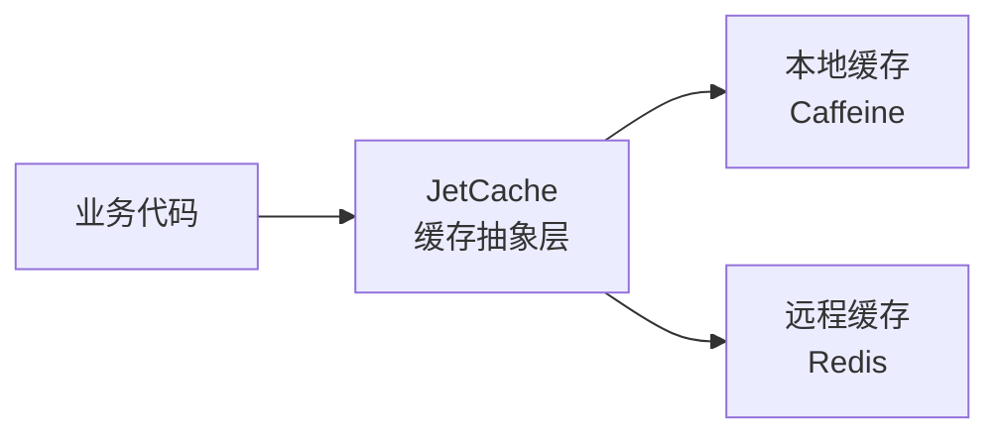

---
tags:
  - backend
  - infrastructure
---

# 基础设施

> spectra-admin 依赖的基础技术设施。

## 技术栈总览

| 技术 | 版本 | 用途 | 配置类 |
|---|---|---|---|
| PostgreSQL | 18 | 关系数据库 | MyBatis-Plus 数据源配置 |
| Redis | — | 缓存 / Session / 分布式锁 | `RedisConfiguration` |
| MyBatis-Plus | 3.5.15 | ORM 框架 | `MyBatisPlusConfiguration` |
| JetCache | 2.7.8 | 多级缓存抽象 | `CacheConfiguration` |
| BCrypt | — | 密码加密 | `PasswordEncoderConfiguration` |
| Kaptcha | 2.3.3 | 图形验证码 | `KaptchaConfiguration` |
| Jackson | — | JSON 序列化 | `JacksonConfiguration` |
| MapStruct | 1.6.3 | 对象映射 | Maven 编译插件 |
| OSHI | 6.9.1 | 系统信息监控 | `ServiceMonitorServiceImpl` |
| Apache Tika | 3.2.3 | 文件内容检测 | 上传模块使用 |
| Flowable | — | 工作流引擎 | `WorkflowConfiguration` |
| LangChain4j | 1.16.3 | AI 集成 | `AiConfiguration` |

## 缓存架构 (JetCache)

两级缓存：本地 Caffeine（L1）+ Redis（L2），通过 JetCache 注解声明式配置。

## 数据库 (PostgreSQL + MyBatis-Plus)

- **BaseEntity** 提供统一的审计字段和软删除支持
- MyBatis-Plus 提供分页插件、乐观锁插件、自动填充
- 软删除通过 `deleted` 字段实现（NULL = 未删除）
- 主键使用 UUID v7（时间有序），通过 `uuid-creator` 生成

## Redis

- 用途：缓存、Session 共享、分布式锁、验证码存储
- 配置类：`RedisConfiguration`

## Spring Security

集成方式：
- `spectra-security-spring-boot-starter` 提供自动配置
- `AuthController` + `AuthServiceImpl` 处理认证
- 多种登录 Provider 策略模式
- Token 基于 Spring Security 实现

## MVC 配置

| 配置项 | 说明 |
|---|---|
| CORS | 跨域支持 |
| API 版本 | URL 路径版本控制 |
| JSON 序列化 | Java8 时间格式 / Long → String 防精度丢失 |
| XSS 防护 | mica-xss 自动过滤 |

### 异常处理优先级

所有 `@RestControllerAdvice` / `@ControllerAdvice` 需显式设置 `@Order`，优先级递减：

| @Order | Advice | 异常类型 |
|---|---|---|
| `-100` | `KaptchaExceptionAdvice` | 验证码过期/不匹配 |
| `-100` | `SqlExceptionAdvice` | 数据库（唯一键冲突、SQL语法、完整性违规） |
| `-50` | `LoginExceptionAdvice` | 登录失败 |
| `-10` | `CommonExceptionAdvice` | 参数校验、运行时异常、Exception 兜底 |

**注意事项**：
- `@Order` 越小优先级越高，**必须 < 0** 才能排在 Spring 默认错误处理（`BasicErrorController`）之前，否则异常会被 HTML 错误页吞掉
- 新增 Advice 时选择合适的 `@Order` 值插入，同值的不同 Advice 处理不同类型异常时互不干扰
- `ResponseModifyAdvice` 是 `ResponseBodyAdvice`，不受异常处理优先级影响

## 关键文件路径

| 文件 | 路径 |
|---|---|
| MvcConfiguration | `spectra-framework/src/main/java/com/devops00/spectra/framework/configure/mvc/MvcConfiguration.java` |
| RedisConfiguration | `spectra-framework/src/main/java/com/devops00/spectra/framework/configure/redis/RedisConfiguration.java` |
| CacheConfiguration | `spectra-framework/src/main/java/com/devops00/spectra/framework/configure/cache/CacheConfiguration.java` |
| MyBatisPlusConfiguration | `spectra-framework/src/main/java/com/devops00/spectra/framework/configure/mybatis/MyBatisPlusConfiguration.java` |
| CommonExceptionAdvice | `spectra-framework/src/main/java/com/devops00/spectra/framework/configure/mvc/advice/exception/CommonExceptionAdvice.java` |
| SqlExceptionAdvice | `spectra-framework/src/main/java/com/devops00/spectra/framework/configure/mvc/advice/exception/SqlExceptionAdvice.java` |
| KaptchaExceptionAdvice | `spectra-framework/src/main/java/com/devops00/spectra/framework/configure/mvc/advice/exception/KaptchaExceptionAdvice.java` |
| LoginExceptionAdvice | `spectra-starter/spectra-security-spring-boot-starter/src/main/java/com/devops00/spectra/security/starter/web/advice/LoginExceptionAdvice.java` |
| BaseEntity | `spectra-common/src/main/java/com/devops00/spectra/common/base/BaseEntity.java` |

## 相关笔记

- [[10-架构分层]]
- [[20-用户与权限]] — Security 集成
- [[50-文件上传]] — S3 存储
- [[60-工作流]] — Flowable
- [[70-AI模块]] — LangChain4j
- [[52-SSL证书配置]] — 本地 SSL 证书
- [[82-数据库连接池]] — HikariCP 配置
- [[50-Redis使用规范]] — Redis 缓存使用规范
