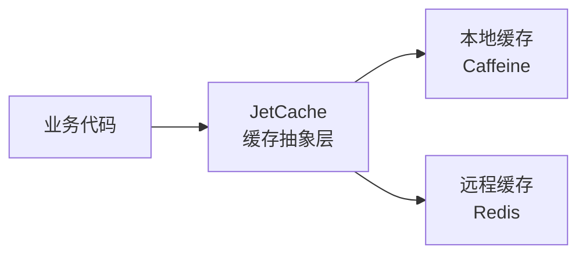

---
tags:
  - backend
  - infrastructure
---

# 基础设施

> spectra-admin 依赖的基础技术设施。

## 技术栈总览

| 技术 | 版本 | 用途 | 配置类 |
|---|---|---|---|
| PostgreSQL | 18 | 关系数据库 | MyBatis-Plus 数据源配置 |
| Redis | — | 缓存 / Session / 分布式锁 | `RedisConfiguration` |
| MyBatis-Plus | 3.5.15 | ORM 框架 | `MyBatisPlusConfiguration` |
| JetCache | 2.7.8 | 多级缓存抽象 | `CacheConfiguration` |
| BCrypt | — | 密码加密 | `PasswordEncoderConfiguration` |
| Kaptcha | 2.3.3 | 图形验证码 | `KaptchaConfiguration` |
| Jackson | — | JSON 序列化 | `JacksonConfiguration` |
| MapStruct | 1.6.3 | 对象映射 | Maven 编译插件 |
| JDK `OperatingSystemMXBean` | Java 25 | 系统 CPU、内存和逻辑处理器监控 | `ServiceMonitorServiceImpl` |
| Spring Boot Actuator `HealthEndpoint` | 4.1.0 | 聚合应用、通知、文件存储和基础设施健康组件 | `ServiceMonitorServiceImpl` |
| PostgreSQL 监控采样表 | — | 单体服务监控历史趋势、保留清理和时间范围查询 | `sys_service_monitor_sample` / `ServiceMonitorSampleMapper` |
| 服务监控告警与诊断表 | — | 告警规则/事件、运行时诊断任务及自动过期清理 | `sys_service_monitor_alert_rule`、`sys_service_monitor_alert_event`、`sys_service_monitor_diagnostic_task` |
| Apache Tika | 3.2.3 | 文件内容检测 | 上传模块使用 |
| Flowable | — | 工作流引擎 | `WorkflowConfiguration` |

堆转储使用当前 Java 25 运行基线提供的 `com.sun.management.HotSpotDiagnosticMXBean`，默认关闭且必须显式确认；如果更换为不提供 HotSpot 管理接口的 JDK/精简运行时，堆转储只返回“不支持”，不影响服务启动和其他只读诊断。

## 服务监控、告警与运行时诊断

服务监控由 `ServiceMonitorServiceImpl` 按 `spectra.monitor.collection-interval-ms` 定时采集，默认每 10 秒记录 CPU、系统内存、JVM 堆/非堆、线程、GC 和 HTTP 请求指标，进程内保留最近 180 个采样点。`GET /api/service/monitor/overview` 返回当前摘要、数据新鲜度、运行时信息和 PostgreSQL/Redis 依赖健康状态；历史趋势持久化到 PostgreSQL，支持 30 分钟、6 小时和 24 小时范围查询、服务端数量限制、保留时间配置和过期清理。依赖检查只返回状态、耗时、最近检查时间和脱敏说明，不暴露连接串、环境变量、异常原文或凭据。

告警规则支持启停、比较方式、阈值、级别、连续触发次数、通知冷却和乐观锁，覆盖 CPU、系统内存、JVM 堆、HTTP 错误率、P95、PostgreSQL 和 Redis 状态；每条规则只保留一个活动事件，恢复后进入历史状态。告警通过统一站内消息网关只通知当前有效的 `ROLE_DEV_OPS` 用户，消息内容不包含连接信息、路径、异常原文或凭据。

运行时诊断为只读能力，提供内存池、GC、线程状态、数据库连接池、Redis 延迟和 HTTP 慢接口信息；线程转储和堆转储通过异步任务执行，文件写入系统临时目录下的受控子目录，数据库只保存随机相对文件名，下载前重新校验任务状态、过期时间和目录边界。堆转储默认关闭，线程/堆转储分别限制文件大小、磁盘空间、并发数和保留时间，过期文件自动清理。

## 缓存架构 (JetCache)

```mermaid
graph LR
    APP["业务代码"] --> JC["JetCache<br/>缓存抽象层"]
    JC --> LOCAL["本地缓存<br/>Caffeine"]
    JC --> REMOTE["远程缓存<br/>Redis"]
```

两级缓存：本地 Caffeine（L1）+ Redis（L2），通过 JetCache 注解声明式配置。

## 数据库 (PostgreSQL + MyBatis-Plus)

- **BaseEntity** 提供统一的审计字段和软删除支持
- MyBatis-Plus 提供分页插件、乐观锁插件、自动填充
- 软删除通过 `deleted` 字段实现（NULL = 未删除）
- 主键使用 UUID v7（时间有序），通过 `uuid-creator` 生成

### Schema 分配

| Schema | 表前缀 | 模块 | 说明 |
|---|---|---|---|
| `spectra_core` | `sys_*` | spectra-core | 用户/角色/权限/菜单/部门/字典/日志/通知 |
| `spectra_oa` | `oa_*` | spectra-oa | OA 办公（资产/考勤/日历/通讯录/合同/文档/会议/公告/报表） |
| `spectra_upload` | `file_*` | spectra-upload | 文件上传（文件信息/类型/分片任务） |
| `spectra_workflow` | `wf_*` + `act_*`/`flw_*` | spectra-workflow | 工作流业务表 + Flowable 引擎表 |

- 每个实体通过 `@TableName(value = "xxx", schema = "spectra_xxx")` 显式指定 schema
- 不使用 MyBatis-Plus 全局 `db-config.schema` 配置
- Flowable 引擎通过 `flowable.database-schema: spectra_workflow` 独立配置

## Redis

- 用途：普通缓存、Session 共享、分布式锁、验证码存储
- 配置类：`RedisConfiguration`
- 配置日志不输出连接 URL、密码或其他连接凭据

### 安全 Redis 强依赖

安全模块的 Redis 是 Token、Session、Refresh Token 轮换、防重放、MFA Challenge、验证码、登录失败锁定和请求 nonce 的事实源，不采用缓存降级语义。安全 Redis 连接失败、超时、命令异常，或 Lua 脚本返回 `null` 等无法确认状态的情况，统一抛出 `SecurityRedisUnavailableException`：

- Token 鉴权过滤器清理上下文并停止请求链，返回 HTTP 503；
- MVC 中的认证、MFA、验证码和会话操作返回 HTTP 503 `安全会话服务暂不可用`；
- 不把 Redis 故障解释为 Token/验证码/Challenge 不存在或校验失败；
- 不允许本地快照、内存回退或继续向业务层传递 Token。

所有安全 Redis 操作通过 `SecurityRedisExecutor` 统一执行。普通业务缓存仍可按缓存规范采用缓存特有的容错策略，但不能复用到安全事实源。

安全运行态统一使用 `sec:*` 命名空间，Key 中只允许摘要或非敏感标识，不允许出现明文 Token：

| Key 前缀 | 用途 |
|---|---|
| `sec:sess:*` | Access Session 事实源 |
| `sec:uc:*` / `sec:ut:*` / `sec:online` | 用户-客户端索引、用户 Token 集合和在线用户集合 |
| `sec:family:*` / `sec:rt:family:*` | Access/Refresh Token Family |
| `sec:rt:*` / `sec:rt:claim:*` / `sec:replay:*` | Refresh 映射、一次性消费声明和重放撤销围栏 |
| `sec:mfa:challenge:*` / `sec:fail:*` | MFA Challenge 和登录失败锁定 |

旧 `auth:*`、`sec:v2:*` 和兼容 Key 不再由运行时读取或写入；开发阶段不维护双命名空间迁移逻辑。

## 审计日志安全

- `ULogListener` 在持久化请求参数和响应结果前统一调用 `AuditLogSanitizer`
- 脱敏会递归处理对象、Map、集合和数组；密码、Token、Authorization、Cookie、API Key、私钥、验证码等字段统一替换为 `***`
- Bearer Token、URL 查询参数中的签名和凭据也会被脱敏，之后才执行长度截断，避免长值绕过字段级保护
- 单元测试覆盖嵌套结构、Bearer Token 和预签名 URL；运行态 canary 已验证原始刷新令牌不会进入 MyBatis SQL 参数日志

## Spring Security

集成方式：
- `spectra-security-spring-boot-starter` 提供自动配置
- `spectra-core.security.authentication` 下的 `AuthenticationController`、`LoginServiceImpl`、`MfaController` 和 `VerificationCodeServiceImpl` 处理认证用例
- 多种登录 Provider 策略模式
- Token 基于 Spring Security 实现
- 当前请求时区按“用户时区 → `system.default-timezone` → UTC”解析，供 `TimeMapper` 和其他时间工具统一使用

## MVC 配置

| 配置项 | 说明 |
|---|---|
| CORS | 跨域支持 |
| API 版本 | `Api-Version` 请求头版本控制，当前统一为 `1.0.0` |
| JSON 序列化 | Java8 时间格式 / Long → String 防精度丢失 |
| XSS 防护 | mica-xss 自动过滤 |

### 异常处理优先级

所有 `@RestControllerAdvice` / `@ControllerAdvice` 需显式设置 `@Order`，优先级递减：

| @Order | Advice | 异常类型 |
|---|---|---|
| `-100` | `KaptchaExceptionAdvice` | 验证码过期/不匹配 |
| `-100` | `SqlExceptionAdvice` | 数据库（唯一键冲突、SQL语法、完整性违规） |
| `-50` | `LoginExceptionAdvice` | 登录失败 |
| `-10` | `CommonExceptionAdvice` | 方法级权限不足（403）、参数校验、运行时异常、Exception 兜底 |

**注意事项**：
- `@Order` 越小优先级越高，**必须 < 0** 才能排在 Spring 默认错误处理（`BasicErrorController`）之前，否则异常会被 HTML 错误页吞掉
- 新增 Advice 时选择合适的 `@Order` 值插入，同值的不同 Advice 处理不同类型异常时互不干扰
- `ResponseModifyAdvice` 是 `ResponseBodyAdvice`，不受异常处理优先级影响
- 方法级 `@PreAuthorize` 抛出的 `AccessDeniedException` 发生在 MVC 调用链内，由 `CommonExceptionAdvice` 映射为 HTTP/业务码 403；过滤器链权限异常仍由 `RestAccessDeniedHandler` 处理

## 关键文件路径

| 文件 | 路径 |
|---|---|
| MvcConfiguration | `spectra-framework/src/main/java/com/devops00/spectra/framework/configure/mvc/MvcConfiguration.java` |
| RedisConfiguration | `spectra-framework/src/main/java/com/devops00/spectra/framework/configure/redis/RedisConfiguration.java` |
| CacheConfiguration | `spectra-framework/src/main/java/com/devops00/spectra/framework/configure/cache/CacheConfiguration.java` |
| MyBatisPlusConfiguration | `spectra-framework/src/main/java/com/devops00/spectra/framework/configure/mybatis/MyBatisPlusConfiguration.java` |
| CommonExceptionAdvice | `spectra-framework/src/main/java/com/devops00/spectra/framework/configure/mvc/advice/exception/CommonExceptionAdvice.java` |
| SqlExceptionAdvice | `spectra-framework/src/main/java/com/devops00/spectra/framework/configure/mvc/advice/exception/SqlExceptionAdvice.java` |
| KaptchaExceptionAdvice | `spectra-framework/src/main/java/com/devops00/spectra/framework/configure/mvc/advice/exception/KaptchaExceptionAdvice.java` |
| LoginExceptionAdvice | `spectra-starter/spectra-security-spring-boot-starter/src/main/java/com/devops00/spectra/security/starter/advice/LoginExceptionAdvice.java` |
| BaseEntity | `spectra-common/src/main/java/com/devops00/spectra/common/base/BaseEntity.java` |

## 相关笔记

- [[10-架构分层]]
- [[20-用户与权限]] — Security 集成
- [[50-文件上传]] — S3 存储
- [[60-工作流]] — Flowable
- [[40-SSL证书配置]] — 本地 SSL 证书
- [[82-数据库连接池]] — HikariCP 配置
- [[50-Redis使用规范]] — Redis 缓存使用规范
