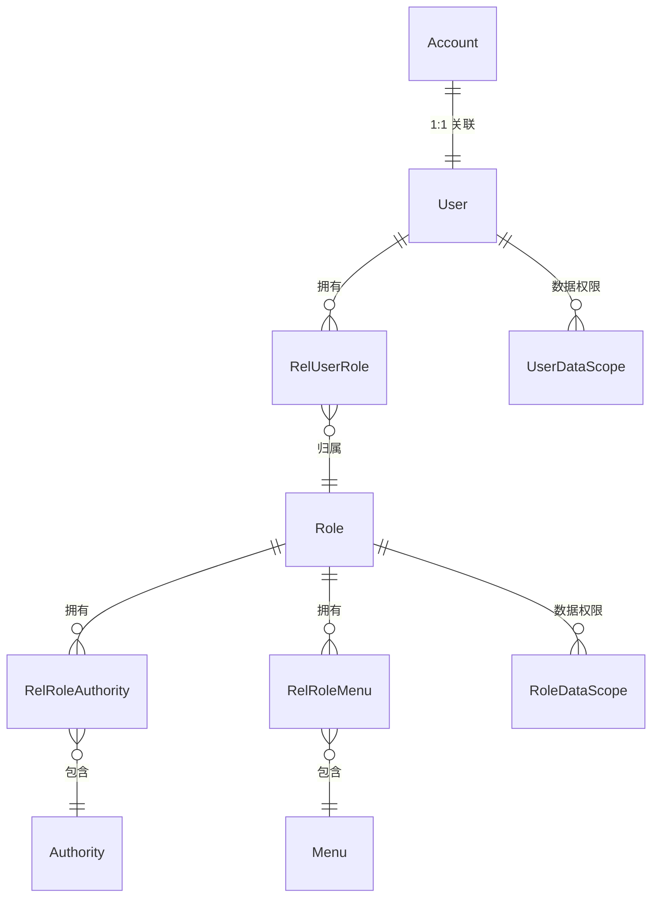
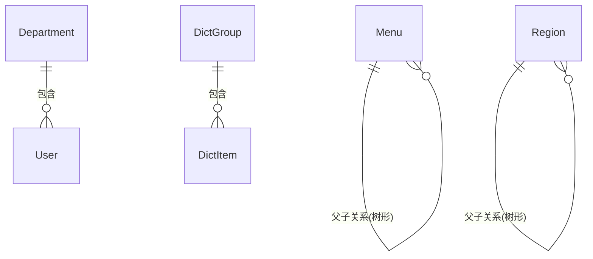
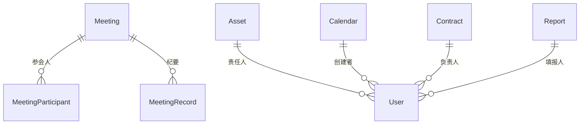
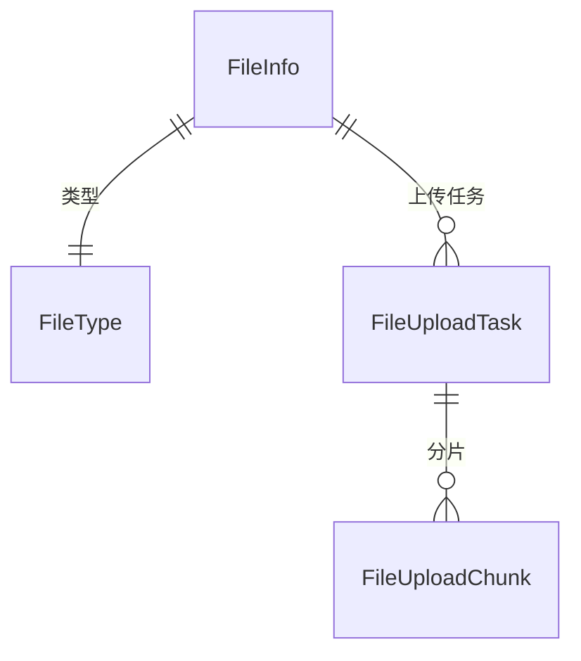
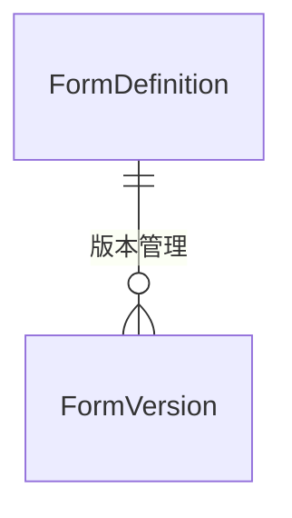

---
tags:
  - database
  - domain
---

# ER 图 — 实体关系总览

> spectra-admin 全部 27 个 Entity 的关系模型。

## 核心域（用户权限）

## 系统管理域

## OA 域

## 文件上传域

## 工作流域

## 完全实体列表（按模块）

### 公共基类
- `BaseEntity` — UUID/审计/软删除/乐观锁

### spectra-core
- `Account` — 认证账户
- `User` — 用户信息
- `Role` — 角色
- `Authority` — 权限
- `RelUserRole` — 用户-角色关联
- `RelRoleAuthority` — 角色-权限关联
- `RelRoleMenu` — 角色-菜单关联
- `RoleDataScope` — 角色数据权限
- `UserDataScope` — 用户数据权限
- `Department` — 部门
- `Menu` — 菜单
- `Region` — 区域
- `DictGroup` — 字典分组
- `DictItem` — 字典项
- `Configured` — 配置表
- `SysConfig` — 系统参数
- `OperationLog` — 操作日志

### spectra-oa
- `Asset` — 资产
- `Attendance` — 考勤
- `Calendar` — 日历
- `Contact` — 通讯录
- `Contract` — 合同
- `Document` — 文档
- `Meeting` — 会议
- `MeetingParticipant` — 参会人
- `MeetingRecord` — 会议纪要
- `Notice` — 公告
- `Report` — 报表

### spectra-upload
- `FileInfo` — 文件信息
- `FileType` — 文件类型
- `FileUploadTask` — 上传任务
- `FileUploadChunk` — 分片记录

### spectra-ai
- `AiSession` — AI 会话

### spectra-workflow
- `FormDefinition` — 表单定义
- `FormVersion` — 表单版本

## 相关笔记

- [[20-实体清单]] — 每个 Entity 的字段详情
- [[20-用户与权限]] — 用户权限域详解
- [[30-系统管理]] — 系统管理域详解
- [[40-OA模块]] — OA 域详解
- [[50-文件上传]] — 上传域详解
- [[60-工作流]] — 工作流域详解
- [[70-AI模块]] — AI 域详解
