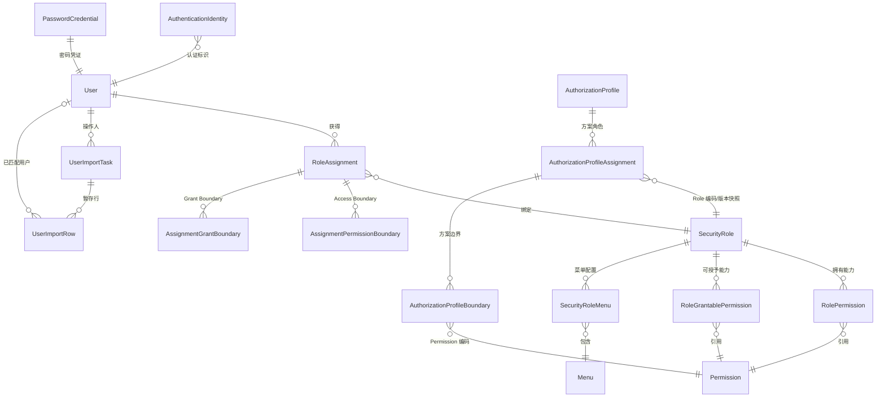
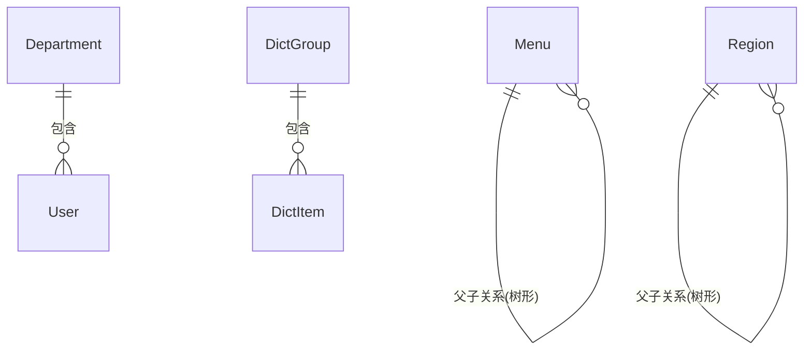
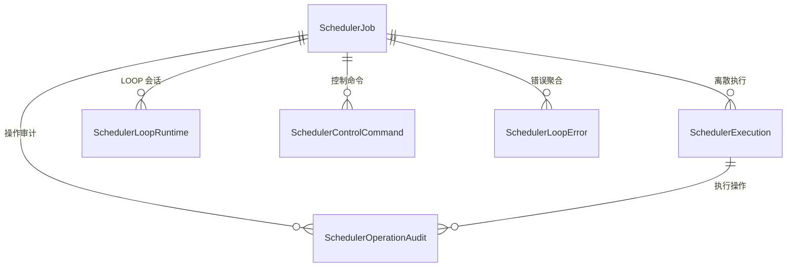
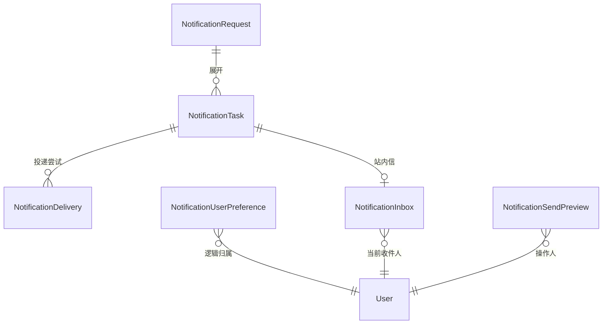
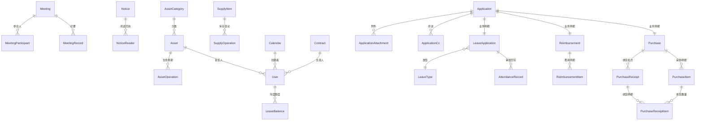
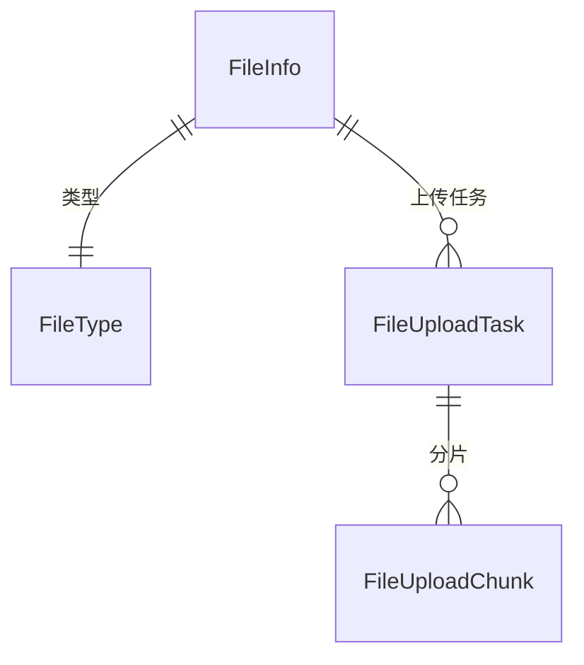
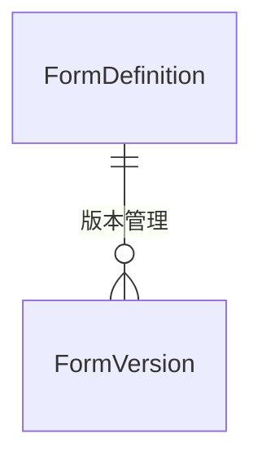

---
tags:
  - database
  - domain
---

# ER 图 — 实体关系总览

> spectra-admin 全部 86 个 Entity 的关系模型。

## 核心域（用户权限）

```mermaid
erDiagram
    AuthenticationIdentity }o--|| User : "认证标识"
    PasswordCredential ||--|| User : "密码凭证"
    User ||--o{ RoleAssignment : "获得"
    RoleAssignment }o--|| SecurityRole : "绑定"
    SecurityRole ||--o{ RolePermission : "拥有能力"
    RolePermission }o--|| Permission : "引用"
    SecurityRole ||--o{ RoleGrantablePermission : "可授予能力"
    RoleGrantablePermission }o--|| Permission : "引用"
    RoleAssignment ||--o{ AssignmentPermissionBoundary : "Access Boundary"
    RoleAssignment ||--o{ AssignmentGrantBoundary : "Grant Boundary"
    AuthorizationProfile ||--o{ AuthorizationProfileAssignment : "方案角色"
    AuthorizationProfileAssignment }o--|| SecurityRole : "Role 编码/版本快照"
    AuthorizationProfileAssignment ||--o{ AuthorizationProfileBoundary : "方案边界"
    AuthorizationProfileBoundary }o--|| Permission : "Permission 编码"
    User ||--o{ UserImportTask : "操作人"
    UserImportTask ||--o{ UserImportRow : "暂存行"
    UserImportRow }o--o| User : "已匹配用户"
    SecurityRole ||--o{ SecurityRoleMenu : "菜单配置"
    SecurityRoleMenu }o--|| Menu : "包含"
```

## 系统管理域

```mermaid
erDiagram
    Department ||--o{ User : "包含"
    Menu ||--o{ Menu : "父子关系(树形)"
    Region ||--o{ Region : "父子关系(树形)"
    DictGroup ||--o{ DictItem : "包含"
```

## 单体调度域

```mermaid
erDiagram
    SchedulerJob ||--o{ SchedulerExecution : "离散执行"
    SchedulerJob ||--o{ SchedulerLoopRuntime : "LOOP 会话"
    SchedulerJob ||--o{ SchedulerControlCommand : "控制命令"
    SchedulerJob ||--o{ SchedulerLoopError : "错误聚合"
    SchedulerJob ||--o{ SchedulerOperationAudit : "操作审计"
    SchedulerExecution ||--o{ SchedulerOperationAudit : "执行操作"
```

调度操作审计统一记录 OPS/SYSTEM 任务的管理操作，并与 `scheduler_control_command` 的 LOOP 控制命令记录合并展示；`scheduler_control_command` 仍然是 LOOP 控制事实表，不被操作审计表替代。

## 统一通知域

```mermaid
erDiagram
    NotificationRequest ||--o{ NotificationTask : "展开"
    NotificationTask ||--o{ NotificationDelivery : "投递尝试"
    NotificationTask ||--o| NotificationInbox : "站内信"
    NotificationUserPreference }o--|| User : "逻辑归属"
    NotificationInbox }o--|| User : "当前收件人"
    NotificationSendPreview }o--|| User : "操作人"
```

通知表不建立跨 schema 外键；用户、业务对象和跳转链接均为逻辑引用。消息中心必须按当前收件人过滤，不能使用角色数据范围扩大可见性。

## OA 域

```mermaid
erDiagram
    Meeting ||--o{ MeetingParticipant : "参会人"
    Meeting ||--o{ MeetingRecord : "纪要"
    Notice ||--o{ NoticeReader : "阅读回执"
    AssetCategory ||--o{ Asset : "分类"
    Asset ||--o{ AssetOperation : "生命周期"
    SupplyItem ||--o{ SupplyOperation : "库存变动"
    Asset ||--o{ User : "责任人"
    Calendar ||--o{ User : "创建者"
    Contract ||--o{ User : "负责人"
    Application ||--o{ ApplicationAttachment : "附件"
    Application ||--o{ ApplicationCc : "抄送"
    Application ||--|| LeaveApplication : "业务明细"
    LeaveApplication }o--|| LeaveType : "类型"
    LeaveApplication ||--o{ AttendanceRecord : "审批回写"
    User ||--o{ LeaveBalance : "年度额度"
    Application ||--|| Reimbursement : "业务明细"
    Reimbursement ||--o{ ReimbursementItem : "费用明细"
    Application ||--|| Purchase : "业务明细"
    Purchase ||--o{ PurchaseItem : "采购明细"
    Purchase ||--o{ PurchaseReceipt : "收货批次"
    PurchaseReceipt ||--o{ PurchaseReceiptItem : "收货明细"
    PurchaseItem ||--o{ PurchaseReceiptItem : "收货数量"
```

## 文件上传域

```mermaid
erDiagram
    FileInfo ||--|| FileType : "类型"
    FileInfo ||--o{ FileUploadTask : "上传任务"
    FileUploadTask ||--o{ FileUploadChunk : "分片"
```

## 工作流域

```mermaid
erDiagram
    FormDefinition ||--o{ FormVersion : "版本管理"
```

## 完全实体列表（按模块）

### 公共基类
- `BaseEntity` — UUID/审计/软删除/乐观锁

### spectra-core
- `AuthenticationIdentity` — 认证身份摘要
- `PasswordCredential` — 密码凭证
- `User` — 用户信息
- `SecurityRole` — 目标角色目录
- `Permission` — Permission Catalog
- `RoleAssignment` — 用户角色授权分配
- `RolePermission` — 角色能力
- `RoleGrantablePermission` — 可授予能力
- `AssignmentPermissionBoundary` — Access Boundary
- `AssignmentGrantBoundary` — Grant Boundary
- `AuthorizationScope` — 授权范围
- `ScopeRule` — 组织范围规则
- `AuthorizationProfile` — 可复用授权方案
- `AuthorizationProfileAssignment` — 方案中的 Role 版本快照
- `AuthorizationProfileBoundary` — 方案中的 Permission Boundary
- `UserImportTask` — 用户批量导入任务
- `UserImportRow` — 用户批量导入暂存行和校验结果
- `SecurityRoleMenu` — 角色菜单 UX 关系
- `MfaEnrollment` — MFA enrollment
- `TotpCredential` — TOTP 凭证
- `RecoveryCode` — Recovery Code
- `Department` — 部门
- `OrganizationVersion` — 组织版本
- `Menu` — 菜单
- `Region` — 区域
- `DictGroup` — 字典分组
- `DictItem` — 字典项
- `Configured` — 配置表
- `SysConfig` — 系统参数
- `OperationLog` — 操作日志
- `SchedulerJob` — 调度任务定义和策略
- `SchedulerExecution` — 离散任务执行、租约和结果
- `SchedulerLoopRuntime` — LOOP 运行会话和心跳
- `SchedulerControlCommand` — LOOP 控制命令事实记录
- `SchedulerLoopError` — LOOP 错误聚合
- `SchedulerOperationAudit` — OPS/SYSTEM 调度操作审计

### spectra-notification
- `NotificationTemplate` — 通知模板版本
- `NotificationRequest` — 逻辑通知请求
- `NotificationTask` — 接收人和渠道任务
- `NotificationDelivery` — 渠道投递尝试
- `NotificationInbox` — 站内消息
- `NotificationUserPreference` — 用户通知偏好
- `NotificationSendPreview` — 受控发送短时 Preview 快照

### spectra-oa
- `Asset` — 资产
- `AssetCategory` — 资产分类
- `AssetOperation` — 资产生命周期操作
- `SupplyItem` — 办公用品 SKU 与库存台账
- `SupplyOperation` — 入库、领用、退库和调整流水
- `Calendar` — 日历
- `Contract` — 合同
- `Document` — 文档
- `Meeting` — 会议
- `MeetingParticipant` — 参会人
- `MeetingRecord` — 会议纪要
- `Notice` — 公告
- `NoticeReader` — 公告阅读回执
- `Application` — 通用申请主表
- `ApplicationType` — 申请类型配置
- `ApplicationAttachment` — 申请附件
- `ApplicationCc` — 申请抄送
- `LeaveType` — 请假类型
- `LeaveApplication` — 请假业务明细
- `LeaveBalance` — 请假年度额度
- `AttendanceRecord` — 请假审批回写的考勤记录
- `Reimbursement` — 费用报销主单
- `ReimbursementItem` — 费用报销明细
- `Purchase` — 采购申请主单与执行状态
- `PurchaseItem` — 物品/服务采购明细
- `PurchaseReceipt` — 分批收货记录
- `PurchaseReceiptItem` — 收货数量与验收差异

### spectra-upload
- `FileInfo` — 文件信息
- `FileType` — 文件类型
- `FileUploadTask` — 上传任务
- `FileUploadChunk` — 分片记录

### spectra-workflow
- `FormDefinition` — 表单定义
- `FormVersion` — 表单版本

## 相关笔记

- [[20-实体清单]] — 每个 Entity 的字段详情
- [[20-用户与权限]] — 用户权限域详解
- [[30-系统管理]] — 系统管理域详解
- [[40-OA模块]] — OA 域详解
- [[50-文件上传]] — 上传域详解
- [[60-工作流]] — 工作流域详解
