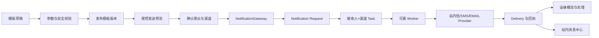

---
tags:
  - plan
  - notification
  - backend
  - frontend
  - operations
  - integration
created: 2026-08-23
updated: 2026-08-23
---

# P-通知中心运维管理与外部渠道接入计划

## 状态

**规划中（跨前后端完整闭环，阶段二进行中；模板后端追溯闭环已完成）**

> 本计划承接已完成的 `P-统一通知模块建设计划`，不重新建设用户消息 Self API、站内信基础投递或既有业务调用迁移。
>
> 适用范围：`spectra-admin`、`spectra-ui`、`spectra_notification` Schema、通知权限/菜单、模板、受控发送和短信/邮件 Provider。
>
> 核心约束：模板、受众、发送、渠道、投递状态和运维页面必须端到端联通；任何只有后端 API、只有占位页面、只能写入数据库但不能展示结果的实现，都不能视为阶段完成。

## 一、背景与现状

统一通知模块 V1 已完成并作为稳定基线：独立 Maven 模块、`NotificationGateway`、Request/Task/Delivery、PostgreSQL Worker、站内信、消息 Self API、用户偏好、数据隔离、验证码安全契约、管理端脱敏 API、真实 HTTP/浏览器回归均已收口。

当前仍存在两个产品断点：

1. `SMS`、`EMAIL` 已接入 Provider 配置、通用 HTTP JSON 适配器、健康门禁和受确认保护的测试发送，但尚未完成具体供应商、回执和未知结果处理。
2. 还没有受控发送流程：运维人员不能从模板开始选择受众、预览实际接收人和渠道、确认发送，再回到 Request/Task/Delivery 观察结果。

## 二、目标

本计划完成后，通知中心应形成以下闭环：



目标分为五层：

1. **模板闭环**：模板草稿、校验、预览、发布版本、停用、回滚和在途任务版本快照完整可用。
2. **运维闭环**：通知运行概览、Request、Task、Delivery、渠道状态、失败重试和取消均有真实 Web 页面。
3. **受控发送闭环**：运维人员只能在权限和数据范围允许的受众内预览、确认和发送，所有发送均进入统一 Gateway 和可靠任务流。
4. **外部渠道闭环**：短信/邮件 Provider 可配置、可健康检查、可投递、可记录回执；失败、超时和未知结果不能伪装成功或无条件重试。
5. **安全与验收闭环**：权限、审计、敏感配置、用户隔离、浏览器验收、真实 HTTP、Provider Mock 和必要的真实沙箱验收全部完成。

## 三、明确不做的事情

- 不重写已完成的 `/notification/**` Self API、用户偏好和站内信列表交互。
- 不开放普通用户任意向任意用户发送站内信；受控发送必须经过权限、受众和频控边界。
- 不把 AccessKey、Secret、SMTP 密码、签名或供应商模板 ID 写入仓库、日志、数据库明文或 API 响应。
- 不引入 Kafka、RabbitMQ 或独立消息平台；继续使用现有 PostgreSQL Outbox Worker，除非后续单独立项。
- 不以日志、调试接口、固定验证码或“已入队”伪装为外部渠道发送成功。
- 不在正式运维菜单中保留本计划范围内的空白占位页作为最终交付。
- 不把营销自动化、群发活动、用户画像和复杂编排混入本计划。
- WebSocket/SSE 实时推送不是本计划的完成条件；运维页面首版通过轮询和手动刷新展示真实状态。

## 四、当前能力基线

| 能力 | 后端现状 | 前端现状 | 本计划处理方式 |
|---|---|---|---|
| 用户消息 Self API | 已完成，强制当前用户隔离 | 已完成 `/notification`、铃铛、抽屉、详情、偏好 | 保持兼容，补充回归，不重写 |
| Gateway / Worker | 已完成，支持幂等、重试、过期和取消 | 无需暴露内部实现 | 复用并补充受控发送入口 |
| Request / Task / Delivery 管理 API | 已完成脱敏查询、详情、渠道状态、重试、取消 | 概览、Request、Task、Delivery 均已接入真实页面 | 补齐跨页面钻取、轮询和实际发送闭环 |
| 模板实体与渲染 | 已完成四态生命周期、版本摘要、模板选择、参数校验和 Request/Task/Delivery 追溯快照 | 已接入模板管理页、复制、版本摘要和版本对比 | 与受控发送和外部渠道串联 |
| 受控发送 | 无完整预览/确认闭环 | 无发送页 | 新增 Preview/Confirm/Apply 全流程 |
| `IN_APP` | 真实可用 | 已接入 | 保持基线 |
| `SMS` / `EMAIL` | 已接入 Provider SPI、配置、通用 HTTP JSON 适配器和健康门禁；具体供应商投递仍默认阻断 | 已接入渠道配置和健康检查页，发送结果仍在 Delivery 运维页观察 | 接入具体供应商、测试发送、回执、失败/UNKNOWN 处理和受控发送 |
| 指标/健康检查/清理 | 已有低基数指标、健康检查、敏感密文清理 | 已接入通知运行概览、渠道状态、趋势和脱敏错误 | 与实际发送和 Provider 结果串联 |
| 权限/审计 | Self、Audit、DevOps 边界已存在 | 运维路由和菜单已有骨架 | 收敛细粒度权限和操作审计 |

## 五、总体设计原则

### 5.1 以 Request/Task/Delivery 为唯一事实链

模板管理和受控发送不得直接写 `ntf_inbox_message`，必须通过 `NotificationGateway` 生成 Request，再按“接收人 × 渠道”展开 Task，由 Worker 产生 Delivery。站内收件箱只是 `IN_APP` 投递结果，不是发送入口。

### 5.2 模板必须版本化且锁定快照

- 草稿不能被发送。
- 每次发布生成不可变版本，模板编辑不修改已发布版本。
- Request/Task 必须保存模板版本和渲染快照，在途任务不受后续模板编辑影响。
- 预览、发送和回执都要能追溯到模板版本、操作人、受众摘要和幂等键。
- 模板变量只允许声明式白名单，不执行 SpEL、脚本或任意表达式。

### 5.3 受众预览必须先于发送

受控发送的 Preview 阶段只返回脱敏统计和必要的逐条预览，不直接派发 Task。后端必须重新执行当前操作人的数据范围、角色授权、部门边界、用户状态、渠道可用性和模板参数校验；前端不能凭本地勾选结果代替后端 Preview。

### 5.4 外部渠道必须 fail-closed

- 未配置 Provider、Provider 健康检查失败、密钥不可解密、地址无效或供应商返回未知结果时，任务必须明确为 `BLOCKED` 或 `UNKNOWN`，不得写入 `SENT`。
- 自动重试必须按错误类型、最大次数、退避和幂等策略执行；`UNKNOWN` 默认禁止无条件重试。
- Provider 配置启用必须同时满足模块开关、配置完整、密钥可解密和健康检查通过。
- 外部渠道默认关闭，真实配置只能来自本机/部署环境的受保护配置，不进入 Git。

### 5.5 前后端同批次交付

每个功能批次必须同时具备：数据库迁移、后端 API/权限、前端页面/状态、审计与测试、文档同步。后端接口完成但前端仍为 Placeholder，只能算“后端阶段完成”，不能算本计划完成。

## 六、权限、菜单与安全契约

### 6.1 权限建议

沿用现有 `notification:admin:*` 命名空间，并补充以下细粒度权限：

| 权限 | 作用 | 默认角色 |
|---|---|---|
| `notification:admin:read` | 概览、渠道状态、Request/Task/Delivery 查询 | `ROLE_DEV_OPS`、`ROLE_AUDIT`（脱敏只读） |
| `notification:template:read` | 查询模板和版本 | `ROLE_DEV_OPS`、`ROLE_AUDIT`（只读） |
| `notification:template:write` | 创建、编辑、停用草稿 | `ROLE_DEV_OPS` |
| `notification:template:publish` | 发布、回滚模板版本 | `ROLE_DEV_OPS` |
| `notification:send:preview` | 受控发送预览 | `ROLE_DEV_OPS` |
| `notification:send:apply` | 确认并发起受控发送 | `ROLE_DEV_OPS` |
| `notification:provider:read` | 查看渠道状态和脱敏配置摘要 | `ROLE_DEV_OPS`、`ROLE_AUDIT`（只读） |
| `notification:provider:configure` | 保存、启停和测试 Provider | `ROLE_DEV_OPS` |
| `notification:admin:retry` | 重试允许重试的失败任务 | `ROLE_DEV_OPS` |
| `notification:admin:cancel` | 取消未完成任务 | `ROLE_DEV_OPS` |

`ROLE_AUDIT` 永远不能读取原始地址、密文、Provider Secret 或执行重试、取消、配置、发布和发送。菜单隐藏不是安全边界，所有接口继续使用 `@PreAuthorize` 和服务层边界校验。

### 6.2 菜单目标

```text
运维管理 / 通知中心
├─ 通知运行概览
├─ 通知请求
├─ 投递任务
├─ 投递记录
├─ 模板管理
├─ 受控发送
└─ 渠道配置
```

只有真实页面和真实接口联通后，叶子菜单才可从 Placeholder 迁移为正式能力。`ROLE_DEV_OPS` 继续使用隐式全菜单契约，普通角色和审计员只获得明确授权的只读入口。

## 七、阶段计划

### 阶段一：冻结基线与端到端契约

目标：在写代码前固定模板、Provider、受众预览、状态和权限契约，避免后端和前端各自定义一套模型。

- [x] 对照 `NotificationAdminController`、`NotificationAdminService`、实体和当前 `devops.ts` 路由建立差距清单。
  - 后端当前已提供渠道状态、Request 分页、Task 分页、Delivery 分页、Task 重试和 Task 取消 6 类管理能力；对应入口为 `NotificationAdminController` 与 `NotificationAdminService`。
  - `NotificationTemplateEntity`、模板渲染、`NotificationRequestEntity`、`NotificationTaskEntity` 和 `NotificationDeliveryEntity` 已存在；模板管理、通知运行概览和 Provider 配置/健康/测试发送 API 已接入，受控发送 Preview/Apply 仍待落地。
  - Web `devops.ts` 中 `DevopsNotificationOverview`、`DevopsNotificationRequest`、`DevopsNotificationDeliveryTask`、`DevopsNotificationDeliveryRecord` 已接入真实页面；`DevopsNotificationTemplate` 已接入真实模板管理页；用户消息 Self API 和 `NotificationBell` 不属于本次缺口。
  - 当前管理权限覆盖 `notification:admin:read`、`notification:admin:retry`、`notification:admin:cancel`、`notification:template:read/write/publish` 和 `notification:provider:read/configure`；受控发送的细粒度权限仍待落地。

#### 阶段一实施记录

| 日期 | 步骤 | 结论 |
|---|---|---|
| 2026-08-23 | 基线盘点 | 后端可靠投递和基础管理 API 可复用；模板管理、Provider 接入、受控发送、运行概览及 4 个 Web 运维页面需要从契约到验收完整建设。 |
| 2026-08-23 | 契约冻结 | 模板直接采用最终生命周期和版本 API；Provider、受控发送、管理分页与权限均以本节契约为唯一实现依据，不保留旧入口或兼容字段。 |
| 2026-08-23 | 模板后端核心 | `spectra-admin` 已落地模板四态、草稿 CRUD、发布/停用/归档、版本历史、回滚草稿、预览校验和模板权限接口；模板管理 API 与菜单权限种子已收口。 |
| 2026-08-23 | 模板权限与菜单 | 已通过 `V23__seed_notification_template_permissions_and_menu.sql` 固化模板查看、维护、发布/回滚权限，并将“模板管理”接入通知中心菜单；`ROLE_DEV_OPS` 拥有完整权限，`ROLE_AUDIT` 仅拥有查看权限。 |
| 2026-08-23 | 模板 Web 页面 | `spectra-ui` 已接入 `/devops/notification/template` 真实路由和模板管理 API，完成列表筛选、草稿编辑、JSON 参数校验、预览、发布、停用、归档、版本历史、复制、版本摘要和版本对比交互。 |
| 2026-08-23 | 模板版本追溯 | `spectra-admin` 已通过 V24 完成模板版本摘要、Request 渠道模板快照、Task/Delivery 版本字段和渲染快照；模板复制已提供独立 API，V22-V24 已在本机 PostgreSQL 正式执行，9 项真实 PostgreSQL 集成测试通过。 |
| 2026-08-23 | 模板 Web 复制与摘要 | `spectra-ui` 已接入独立复制草稿 API，并在列表和版本历史中展示截断后的版本摘要。 |
| 2026-08-23 | 模板 Web 版本对比 | `spectra-ui` 版本历史已支持选择两个版本并并列查看摘要、用途、标题模板和正文模板。 |
| 2026-08-23 | 通知运行概览后端 | `GET /notification/admin/overview` 已接入真实 PostgreSQL 聚合，支持 1–168 小时窗口、渠道可用性、队列/失败/UNKNOWN 摘要、连续小时趋势和脱敏最近错误；Mapper 同步补齐模板快照与投递渲染快照字段映射。 |
| 2026-08-23 | 通知运行概览 Web 页面 | `DevopsNotificationOverview` 已替换 Placeholder，接入真实概览 API，支持窗口选择、自动刷新、指标卡、渠道状态、投递趋势和脱敏错误展示；Request/Task/Delivery 页面均已接入。 |
| 2026-08-23 | Request 运维链路 | Request/Task/Delivery 管理查询统一默认最近 31 天，显式范围不得超过 31 天；Request 精确详情和关联 Task 查询不受默认窗口影响；`DevopsNotificationRequest` 已接入真实列表、详情摘要和关联 Task 展示。 |
| 2026-08-23 | Task 运维链路 | 新增 Task 脱敏详情接口，`DevopsNotificationDeliveryTask` 已接入真实分页、状态/渠道/用途/Request/收件用户/时间筛选、任务详情、供应商投递记录、权限保护的重试与取消；Task 精确关联查询不受默认时间窗口影响。 |
| 2026-08-23 | Delivery 运维链路 | 投递分页改为任务联表查询，支持渠道、Request、Task、收件用户、状态和 31 天时间范围筛选；新增脱敏 Delivery 详情，`DevopsNotificationDeliveryRecord` 已接入真实列表、供应商回执、脱敏错误详情和权限保护的详情查询。 |
- [x] 固定模板生命周期：`DRAFT`、`PUBLISHED`、`DISABLED`、`ARCHIVED`，明确发布和回滚规则。
  - `DRAFT` 只能编辑和预览；`PUBLISHED` 只能被发送和查看；`DISABLED` 不参与发送但保留历史；`ARCHIVED` 只读保存。
  - 发布只能从草稿生成不可变版本；停用作用于已发布版本；回滚通过指定历史版本创建新的草稿，不修改历史版本。
  - 模板接口统一使用 `/notification/admin/templates`，创建、编辑、发布、停用、归档和回滚均使用最终路由，不保留别名。
- [x] 固定 Provider 状态：`NOT_CONFIGURED`、`DISABLED`、`HEALTHY`、`UNHEALTHY`、`BLOCKED`，明确任务状态与渠道状态的映射。
- [x] 固定受控发送三阶段：Preview、Confirm、Apply；Preview Token、请求摘要、模板版本和过期时间必须绑定。
  - Preview 只返回脱敏受众统计、样例、跳过原因和请求摘要；Confirm 只确认当前 Preview；Apply 只调用 `NotificationGateway`。
  - Preview Token 默认 10 分钟有效且只能 Apply 一次；模板版本、渠道、参数摘要、受众摘要、操作权限或幂等键变化时必须拒绝 Apply。
- [x] 固定 Request/Task/Delivery 对前端的脱敏字段、分页、过滤、时间范围和轮询协议。
  - 分页统一返回 `records/current/size/total/pages`；管理查询时间范围最多 31 天；前端每 5 秒轮询，进入终态或连续失败 3 次后停止。
  - 管理 VO 不返回原始地址、密文、Secret、完整敏感参数、异常堆栈或未经脱敏的 Provider 响应。
- [x] 固定权限、菜单、审计事件和 `ROLE_AUDIT` 只读边界。
- [x] 固定 Provider Secret 的存储、解密、轮换和响应脱敏方案；不在仓库保存任何真实凭据。

#### 阶段一最终契约

| 对象 | 最终字段/状态 | 约束 |
|---|---|---|
| 模板 | `id`、`templateGroupCode`、`channel`、`purpose`、`versionNo`、`state`、`titleTemplate`、`contentTemplate`、`htmlTemplate`、`parameterSchema`、`providerTemplateCode`、`versionDigest`、`version` | `state` 为四态枚举；已发布版本不可编辑；变量只能使用 `{{name}}` 占位符；HTML 模板拒绝脚本、事件属性和 `javascript:`；版本摘要用于不可变追溯。 |
| 模板 API | `GET/POST/PUT /notification/admin/templates`、`GET /{id}`、`POST /{id}/copy`、`POST /{id}/publish`、`POST /{id}/disable`、`POST /{id}/archive`、`GET /{id}/versions`、`POST /{id}/rollback`、`POST /preview` | 写操作按状态和乐观锁校验；复制和回滚均创建独立草稿；所有操作写审计；预览不落库收件人和敏感参数。 |
| Provider | `NOT_CONFIGURED`、`DISABLED`、`HEALTHY`、`UNHEALTHY`、`BLOCKED` | 未配置、健康检查失败、密钥不可解密和未知结果均不得报告发送成功。 |
| 受控发送 | `Preview -> Confirm -> Apply` | Apply 必须绑定一次性 Token、模板版本、请求摘要、受众摘要、权限快照和幂等键，并统一进入 Gateway。 |
| 管理权限 | `notification:admin:read`、`notification:template:read/write/publish`、`notification:send:preview/apply`、`notification:provider:read/configure`、`notification:admin:retry/cancel` | `ROLE_AUDIT` 只读，不能发布、回滚、配置、重试、取消或发送。 |

阶段门禁：契约评审通过、API/TypeScript 类型表完成、菜单和权限清单一致后才能进入阶段二。以上契约已冻结，阶段二直接按最终模型实现。

### 阶段二：模板管理完整闭环

目标：让模板从创建到发布、发送、追溯和回滚完整可用。

#### 后端

- [x] 盘点现有 `NotificationTemplateEntity` 的用途、版本、状态、语言、渠道和变量字段；已通过 `V22__complete_notification_template_lifecycle.sql` 将模板状态收敛为四态，并移除旧的 `enabled` 字段。
- [x] 固化模板管理权限和通知中心“模板管理”菜单；`ROLE_DEV_OPS` 拥有完整维护权限，`ROLE_AUDIT` 仅可查看。
- [x] 实现模板列表、详情、草稿创建、编辑、复制、停用和归档 API。
- [x] 实现模板版本发布、版本列表、版本详情、回滚和乐观锁校验。
- [ ] 实现变量声明和模板校验：缺失变量、多余变量、非法占位符、HTML/URL 安全、用途/渠道不匹配均拒绝发布。
- [x] 实现模板预览 API，只允许使用脱敏的示例参数，不落库真实收件人和敏感载荷。
- [x] 发布时生成不可变版本摘要；Request/Task/Delivery 保存版本标识和渲染快照。
- [x] 增加模板操作审计：创建、修改、复制、发布、停用、归档、回滚、预览和失败原因均由管理 Controller 写入操作日志。

#### 前端

- [x] 新增 `/devops/notification/template` 模板列表页面，支持用途、渠道、状态、版本和更新时间查询。
- [x] 新增模板编辑页面，支持基本信息、用途/渠道限制、变量声明、标题/正文和安全校验提示。
- [x] 新增模板预览、发布确认、版本历史、回滚和停用交互。
- [x] 增加版本对比交互。
- [x] 接入独立复制 API 与版本摘要展示。
- [ ] 发布前展示校验结果和影响范围；草稿、已发布版本和停用版本的操作按钮按权限显示。
- [ ] 模板页面接入真实 API、局部 loading、错误恢复、乐观锁冲突提示和浏览器回归。

阶段门禁：一个真实模板能够创建、校验、发布、预览、用于发送、查看版本快照并回滚；没有模板 CRUD 页面和版本验收不得关闭阶段。

### 阶段三：Provider 与外部渠道闭环

目标：在不泄露凭据和不伪造成功的前提下接入短信/邮件供应商。

#### 后端

- [x] 定义 `NotificationProvider` SPI，隔离供应商 SDK、地址格式化、发送、查询回执和健康检查；通知 Worker 不直接依赖 HTTP 或供应商实现。
- [x] 实现 SMS/EMAIL 渠道 Sender 与通用 `HTTP_JSON` Provider 适配器；具体供应商通过配置选择，HTTP/供应商细节不绑定到 Gateway 或 Worker。
- [x] 设计 Provider 配置模型：供应商类型、启用状态、端点、超时、限流、重试、模板映射和加密 Secret 引用；SMS/EMAIL 非敏感配置写入 `spectra_core.sys_config` 的 `notification.provider.*`。
- [x] Secret 使用现有 AES-GCM 能力保存，API 只返回是否配置、Key ID、更新时间和脱敏摘要，不返回原文；Secret 密文单独存储在对应的 `.secret` 配置键中。
- [x] 增加 Provider 测试发送/健康检查；测试发送必须使用明确的测试地址和 `SEND_TEST` 操作确认，目标只在内存中加密使用，不从用户数据推导，也不写入业务 Request/Task/Delivery。
- [x] Delivery 已记录供应商消息 ID、标准化结果状态、完成时间和脱敏错误码；外部回执入口及重复回执幂等仍待接入。
- [ ] 处理成功、明确失败、限流、超时和未知结果；当前 Worker 对明确限流按任务最大尝试次数退避，对超时/UNKNOWN 写入 Delivery 后停止自动重试；UNKNOWN 的人工确认或受控重试入口仍待完成。
- [x] 保留测试 scope 的 Placeholder/Mock Sender，并由 Provider Runtime 对未配置、未健康或未注册 Provider 做 `BLOCKED` 安全回退，默认不报告成功。

#### 前端

- [x] 新增 `/devops/notification/provider` 渠道配置页面，按 SMS/EMAIL/IN_APP 分组展示状态。
- [x] 支持 Provider 类型、非敏感参数、Secret 更新、启停、健康检查和测试发送确认；测试发送结果只展示标准化状态、消息 ID 和脱敏摘要。
- [x] Secret 输入只允许覆盖更新，不回显原文；离开页面和刷新后不得保留明文。
- [x] 展示渠道健康、最近检查时间、队列积压、成功/失败/UNKNOWN 摘要和脱敏错误原因。
- [x] Provider 未配置或健康检查失败时，前端明确显示阻断状态，不展示“发送成功”。

阶段门禁：Provider 配置、健康检查、测试发送、真实/Mock 投递、回执、失败、超时、UNKNOWN 和重复回执均有后端测试和前端验收；没有真实沙箱或可重复 Mock 验收不得关闭阶段。

#### 阶段三实施记录

| 日期 | 步骤 | 结论 |
|---|---|---|
| 2026-08-23 | Provider 配置与 Secret 保护 | `spectra-admin` 已增加全局 SMS/EMAIL Provider 配置契约、脱敏管理 API、`notification:provider:read/configure` 权限和“渠道配置”菜单；非敏感配置写入 `spectra_core.sys_config`，Secret 使用通知模块 AES-GCM 密文和 Key ID 保存。配置完整但未健康检查前统一返回 `UNHEALTHY`，未配置或密钥缺失时返回 `NOT_CONFIGURED/BLOCKED`，不会报告发送成功。 |
| 2026-08-23 | Provider SPI 与 HTTP 适配器 | 已增加 `NotificationProvider` SPI、`HTTP_JSON` 通用适配器和本地 HTTP 沙箱测试；适配器负责地址解密、标准 JSON 请求、健康检查、供应商消息 ID提取和成功/失败/未知结果脱敏映射。SMS/EMAIL Sender、健康状态缓存、测试发送和回执闭环仍待接入，当前生产 Worker 继续使用安全阻断 Sender。 |
| 2026-08-23 | 渠道 Sender 与健康门禁 | 已接入 `SmsNotificationSender`、`EmailNotificationSender` 和 Provider Runtime；健康检查结果按配置更新时间缓存，配置变更自动失效，未通过健康检查的任务不会调用外部网络。新增 `POST /notification/admin/providers/{channel}/health`，测试发送接口已接入，回执和重试分类仍待完成。 |
| 2026-08-23 | Provider 测试发送 | 新增 `POST /notification/admin/providers/{channel}/test`；只接受 SMS/EMAIL、明确测试地址和 `SEND_TEST` 确认词，测试任务只在内存中组装并复用健康门禁，不写业务 Request/Task/Delivery，响应不回显地址或原始供应商响应。 |
| 2026-08-23 | Provider Web 页面 | `spectra-ui` 已接入 `/devops/notification/provider`，按 `IN_APP`、`SMS`、`EMAIL` 展示真实配置和渠道状态；外部渠道支持 Provider 类型、非敏感参数、启停、Secret 覆盖/清除、健康检查和确认后的测试发送，Secret 不回显。页面同时展示最近健康检查、队列积压、成功/失败/UNKNOWN 摘要，并对未配置、未健康和阻断状态明确告警；具体供应商回执仍待完成。 |
| 2026-08-23 | Delivery 结果与重试分类 | Worker 已为每次 Provider 结果写入 Delivery；明确 `PROVIDER_RATE_LIMITED` 按任务最大尝试次数退避，明确失败终止，Provider 异常和 `UNKNOWN` 写入 Delivery 后停止无条件重试。外部回执幂等和 UNKNOWN 人工确认/受控重试仍待完成。 |

### 阶段四：受控发送与受众预览闭环

目标：让运维人员可以安全地从模板发起通知，并能证明“发给了谁、走了什么渠道、结果是什么”。

#### 后端

- [ ] 新增受控发送 Preview API：接收模板版本、用途、受众条件、渠道和非敏感参数，返回脱敏统计、样例、冲突、跳过原因和预览有效期。
- [ ] 受众支持明确用户、部门/子部门、角色等范围，但每一种受众都必须经过当前操作人的数据范围和授权边界校验。
- [ ] Preview 生成请求摘要和短时一次性 Token；Apply 必须校验 Token、模板版本、请求摘要、当前权限和幂等键。
- [ ] Apply 只调用 `NotificationGateway`，禁止受控发送服务直接写 Request/Task/Inbox 表。
- [ ] 对发送规模、渠道数量、并发、频率、单用户重复通知和单次任务时长设置服务端上限。
- [ ] 记录受控发送审计：操作人、模板版本、受众摘要、渠道、规模、确认时间、幂等键和结果统计，不记录完整用户清单或敏感正文。

#### 前端

- [ ] 新增 `/devops/notification/send` 受控发送页面：选择模板版本、填写参数、选择受众、选择渠道。
- [ ] 分步展示基本信息、受众预览、渠道确认、最终确认和发送结果，Preview 前不允许 Apply。
- [ ] 展示新增/跳过/无地址/渠道不可用/超出边界等统计；受众和地址默认脱敏。
- [ ] Apply 后跳转或联动到 Request/Task 页面，轮询展示处理进度、成功、失败、跳过和 UNKNOWN。
- [ ] 处理刷新、重复点击、Preview 过期、权限变化、模板版本变化和网络失败，不重复派发任务。

阶段门禁：使用一个真实模板和一个真实测试受众完成 Preview → Confirm → Apply → Worker → Delivery → 页面结果查看；任一环节只能通过手工数据库操作都不能关闭阶段。

### 阶段五：通知运维页面与后端管理 API 完整接入

目标：把现有后端管理 API 和已有菜单骨架变成可用的运维工作台。

#### 后端

- [x] 补充通知运行概览 API：`GET /notification/admin/overview` 支持 1–168 小时窗口，返回渠道可用性、待处理/处理中数量、最早待处理时间、失败率、UNKNOWN 数量、脱敏最近错误和连续小时趋势。
- [x] 完善 Request/Task/Delivery 查询的时间范围上限、Request/Task/Delivery 详情摘要契约：普通管理查询默认最近 31 天且最大 31 天，按 Request/Task 精确 ID 关联查询不受默认窗口影响；详情均只返回脱敏摘要，Delivery 额外返回渠道、供应商回执和脱敏错误字段。
- [ ] 为重试、取消、Provider 测试、模板发布和受控发送补齐权限、幂等和审计。
- [ ] 确认管理端 VO 永不返回原始地址、Secret、验证码、敏感载荷、完整模板敏感参数或异常堆栈。
- [ ] 所有运维查询和写操作增加服务层权限边界测试，不能只依赖 Controller 注解。

#### 前端

- [x] 将 `DevopsNotificationOverview` 从 Placeholder 替换为真实运行概览页面：接入 24/72/168 小时窗口、自动刷新、队列/失败/UNKNOWN 指标、渠道状态、投递趋势和脱敏最近错误。
- [x] 将 `DevopsNotificationRequest` 替换为 Request 列表、详情和关联 Task 页面：支持状态、用途、来源模块、业务对象、时间范围筛选，展示脱敏详情和关联任务。
- [x] 将 `DevopsNotificationDeliveryTask` 替换为 Task 列表、状态/渠道/用途/关联 Request/收件用户筛选、权限保护的重试/取消和供应商投递详情页面。
- [x] 将 `DevopsNotificationDeliveryRecord` 替换为 Delivery 列表、渠道、供应商回执和脱敏错误详情页面。
- [ ] 统一使用真实 API、分页、时间范围、局部 loading、错误保留上一份数据和轮询退出条件。
- [ ] 菜单、面包屑、路由、按钮权限和后端权限保持一致；正式菜单不再指向 Placeholder。

阶段门禁：四个通知运维页面全部使用真实接口，能够从概览钻取到 Request、Task、Delivery，并执行经过权限保护的重试/取消；页面不依赖模拟数据。

### 阶段六：全链路安全、测试、文档与发布

- [ ] 增加模板生命周期、版本快照、变量校验和 HTML/URL 安全测试。
- [ ] 增加 Provider Mock 测试：成功、失败、限流、超时、UNKNOWN、重复回执、重复发送和密钥不可用。
- [ ] 增加受控发送 Preview/Apply 幂等、Token 过期、权限变化、数据范围、规模上限和审计测试。
- [ ] 增加 `ROLE_USER`、`ROLE_AUDIT`、`ROLE_ADMIN_SYSTEM`、`ROLE_DEV_OPS` 的 API/页面矩阵回归。
- [ ] 增加用户 A/B、部门边界、角色边界和受控发送目标隔离测试。
- [ ] 通过真实 PostgreSQL 迁移、事务、并发 Worker、Delivery 回执和敏感配置清理测试。
- [ ] 在真实 HTTP 登录、Token 刷新/登出和浏览器会话中完成模板、发送、运维查询和错误处理验收。
- [ ] 同步 `docs/10-后端/75-统一通知模块.md`、`docs/10-后端/90-API总览.md`、`docs/20-前端/10-spectra-ui.md`、实体字典、API 端点、配置清单、ER 图和 SQL。
- [ ] 运行前端格式、Lint、类型检查、测试、构建；运行后端 Spotless、测试和文档检查。
- [ ] 编写部署/回滚说明：Provider 默认关闭、配置校验失败阻断发送、数据库迁移可回滚边界和旧数据处理策略。

## 八、建议 API 与页面清单

以下路径是计划契约，实施阶段应先落 TypeScript/Java From/VO，再实现页面和 Controller；如现有路径更合理，必须在阶段一记录变更，不允许前后端各自漂移。

| 能力 | 后端建议路径 | Web 页面 |
|---|---|---|
| 模板列表/详情 | `GET /notification/admin/templates`、`GET /notification/admin/templates/{id}` | `/devops/notification/template` |
| 模板草稿 | `POST/PUT /notification/admin/templates` | 模板编辑页 |
| 模板版本 | `GET /notification/admin/templates/{id}/versions` | 版本历史/对比 |
| 发布/停用/回滚 | `POST /notification/admin/templates/{id}/publish` 等 | 发布确认/版本操作 |
| 模板预览 | `POST /notification/admin/templates/{id}/preview` | 预览面板 |
| Provider 状态/配置 | `GET/PUT /notification/admin/providers/{channel}` | `/devops/notification/provider` |
| Provider 健康/测试 | `POST /notification/admin/providers/{channel}/health`、`/test` | 渠道测试 |
| 受控发送预览 | `POST /notification/admin/send/preview` | `/devops/notification/send` |
| 受控发送应用 | `POST /notification/admin/send/apply` | 发送确认/结果 |
| 运行概览 | `GET /notification/admin/overview` | `/devops/notification/overview` |
| Request/Task/Delivery | 现有 `/notification/admin/requests`、`tasks`、`deliveries` | 对应运维页 |

## 九、数据模型与迁移要求

- [ ] 以现有 `ntf_template`、`ntf_request`、`ntf_task`、`ntf_delivery` 为基线，先核对当前字段再设计增量迁移。
- [ ] 如现有模板实体不足，新增不可变模板版本表或等价版本字段；禁止覆盖在途任务使用的模板快照。
- [ ] 如 Provider 配置需要落库，新增独立配置表或受控配置结构，Secret 只能保存密文和 Key ID，不能复用普通明文配置字段。
- [ ] 为外部回执和供应商消息 ID 增加唯一约束/索引，确保重复回调幂等。
- [ ] 受控发送 Preview 的短期数据必须具备过期时间和操作人绑定；不长期保存完整受众清单和敏感正文。
- [ ] 所有数据库变更使用新的 Flyway 增量迁移，已执行迁移不可改写；同步 ER 图、建表 SQL、实体清单和数据字典。
- [ ] 迁移失败时不启用 Provider、不生成半配置菜单，不影响现有 IN_APP Self API。

## 十、完成定义

本计划只有同时满足以下条件，才允许标记为完成：

- [ ] 模板能够创建、编辑、校验、预览、发布、停用、回滚，且版本快照可追溯。
- [ ] 受控发送能够完成 Preview、Confirm、Apply，并通过统一 Gateway 生成 Request/Task/Delivery。
- [ ] 受众预览、数据范围、角色边界、规模上限和幂等校验全部由后端执行。
- [ ] `IN_APP`、已接入的 SMS/EMAIL Provider 均有真实或可重复 Mock 的成功、失败、超时、UNKNOWN 和重复回执验收。
- [ ] Provider 未配置、Secret 不可用或健康检查失败时不会产生假成功。
- [ ] 通知运行概览、Request、Task、Delivery、模板、受控发送和渠道配置页面全部使用真实接口，不存在本计划范围内的 Placeholder 页面。
- [ ] `ROLE_AUDIT` 只能查看脱敏信息，`ROLE_DEV_OPS` 才能执行配置、发布、发送、重试和取消。
- [ ] 真实浏览器完成模板 → 预览 → 发送 → 投递 → 结果查看，以及失败/重试/取消/回执场景验收。
- [ ] 后端测试、前端测试、类型检查、构建、Spotless、文档检查和数据库迁移检查全部通过。
- [ ] 部署、Provider 配置、密钥轮换、关闭渠道、回滚和故障处置文档完成。

## 十一、风险与决策点

| 风险/决策 | 处理方式 |
|---|---|
| 供应商尚未确定 | 先完成 Provider SPI、Mock 和配置契约；真实 Provider 按部署选择，不把供应商绑定写死到 Gateway |
| 外部 Provider 返回 UNKNOWN | 进入 UNKNOWN 和人工确认/受控重试，不自动无条件重发验证码或普通通知 |
| 模板变更影响已发送消息 | Task 保存模板版本和渲染快照，已发布版本不可变 |
| 受控发送越权 | Preview 和 Apply 均重新执行权限、数据范围、版本和幂等校验 |
| Secret 泄露 | 密文存储、响应脱敏、日志清理、轮换和最小权限；禁止提交本机配置 |
| 后端和前端进度不一致 | 阶段门禁要求 API、页面、测试和文档同批次完成 |
| 运维页面依赖模拟数据 | 正式菜单迁移前必须完成真实接口接入；Placeholder 只能作为未启用路线 |
| 大规模发送拖垮 Worker | 预览规模上限、频控、并发限制、队列告警和可取消任务 |

## 十二、相关文档

- [[10-后端/75-统一通知模块]] — 已完成的通知后端 V1 基线
- [[20-前端/10-spectra-ui]] — 已完成的用户消息中心和运维前端规范
- [[10-后端/90-API总览]] — 现有 Self/Admin API
- [[10-后端/20-用户与权限]] — 角色、权限、数据范围和运维角色契约
- [[90-计划/spectra-admin/P-统一通知模块建设计划]] — 已完成的基础模块计划
