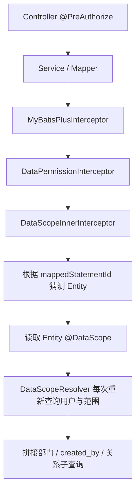
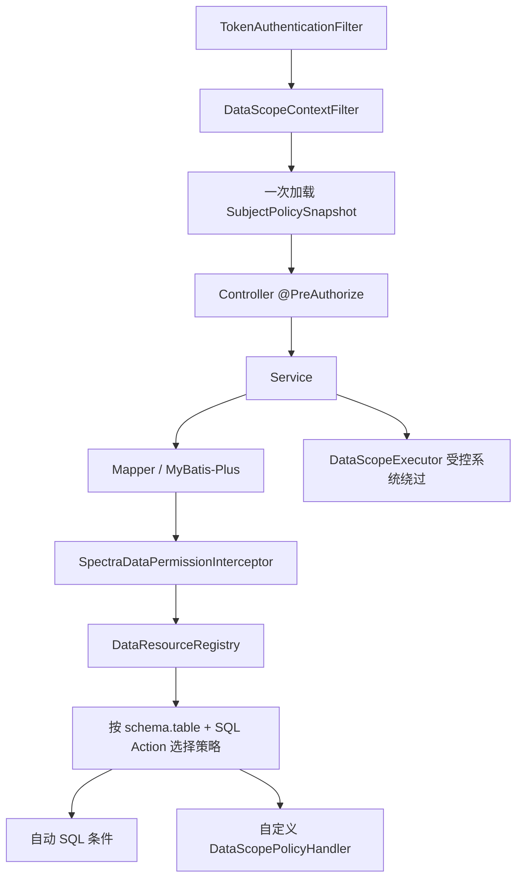

---
tags:
  - plan
  - backend
  - security
  - data-scope
  - mybatis-plus
created: 2026-08-01
---

# P-数据权限与数据隔离重构计划

## 状态

**执行中（P0/P1 安全基线已落地，统一策略表迁移待后续窗口）**

> 创建时间：2026-08-01
> 适用范围：`spectra-admin`，重点覆盖 `spectra-common`、`spectra-framework`、`spectra-security-*`、`spectra-core`、`spectra-oa`。
> 本计划替代当前“Entity 上 `@DataScope` + 每条 SQL 动态解析权限”的实现路线；迁移完成前保留兼容开关。

## 执行摘要

现有数据权限框架的方向正确：利用 MyBatis-Plus `DataPermissionInterceptor` 对 SELECT、UPDATE、DELETE 自动追加数据范围条件，避免在每个 Service 方法里重复编写部门、本人和关联关系条件。

但当前实现尚不具备可靠启用条件：

1. 开发库全部用户和角色均为 `GLOBAL`，实际过滤路径没有被运行数据验证。
2. 角色范围存在 `sys_role.scope` 与 `sys_role_data_scope` 两套数据源，写入与读取不一致。
3. 用户保存时无论是否显式配置范围，都会创建用户级范围，导致角色范围继承失效。
4. 空范围、无法解析 Entity、无登录上下文等场景会静默放行，违反安全边界的 fail-closed 原则。
5. `SELF` 固定使用 `created_by`，无法正确支持 `user_id` 等所有者字段。
6. 关系表缺少 schema，表别名未保留，JOIN/别名 SQL 存在错误或漏过滤风险。
7. INSERT 不受数据权限拦截，业务归属字段未统一由服务端填充。
8. READ 关系被无差别复用于 UPDATE/DELETE，可能把“可查看”错误扩大为“可修改”。
9. 每条受保护 SQL 都重新查询用户、范围和部门树，存在显著额外数据库开销。
10. 当前没有有效的数据权限单元测试或 PostgreSQL 集成测试。

本计划采用“**默认自动、特殊策略扩展、极少数受控绕过**”的架构：

- 普通 CRUD：由实体资源元数据和统一 SQL 拦截器自动处理。
- 特殊 JOIN/统计：由 Mapper 方法声明自定义策略 Bean，仍处于统一安全框架内。
- 系统任务/迁移：通过有权限校验、原因、审计和作用域恢复的执行器临时绕过。
- 禁止在普通业务代码中直接使用裸 `@InterceptorIgnore(dataPermission = "true")`。

## 本轮执行结果（2026-08-01）

已完成并通过模块编译/回归测试：

- `DataScopeInnerInterceptor`：空范围恒假、缺少用户/范围拒绝执行、保留 SQL 别名、支持 `ownerColumn`、关系表支持显式 schema。
- `DataScopeContextFilter` + `DataScopeContextHolder`：一次请求只解析一次 `EffectiveScope`，请求结束清理 ThreadLocal。
- `DataScopeEntityRegistry`：按 `@DataScope` 实体的真实表名注册元数据，XML/非标准 Mapper 无法因类名推导失败而绕过已声明资源。
- `DataScopeExecutor`：仅 `ROLE_DEV_OPS` 或 `*` 权限可以在 lambda 作用域内临时绕过隔离。
- 用户/角色范围：用户 `null` 表示继承角色；角色写入同步规范范围表；修正角色目标 UUID/整数类型、逻辑删除过滤、停用角色不再继承；`GLOBAL` 与空 `CUSTOM` 由服务层拒绝越权配置。
- OA 会议：服务端强制写入当前用户的发起人和部门归属，并加入事务与更新结果校验；关系表声明 `spectra_oa` schema。
- `MetaObjectHandlerImpl`：凡实体声明 `departmentId` 且未显式归属时，自动使用当前用户部门；数据范围异常统一映射为 HTTP 403。
- 回归测试：新增 `DataScopeIsolationTest`，覆盖请求上下文、绕过作用域、SELF 字段/别名、空 CUSTOM、关系 schema。
- 文档/SQL：同步 `docs/10-后端/25-数据权限设计.md`、`docs/sql/spectra_core/建表.sql`；活动范围唯一索引和目标查询索引已并入建表 SQL，历史库兼容回填已并入 `docs/sql/spectra_core/权限树与角色基线.sql`。

仍需在独立数据库变更窗口完成：资源策略表（`sys_data_scope_policy`）及 INSERT 写入策略的完整迁移、READ/WRITE 分动作关系策略、PostgreSQL 集成测试和旧 `sys_role.scope` 字段下线。上述内容保留在本计划后续阶段，不能以本轮兼容修复替代。

---

## 一、现状基线

### 1.1 当前代码链路



### 1.2 只读开发库核对结果

2026-08-01 使用 AGENTS.md 提供的只读数据库账号核对本地开发库，得到以下匿名汇总：

| 指标 | 结果 | 影响 |
|---|---:|---|
| 有效用户 | 4 | — |
| 用户级范围行 | 4 | 所有用户都有覆盖，不会继承角色 |
| 用户级 GLOBAL | 4 | 所有业务 SQL 实际不过滤 |
| 有效角色 | 4 | — |
| `sys_role.scope` 非空 | 4 | 当前角色编辑写入该字段 |
| `sys_role_data_scope` 有效行 | 0 | 当前解析器读取不到角色范围 |
| `search_path` | `"$user", public` | 未带 `spectra_oa` 的关系表无法解析 |

> 该数据仅代表本地开发库，不推断生产环境；但它说明当前开发验证不能证明非 GLOBAL 数据隔离正确。

### 1.3 已确认的代码问题

| 编号 | 严重度 | 问题 | 主要位置 |
|---|---|---|---|
| DS-01 | P0 | 角色范围双数据源，RoleService 写 `sys_role.scope`，Resolver 读独立表 | `RoleServiceImpl`、`DataScopeResolver` |
| DS-02 | P0 | 用户范围为空时强制保存 DEPT，角色继承无法表达 | `UserServiceImpl#updateUserScope` |
| DS-03 | P0 | 空 CUSTOM、解析失败等场景返回 null，形成 fail-open | `DataScopeInnerInterceptor` |
| DS-04 | P0 | SELF 忽略 `@DataScope.column`，`MeetingParticipant.user_id` 不生效 | `DataScopeInnerInterceptor` |
| DS-05 | P0 | 会议关系表未写 schema，非 GLOBAL 查询会失败 | `Meeting`、`MeetingRecord` |
| DS-06 | P0 | INSERT 不填充可信 departmentId，会议创建后可能不可见/不可更新 | `MeetingServiceImpl` |
| DS-07 | P0 | GLOBAL 可由普通 USER/ROLE 更新权限间接授予 | `UserController`、`RoleController`、对应 Service |
| DS-08 | P1 | READ 关系条件同时作用于 UPDATE/DELETE | MyBatis-Plus 数据权限链路 |
| DS-09 | P1 | 通过 Mapper 名称字符串猜测 Entity，失败后静默放行 | `resolveEntityClass` |
| DS-10 | P1 | 构造 Column 时丢弃 alias，多表查询不稳定 | `DataScopeInnerInterceptor` |
| DS-11 | P1 | 每张表、每条 SQL 都重新解析并访问数据库 | `DataScopeInnerInterceptor`、`DataScopeResolver` |
| DS-12 | P1 | RoleDataScopeTarget Java 类型与数据库 UUID/integer 不一致 | Entity、Mapper、数据库 |
| DS-13 | P1 | 范围 XML 查询未统一排除 deleted，唯一索引不能保证仅一个有效行 | Mapper XML、DDL |
| DS-14 | P1 | 禁用角色未从权限加载链路排除，授权变更后会话未统一失效 | `RelUserRoleServiceImpl` |
| DS-15 | P2 | 角色 4 个查询接口仅依赖全局 authenticated，无方法级权限 | `RoleController` |
| DS-16 | P2 | 开发/生产逻辑删除配置不一致，文档 SQL 与真实库漂移 | application yml、`docs/sql` |
| DS-17 | P0 | 无有效数据隔离测试 | 后端 test 目录 |

---

## 二、目标与非目标

### 2.1 修复目标

1. 形成一个数据权限策略的唯一事实来源，消除角色/用户双表双字段漂移。
2. 普通 Service/Mapper 方法不再手写数据范围条件。
3. SELECT、UPDATE、DELETE 默认自动过滤；INSERT 自动建立可信归属。
4. 数据范围解析失败、空范围或无上下文时默认拒绝，不允许静默全量放行。
5. 区分 READ、CREATE、UPDATE、DELETE，不把可见权限自动升级为写权限。
6. 支持本人、部门、部门树、自定义部门、全局，以及会议参与者等关系权限。
7. 支持多角色集合并集；用户可显式 REPLACE 或 AUGMENT 角色范围。
8. 支持资源级范围，例如会议和合同可以拥有不同数据策略。
9. 每个请求最多加载一次主体策略快照，避免每条 SQL 反复访问权限表。
10. 为特殊查询提供显式自定义策略，为系统任务提供严格受控的临时绕过。
11. 建立覆盖 SQL、数据库、接口和权限提升边界的测试矩阵。
12. 可灰度、可对比、可快速回滚到旧实现。

### 2.2 非目标

- 本计划不实现完整的通用 ABAC/规则脚本引擎。
- 本阶段不实现 DENY 规则；所有范围先按 ALLOW 集合并集处理。
- 本计划解决部门/所有者/业务关系数据权限，不等同于 SaaS 租户硬隔离。
- 若未来引入多租户，应单独增加不可为空的 `tenant_id`、TenantInterceptor，并评估 PostgreSQL RLS；不得复用 `department_id` 充当租户边界。
- 本阶段不要求一次性补全全部 OA 业务功能，只保证已存在和未来新增 CRUD 能正确接入数据权限框架。

---

## 三、核心设计决策

### 3.1 权限与数据范围分层

```text
功能权限：用户能否执行 OA_MEETING:UPDATE？       → @PreAuthorize
数据权限：用户能更新哪些具体 Meeting 行？        → Data Scope
业务校验：会议是否处于允许修改的状态？            → Service
```

三层必须同时通过。菜单权限不替代功能权限，功能权限不替代行级数据范围。

### 3.2 单一策略数据源

新增统一策略表：

```sql
CREATE TABLE spectra_core.sys_data_scope_policy (
    id            UUID PRIMARY KEY,
    subject_type  VARCHAR(16)  NOT NULL,
    subject_id    UUID         NOT NULL,
    resource_code VARCHAR(100) NOT NULL DEFAULT '*',
    effect_mode   VARCHAR(16)  NOT NULL DEFAULT 'REPLACE',
    scope_type    INTEGER      NOT NULL,
    created_by    UUID,
    created_at    TIMESTAMPTZ  NOT NULL,
    updated_by    UUID,
    updated_at    TIMESTAMPTZ  NOT NULL,
    deleted       TIMESTAMPTZ,
    version       BIGINT       DEFAULT 0,
    CONSTRAINT ck_data_scope_subject
        CHECK (subject_type IN ('USER', 'ROLE')),
    CONSTRAINT ck_data_scope_effect
        CHECK (effect_mode IN ('REPLACE', 'AUGMENT')),
    CONSTRAINT ck_data_scope_type
        CHECK (scope_type IN (0, 1, 2, 3, 4))
);

CREATE UNIQUE INDEX uk_data_scope_policy_active
    ON spectra_core.sys_data_scope_policy
       (subject_type, subject_id, resource_code)
    WHERE deleted IS NULL;

CREATE INDEX idx_data_scope_policy_subject
    ON spectra_core.sys_data_scope_policy
       (subject_type, subject_id)
    WHERE deleted IS NULL;
```

目标表：

```sql
CREATE TABLE spectra_core.sys_data_scope_target (
    id          UUID PRIMARY KEY,
    policy_id   UUID        NOT NULL,
    target_type VARCHAR(32) NOT NULL DEFAULT 'DEPARTMENT',
    target_id   UUID        NOT NULL,
    created_by  UUID,
    created_at  TIMESTAMPTZ NOT NULL,
    updated_by  UUID,
    updated_at  TIMESTAMPTZ NOT NULL,
    deleted     TIMESTAMPTZ,
    version     BIGINT      DEFAULT 0,
    CONSTRAINT ck_data_scope_target_type
        CHECK (target_type IN ('DEPARTMENT'))
);

CREATE UNIQUE INDEX uk_data_scope_target_active
    ON spectra_core.sys_data_scope_target
       (policy_id, target_type, target_id)
    WHERE deleted IS NULL;

CREATE INDEX idx_data_scope_target_policy
    ON spectra_core.sys_data_scope_target(policy_id)
    WHERE deleted IS NULL;
```

迁移稳定后删除或废弃：

- `sys_role.scope`
- `sys_role_data_scope`
- `sys_role_data_scope_target`
- `sys_user_data_scope`
- `sys_user_data_scope_target`

### 3.3 范围继承和合并规则

#### 角色

- 每个角色可以在资源 `*` 或具体 `resource_code` 上定义策略。
- 用户拥有多个角色时，各角色产生的可见集合取并集。
- `GLOBAL` 只要在一个有效角色中出现即为全局，但只能由 `ROLE_DEV_OPS` 授予。
- 不再使用 `GLOBAL > DEPT_AND_CHILDREN > ...` 的枚举优先级比较。

#### 用户

- 用户没有策略行：继承角色策略。
- `effect_mode = REPLACE`：该资源上完全替换角色范围。
- `effect_mode = AUGMENT`：在角色范围上追加用户范围。
- 具体资源策略优先于同一主体的 `resource_code = '*'` 策略。
- 删除用户策略行即恢复继承，不再用 `null → DEPT` 隐式转换。

#### 默认值

- 无用户策略、无角色策略：默认 `SELF`。
- `CUSTOM` 无有效 target：结果为空集，不是全量。
- 无部门用户请求 DEPT/DEPT_AND_CHILDREN：结果为空集并记录安全告警。
- 解析异常：抛出 `DataScopeViolationException`，禁止返回无过滤 SQL。

### 3.4 有效策略不再是单一枚举

解析器返回集合化快照：

```java
public record EffectiveDataScope(
        boolean global,
        boolean ownerAllowed,
        Set<UUID> departmentIds,
        UUID currentUserId,
        UUID currentDepartmentId
) {
}
```

说明：

- SELF → `ownerAllowed = true`
- DEPT → 加入当前部门
- DEPT_AND_CHILDREN → 加入当前部门及全部后代
- CUSTOM → 加入 target 部门
- 多角色 → 合并 `ownerAllowed` 与 `departmentIds`
- GLOBAL → `global = true`
- 参与者等业务关系不存入主体策略表，而由资源元数据按动作声明

---

## 四、目标架构



### 4.1 分层职责

| 模块 | 职责 |
|---|---|
| `spectra-common` | 注解、枚举、DTO/record、Provider/Handler SPI、异常，不依赖业务模块 |
| `spectra-framework` | 资源注册表、SQL 拦截器、上下文 Holder、INSERT 归属填充、配置属性 |
| `spectra-security-base` | 当前认证用户读取能力，不持久化业务策略 |
| `spectra-security-spring-boot-starter` | 请求级数据范围上下文过滤器、自动配置 |
| `spectra-core` | 统一策略实体、Mapper、Service、Resolver、授权校验、缓存失效 |
| `spectra-oa` | Entity 声明资源元数据；特殊业务关系提供 PolicyHandler |

### 4.2 依赖约束

- `common` 只定义 SPI，不引用 `core`。
- `framework` 通过 `ObjectProvider<DataScopeProvider>` 获取实现。
- `core` 实现策略解析与持久化。
- OA 自定义 PolicyHandler 实现 `common` SPI，由 Spring 收集。
- 拦截器不得直接依赖任何 OA Entity/Service。

---

## 五、资源元数据设计

### 5.1 新注解

用 `@DataResource` 替换现有含义混杂的 `@DataScope`：

```java
@Documented
@Target(ElementType.TYPE)
@Retention(RetentionPolicy.RUNTIME)
public @interface DataResource {

    String code();

    String schema();

    String table();

    String ownerColumn() default "created_by";

    String departmentColumn() default "department_id";

    DataRelation[] relations() default {};
}
```

关系声明必须包含允许动作：

```java
public @interface DataRelation {
    String schema();
    String table();
    String joinColumn();
    String userColumn() default "user_id";
    String mainColumn() default "id";
    DataAction[] actions() default {DataAction.READ};
}
```

会议示例：

```java
@DataResource(
        code = "OA_MEETING",
        schema = "spectra_oa",
        table = "oa_meeting",
        ownerColumn = "created_by",
        departmentColumn = "department_id",
        relations = @DataRelation(
                schema = "spectra_oa",
                table = "oa_meeting_participant",
                joinColumn = "meeting_id",
                userColumn = "user_id",
                actions = DataAction.READ
        )
)
```

### 5.2 资源注册表

新增 `DataResourceRegistry`：

1. Spring 启动时扫描所有 `@DataResource` Entity。
2. 以小写 `schema.table` 作为唯一键注册。
3. 校验资源 code、表名、列名和关系表不为空。
4. 检测重复资源 code 或重复物理表时直接启动失败。
5. 不再通过 `mappedStatementId.replace("Mapper", "")` 猜 Entity。
6. JSqlParser 处理时使用 AST 中的 schema、table、alias。
7. 多表 SQL 默认对每个受保护表分别应用其资源策略；特殊跨资源 JOIN 使用显式自定义 Handler。

### 5.3 SQL 动作

新增：

```java
public enum DataAction {
    READ,
    CREATE,
    UPDATE,
    DELETE
}
```

映射规则：

| SQL | DataAction | 默认数据条件 |
|---|---|---|
| SELECT | READ | owner OR department OR read relation |
| INSERT | CREATE | 不拼 WHERE；由服务端填充归属并验证 |
| UPDATE | UPDATE | owner/department；关系仅在显式声明 UPDATE 时加入 |
| DELETE | DELETE | owner/department；默认不使用关系可见条件 |

---

## 六、SQL 拦截器重构

### 6.1 新拦截器

新增或重写为 `SpectraDataPermissionInterceptor` + `DataScopeSqlHandler`：

- 保持 MyBatis-Plus 分页、BlockAttack、乐观锁插件。
- 数据权限必须在分页 SQL 计算前完成；最终插件顺序通过集成测试固定。
- 从 `DataScopeContextHolder` 读取请求快照，不在每个表回调内访问数据库。
- 根据 AST 的全限定表名查 `DataResourceRegistry`。
- 使用 alias 作为列限定符；无 alias 时使用 AST 原 Table。
- 使用 JSqlParser Expression 构造参数化条件，不拼接未经验证的请求字符串。
- 关系子查询必须使用完整 schema。
- 已有 WHERE 与数据条件用括号包裹后 AND，内部范围用括号 OR。

### 6.2 fail-closed 规则

以下情况禁止返回无过滤 SQL：

| 场景 | 行为 |
|---|---|
| 受保护表但无认证用户 | 抛 `DataScopeViolationException("缺少数据权限上下文")` |
| 受保护表但 Provider 不存在 | 应用启动失败 |
| 资源注册冲突/缺失 | 应用启动失败或请求拒绝 |
| CUSTOM 目标为空 | 生成恒假表达式 `1 = 0` |
| DEPT 用户无部门 | 生成 `1 = 0` 并告警 |
| 策略解析异常 | 请求失败，不执行原 SQL |
| 未受保护表 | 不追加数据条件 |
| GLOBAL | 不追加行条件，但保留 GLOBAL 授权来源审计 |

现有 `DataScopeViolationException` 必须真正接入全局异常处理，返回统一 403/业务错误码，不暴露 SQL 细节。

### 6.3 SQL 安全边界

- 注解中的 schema/table/column 只能来自代码常量，不接受请求输入。
- 启动阶段使用正则或 JSqlParser Identifier 校验注解值。
- 自定义 Handler 返回 Expression，不返回任意 SQL 字符串。
- 禁止使用 `${}` 注入数据范围字段或 target。
- 对批量 UPDATE/DELETE 同样应用数据权限，BlockAttack 只作为第二道防线。
- 写操作返回 0 行时，Service 必须区分“数据不存在/不可见”和“乐观锁冲突”，不得假定成功。

---

## 七、请求上下文与性能

### 7.1 请求级快照

新增 `DataScopeContextFilter`，位于 Token 认证之后：

1. 从 `SecUtil` 获取 userId。
2. 一次性加载用户部门、有效角色、用户策略、角色策略和 targets。
3. 构建不可变 `SubjectPolicySnapshot`。
4. 存入 `DataScopeContextHolder`。
5. 请求结束在 `finally` 中清理。

不得继续在 `SecurityUser` 中同时保存另一份 `dataScopeType/targetIds` 作为事实来源；迁移完成后移除这些字段，避免权限变更后的双快照不一致。

### 7.2 缓存策略

- 第一阶段先保证“每请求一次查询”，不做跨请求缓存。
- 性能验证后可使用 JetCache 缓存 `SubjectPolicySnapshot`。
- 缓存 key：`data-scope:subject:{userId}:{policyVersion}`。
- 用户策略修改、角色策略修改、用户角色变化、角色禁用时必须主动失效。
- 角色策略变化需要根据用户-角色关系批量失效受影响用户缓存。
- 部门树变化需要失效 DEPT_AND_CHILDREN 相关快照。
- 不允许仅依赖固定 TTL 保证权限回收。

### 7.3 异步与系统任务

- 普通异步任务必须显式传播 `DataScopeContext`。
- 无上下文异步任务访问受保护表默认拒绝。
- Flowable Job、初始化脚本、数据迁移等系统任务使用受控 `DataScopeExecutor`。
- 不以“当前线程没有登录用户”为全量访问依据。

---

## 八、INSERT 与数据归属

### 8.1 部门归属基类

新增：

```java
public abstract class DepartmentScopedEntity extends BaseEntity {

    @TableField(value = "department_id", fill = FieldFill.INSERT)
    private UUID departmentId;
}
```

具有部门归属的 OA Entity 统一继承该类，移除重复的 `departmentId` 字段。

### 8.2 自动填充规则

扩展 `MetaObjectHandlerImpl`：

- `createdBy`、`updatedBy` 继续从当前用户填充。
- `DepartmentScopedEntity.departmentId` 默认从当前用户部门填充。
- 普通用户传入非空且不同于可信部门的 departmentId 时拒绝保存。
- 系统任务和授权的数据转移操作必须通过显式上下文声明目标部门。
- `initiatorId`、ownerId 等代表当前操作人的字段由 Service 设置，不信任 From。

### 8.3 父子资源规则

- `MeetingParticipant.departmentId`、`MeetingRecord.departmentId` 应继承 Meeting 的部门，不直接使用当前用户部门。
- 新增子资源前先通过受保护查询读取父资源；不可见父资源不得新增子资源。
- 关联表中 `user_id` 是业务参与者，不等同于 `created_by`。
- 批量插入参与者时统一校验用户存在、未删除且状态有效。

### 8.4 OA 当前修复点

- `MeetingServiceImpl#created` 增加 `@Transactional`。
- 服务端设置 initiatorId、departmentId。
- 实际保存 `participants`，并继承会议归属。
- `save`、`updateById` 结果必须检查；失败抛项目自定义异常。
- 工作流启动失败时整体回滚，避免只保存会议而无流程实例。
- 其他 OA Entity 在实现 CRUD 时必须先继承 `DepartmentScopedEntity`，不得各自复制归属逻辑。

---

## 九、特殊场景与手动处理

### 9.1 默认 AUTO

Entity 有 `@DataResource` 时，所有对应 Mapper 的标准 CRUD 自动进入数据权限，不需要在每个方法编写 Wrapper 条件。

### 9.2 自定义策略 Handler

新增 Mapper 方法注解：

```java
@DataScopeOverride(policy = MeetingArchivePolicy.class)
IPage<MeetingArchiveVO> pageArchive(...);
```

`MeetingArchivePolicy` 实现：

```java
public interface DataScopePolicyHandler {
    Expression build(DataScopePolicyContext context);
}
```

约束：

- Handler 是 Spring Bean。
- 输入只包含当前用户快照、动作、资源、AST Table 和 mappedStatementId。
- 返回 JSqlParser Expression。
- Handler 不允许自行关闭整个拦截器。
- Handler 必须有独立单元测试和 PostgreSQL 集成测试。

适用场景：

- 复杂报表聚合。
- 跨资源 JOIN。
- 工作流任务候选人/发起人关系。
- 会议参与者、合同协作者等非部门关系。

### 9.3 受控绕过执行器

真正需要全量访问时：

```java
dataScopeExecutor.runWithoutScope(
        "生成全公司月度报表",
        () -> reportMapper.aggregateAll()
);
```

`DataScopeExecutor` 必须：

1. 校验当前用户具有 `DATA_SCOPE:BYPASS` 或调用方是已注册系统任务。
2. reason 非空且长度受限。
3. 记录操作者、调用方法、资源、起止时间、影响行数。
4. 使用栈式上下文，支持嵌套并在 finally 恢复。
5. 默认禁止 HTTP 请求中的普通用户调用。
6. 不允许把 bypass 状态传播到不相关异步线程。

### 9.4 禁止事项

- 普通 Mapper 方法直接使用 `@InterceptorIgnore(dataPermission = "true")`。
- Service 手工复制统一部门/本人条件。
- 通过传入 `GLOBAL` 或空 target 绕过条件。
- 通过伪造 departmentId、createdBy、ownerId 改变归属。
- 捕获 `DataScopeViolationException` 后继续执行无范围 SQL。

### 9.5 静态检查

CI 增加扫描：

```bash
rg "InterceptorIgnore.*dataPermission" spectra-admin --glob "*.java"
```

预期仅允许出现在框架内部白名单文件；业务模块出现即失败。

---

## 十、数据范围管理 API 与防提权

### 10.1 独立管理接口

将数据范围配置从普通 User/Role 保存对象中拆出，避免修改昵称/角色名称时顺带提升数据权限。

建议新增 `DataScopeController`：

| 方法 | 路径 | 权限 | 说明 |
|---|---|---|---|
| GET | `/data-scopes/{subjectType}/{subjectId}` | `DATA_SCOPE:READ` | 查询主体全部策略 |
| PUT | `/data-scopes/{subjectType}/{subjectId}/{resourceCode}` | `DATA_SCOPE:UPDATE` | 新增或更新策略 |
| DELETE | `/data-scopes/{subjectType}/{subjectId}/{resourceCode}` | `DATA_SCOPE:UPDATE` | 删除用户策略即恢复继承 |

所有 Controller 方法必须包含 `@ULog`、`@PreAuthorize`、版本和写入校验分组。

### 10.2 From/VO

新增：

- `DataScopePolicySaveFrom`
- `DataScopePolicyVO`
- `DataScopeTargetVO`
- `SubjectDataScopeVO`

校验：

- `subjectType/resourceCode/scopeType/effectMode` 必填。
- CUSTOM 必须至少一个 target。
- 非 CUSTOM 禁止提交 target。
- target 必须是有效、未删除的 Department。
- 角色策略不允许 `REPLACE/AUGMENT` 产生歧义，统一按角色 grant 参与并集。

### 10.3 防提权规则

- GLOBAL 只能由 `ROLE_DEV_OPS` 设置和删除。
- 非超管不能给用户或角色授予超出自己可管理部门集合的 CUSTOM target。
- 非超管不能授予自己不拥有的角色、Authority 或 `DATA_SCOPE:BYPASS`。
- 不能通过修改自己的用户记录提升范围。
- 内置超管角色和默认用户范围修改需要额外保护。
- 所有 GLOBAL、BYPASS、REPLACE 修改写入操作日志。
- 服务端校验是最终边界，不能依赖前端隐藏选项。

---

## 十一、RBAC 配套整改

### 11.1 角色有效性

`RelUserRoleServiceImpl#getRoles` 增加：

- 关联未删除。
- Role 未删除。
- `Role.state = true`。

### 11.2 会话与缓存失效

- 用户角色变更后立即 `SecUtil.kick(userId)` 或刷新认证快照。
- 角色 Authority、状态变化后失效该角色全部用户会话。
- 数据范围策略变化至少失效数据范围缓存；GLOBAL/敏感范围变化同时强制下线。
- 禁止依赖 access token 自然过期完成权限回收。

### 11.3 Controller 注解补全

修复 `RoleController` 缺失方法级权限的 4 个查询接口：

- 角色分页/list：`ROLE:READ`
- 查询角色 Authority/Menu：`ROLE:READ`

同步复查 35 个 Controller 的所有 Mapping，类级权限可以保留，但公开接口必须同时满足白名单和 `permitAll()` 设计一致。

### 11.4 上传预览白名单

统一实际路径 `/file/upload/preview/**` 与 SecurityProperties 白名单，明确预览是否真的公开；若公开，需要使用不可猜测签名 URL/临时 token，不应仅凭文件 UUID 永久公开。

---

## 十二、实施阶段

### 阶段 0：冻结基线与安全开关（P0）

**操作**：

- 新增配置：
  - `spectra.data-scope.enabled`
  - `spectra.data-scope.mode = LEGACY | COMPARE | ENFORCE`
  - `spectra.data-scope.enforced-resources`
- 记录当前策略表匿名计数、GLOBAL 数量和 OA department_id 空值数量。
- 补充旧实现行为测试，固定已知缺陷，避免迁移过程中误判。
- 禁止继续新增旧 `@DataScope` 使用点。

**验证**：

- 关闭新实现时现有接口行为不变。
- 配置项在 dev/prod 均有明确值。
- 配置清单文档已同步。

### 阶段 1：立即安全修复（P0）

在新架构完成前先修复现有高风险问题：

- GLOBAL 授权增加超管 Service 校验。
- CUSTOM target 为空直接拒绝保存。
- `RoleDataScopeMapper` UUID 参数及 Target Java 类型修正。
- 关系表补全 `spectra_oa` schema。
- SELF 所有者列与部门列分离。
- 空 target 返回恒假表达式，不再 return null。
- 无登录上下文访问受保护表改为拒绝。
- RoleController 方法级权限补齐。
- 禁用角色从权限加载排除。

**验证**：

- 将测试用户设为 SELF/DEPT/CUSTOM 后可以运行会议查询。
- CUSTOM 空 target 无法保存且 SQL 不会全量返回。
- 非超管无法设置 GLOBAL。

### 阶段 2：统一策略表与管理 API（P0）

**操作**：

- 新增 `DataScopePolicy`、`DataScopeTarget` Entity/Mapper/Service/Converter/From/VO。
- 新增 DataScopeController。
- 新增 `docs/sql/spectra_core/迁移/V20260801__unify_data_scope_policy.sql`。
- 为 subject/resource 和 target 增加有效行唯一索引。
- 普通 UserSaveFrom/RoleFrom 停止直接修改数据范围；兼容期保留字段但标记 deprecated。
- 新增权限代码 `DATA_SCOPE:READ/UPDATE/BYPASS`。

**验证**：

- 重复有效策略被数据库拒绝。
- 删除用户策略后恢复角色继承。
- GLOBAL、CUSTOM、防越权规则全部通过测试。

### 阶段 3：新解析器与请求快照（P0）

**操作**：

- 新增 `SubjectPolicySnapshot`、`EffectiveDataScope`。
- 重写 Resolver，批量读取策略，按 resource 合并。
- 新增请求级上下文 Filter/Holder。
- 移除拦截器内的逐 SQL 数据库访问。
- COMPARE 模式同时计算旧/新结果，记录 scope 类型、部门集合差异，不记录敏感业务行。

**验证**：

- 一个 HTTP 请求包含多条受保护 SQL 时，策略表只加载一次。
- 多角色 DEPT_AND_CHILDREN + CUSTOM 能产生部门集合并集。
- 用户 REPLACE/AUGMENT 行为正确。

### 阶段 4：资源注册与 SQL 拦截器（P0）

**操作**：

- 新增 `@DataResource`、`@DataRelation`、`DataAction`。
- 新增 `DataResourceRegistry`。
- 重写数据权限 SQL Handler。
- 逐个迁移 OA Entity 注解。
- 保留旧注解兼容适配器，迁移完成后删除。

**验证**：

- schema、alias、JOIN、子查询、分页 SQL 正确。
- SELECT/UPDATE/DELETE 产生符合动作的不同关系条件。
- Entity/Mapper 命名不一致不影响过滤。
- 受保护表元数据错误时应用启动失败。

### 阶段 5：写入归属与 OA 接入（P0）

**操作**：

- 新增 `DepartmentScopedEntity`。
- 扩展 MetaObjectHandler。
- 迁移 11 个 OA Entity。
- 修复 Meeting 创建、参与者、纪要的归属与事务。
- 清理 From 中不应由客户端控制的归属字段。

**验证**：

- SELF 用户创建后立即可见。
- DEPT 用户创建的数据自动属于当前部门。
- 客户端伪造 departmentId 被拒绝。
- 子资源继承父资源部门。
- 更新不可见数据返回 0 并转换为明确业务异常。

### 阶段 6：自定义策略与受控绕过（P1）

**操作**：

- 新增 `@DataScopeOverride`、`DataScopePolicyHandler`。
- 新增 `DataScopeExecutor`。
- 为会议关系、复杂报表和工作流场景建立示例 Handler。
- 接入 ULog/OperationLog 审计。
- CI 禁止裸 InterceptorIgnore。

**验证**：

- 无 BYPASS 权限不能调用绕过执行器。
- 异常后上下文必定恢复。
- 自定义 Handler 不影响其他 Mapper。

### 阶段 7：数据迁移与灰度（P0）

**迁移规则**：

1. 备份旧范围表和 `sys_role.scope` 匿名统计。
2. 角色以 `sys_role.scope` 为当前可见配置源迁入新策略表；若旧独立表存在有效数据，生成冲突报告，不自动覆盖。
3. 用户独立范围迁为 USER/`*`/REPLACE 策略。
4. 旧 CUSTOM target 转入统一 target 表。
5. 除明确超管外，禁止批量把现有 GLOBAL 直接迁入生产；必须人工确认清单。
6. COMPARE 模式运行至少一个完整业务回归周期。
7. 按资源逐步加入 `enforced-resources`：Meeting → 其他 OA → Upload/AI/Workflow 中需要保护的资源。
8. 稳定一个版本后停止双写，再删除旧表/字段。

**数据校验 SQL 必须检查**：

- 每个主体/资源最多一个有效策略。
- CUSTOM 均至少一个有效 target。
- target 无孤儿 policy。
- target Department 均存在且未删除。
- 仅批准的超管主体拥有 GLOBAL。
- OA 受保护表 department_id 不为空。
- 新旧策略快照差异为 0 或已人工确认。

### 阶段 8：移除旧实现与文档收口（P1）

**操作**：

- 删除旧 `@DataScope`、旧 Resolver、旧范围 Entity/Mapper/XML。
- 删除 SecurityUser 中重复数据范围字段。
- 删除 LEGACY/COMPARE 模式，仅保留 ENFORCE。
- 删除兼容 From 字段和双写代码。
- 更新全部知识库、API、实体和 SQL 文档。

**验证**：

- 全局搜索旧类/表名返回 0（迁移脚本和历史计划除外）。
- 全量构建、测试、手动回归通过。

---

## 十三、预计文件变更

### 13.1 spectra-common

新增/修改建议：

```text
spectra-common/src/main/java/com/devops00/spectra/common/
├── annotation/
│   ├── DataResource.java
│   ├── DataRelation.java
│   └── DataScopeOverride.java
├── constant/
│   ├── DataAction.java
│   ├── DataScopeEffectMode.java
│   ├── DataScopeSubjectType.java
│   └── DataScopeType.java
├── exception/
│   └── DataScopeViolationException.java
└── mybatis/
    ├── DataScopeProvider.java
    ├── DataScopePolicyHandler.java
    ├── EffectiveDataScope.java
    └── SubjectPolicySnapshot.java
```

### 13.2 spectra-framework

```text
spectra-framework/src/main/java/com/devops00/spectra/framework/configure/mybatis/
├── MyBatisPlusConfiguration.java
├── MetaObjectHandlerImpl.java
└── datascope/
    ├── DataResourceRegistry.java
    ├── DataScopeContext.java
    ├── DataScopeContextHolder.java
    ├── DataScopeExecutor.java
    ├── DataScopeSqlHandler.java
    └── SpectraDataPermissionInterceptor.java
```

### 13.3 spectra-core

```text
spectra-modules/spectra-core/src/main/java/com/devops00/spectra/core/user/
├── controller/DataScopeController.java
├── javabean/
│   ├── converter/DataScopePolicyConverter.java
│   ├── entity/DataScopePolicy.java
│   ├── entity/DataScopeTarget.java
│   ├── from/DataScopePolicySaveFrom.java
│   └── vo/DataScopePolicyVO.java
├── mapper/
│   ├── DataScopePolicyMapper.java
│   └── DataScopeTargetMapper.java
└── service/
    ├── DataScopePolicyService.java
    └── impl/
        ├── DataScopePolicyServiceImpl.java
        └── DataScopeResolver.java
```

### 13.4 spectra-oa

- 11 个 OA Entity 迁移到 `@DataResource`。
- 有部门字段的 Entity 继承 `DepartmentScopedEntity`。
- Meeting/MeetingParticipant/MeetingRecord 增加资源关系测试。
- MeetingServiceImpl 修复事务、归属、参与者保存和写入结果判断。

### 13.5 配置与 SQL

- `spectra-config/src/main/resources/application-dev.yml`
- `spectra-config/src/main/resources/application-prod.yml`
- `docs/sql/spectra_core/建表.sql`
- `docs/sql/spectra_core/迁移/V20260801__unify_data_scope_policy.sql`
- `docs/sql/spectra_oa/建表.sql`（department_id 非空约束/迁移说明）

---

## 十四、测试方案

### 14.1 单元测试

#### 策略解析

- [ ] 无用户策略、单角色 SELF
- [ ] 单角色 DEPT
- [ ] 单角色 DEPT_AND_CHILDREN
- [ ] 单角色 CUSTOM
- [ ] 多角色 DEPT_AND_CHILDREN + CUSTOM 并集
- [ ] 多角色任一 GLOBAL
- [ ] 用户 REPLACE
- [ ] 用户 AUGMENT
- [ ] 具体 resource 覆盖 `*`
- [ ] CUSTOM 空 target 拒绝
- [ ] DEPT 无部门返回空范围
- [ ] 禁用/删除角色不参与计算

#### SQL 生成

- [ ] 无 WHERE SELECT
- [ ] 有 WHERE SELECT，括号优先级正确
- [ ] 表带 schema
- [ ] 表带 alias
- [ ] INNER/LEFT JOIN
- [ ] 子查询、CTE、UNION
- [ ] 分页 count SQL
- [ ] UPDATE BY ID
- [ ] 批量 UPDATE
- [ ] DELETE BY ID
- [ ] BlockAttack 与数据范围组合
- [ ] READ 关系不进入 UPDATE/DELETE
- [ ] CUSTOM 空集合生成 `1 = 0`
- [ ] protected resource 无上下文拒绝
- [ ] 非 protected table 不处理

#### 上下文/绕过

- [ ] 请求结束清理 ThreadLocal/上下文
- [ ] 嵌套执行器恢复正确
- [ ] 异常路径恢复正确
- [ ] 无 BYPASS 权限拒绝
- [ ] 系统任务白名单可执行
- [ ] 普通异步线程不自动获得 bypass

### 14.2 PostgreSQL 集成测试

优先使用 Testcontainers PostgreSQL，测试真实 SQL，而不是仅断言字符串：

- [ ] 建立 spectra_core/spectra_oa schema。
- [ ] 插入两个部门、子部门、多个用户和角色。
- [ ] 验证每种范围的实际返回行 ID 集合。
- [ ] 验证不可见行 UPDATE/DELETE 影响 0 行。
- [ ] 验证参与者可 READ 但不可 UPDATE/DELETE。
- [ ] 验证 alias、schema、JOIN SQL 可执行。
- [ ] 验证空 CUSTOM 返回 0 行而非全量。
- [ ] 验证伪造 departmentId 的 INSERT 被拒绝。
- [ ] 验证唯一索引与软删除后的重新创建。

### 14.3 Controller 安全测试

- [ ] 未认证访问受保护接口返回 401。
- [ ] 已认证但无功能权限返回 403。
- [ ] 有功能权限但目标行不可见时查询为空/更新失败。
- [ ] 普通管理员设置 GLOBAL 返回 403。
- [ ] 超管设置 GLOBAL 成功并产生操作日志。
- [ ] Role 查询接口要求 ROLE:READ。
- [ ] 禁用角色后权限立即失效。

### 14.4 性能验证

- [ ] 一个请求执行 N 条受保护 SQL，策略表查询次数不超过 1 次。
- [ ] 常规 page 查询执行计划命中 department_id、created_by、关系表索引。
- [ ] 大部门树不把超长 IN 列表无限拼入 SQL；超过阈值时评估闭包表/递归 CTE/临时表方案。
- [ ] 会议参与者子查询命中 `(user_id, meeting_id)` 索引。
- [ ] 数据权限开启后 P95 延迟增量在约定阈值内。

### 14.5 全量验证命令

```powershell
cd spectra-admin
.\mvnw.cmd test
.\mvnw.cmd clean package -DskipTests
```

若新增独立集成测试 profile：

```powershell
.\mvnw.cmd verify -Pdata-scope-it
```

---

## 十五、验收门槛

### Gate A：框架正确性

- [ ] 不再通过 Mapper 名称猜 Entity。
- [ ] schema、alias、JOIN 全部通过集成测试。
- [ ] 所有 fail-open 分支已消除。
- [ ] READ/UPDATE/DELETE 动作策略可区分。

### Gate B：数据模型

- [ ] 只有一套策略事实来源。
- [ ] 有效策略和 target 均有部分唯一索引。
- [ ] 旧表数据完成迁移且冲突清单为 0 或已确认。
- [ ] 文档 DDL 与真实数据库一致。

### Gate C：写入安全

- [ ] 普通客户端不能控制 createdBy/departmentId。
- [ ] 所有 OA 受保护数据均有有效归属。
- [ ] 父子资源归属一致。
- [ ] INSERT/批量 INSERT/工作流回调均覆盖。

### Gate D：授权安全

- [ ] 非超管无法授予 GLOBAL/BYPASS。
- [ ] 管理员不能授予超出自身管理范围的部门 target。
- [ ] 禁用角色和撤销权限立即生效。
- [ ] RoleController 等接口方法级权限完整。

### Gate E：回归与性能

- [ ] 单元测试和 PostgreSQL 集成测试全部通过。
- [ ] 无裸 InterceptorIgnore。
- [ ] 每请求策略加载不超过一次。
- [ ] 关键接口 P95 延迟符合目标。

只有 A-E 全部通过，才能删除 LEGACY 路径。

---

## 十六、灰度、监控与回滚

### 16.1 灰度

1. dev 环境启用 COMPARE。
2. 修复所有策略差异。
3. test/staging 先对 `OA_MEETING` 启用 ENFORCE。
4. 逐资源扩大 enforced-resources。
5. 生产先对内部测试账号/部门启用，再全量。

### 16.2 监控指标

- `data_scope_decision_total{resource,action,result}`
- `data_scope_resolution_duration`
- `data_scope_policy_load_count`
- `data_scope_denied_total`
- `data_scope_bypass_total`
- `data_scope_compare_mismatch_total`
- `data_scope_empty_target_total`

日志不得记录完整 targetIds 或业务数据；使用数量、策略 ID、resource、action 和匿名主体标识。

### 16.3 回滚

- 新表迁移采用向前兼容方式，初期不删除旧列/旧表。
- ENFORCE 异常时按资源切回 COMPARE/LEGACY。
- 双写阶段保留旧数据，回滚不需要反向数据转换。
- 不通过“把所有用户改成 GLOBAL”实现回滚。
- 旧实现只在新实现稳定一个版本后删除。

---

## 十七、风险与缓解

| 风险 | 影响 | 缓解措施 |
|---|---|---|
| fail-closed 导致历史脏数据不可见 | 业务中断 | 上线前扫描空 departmentId，按规则补齐并人工抽检 |
| 复杂 JOIN 被多资源过滤后结果减少 | 报表差异 | COMPARE + 自定义 PolicyHandler + 结果集回归 |
| 部门树 IN 列表过长 | SQL 性能下降 | 缓存展开结果，达到阈值后采用闭包表/递归 CTE |
| 策略变更缓存未失效 | 越权窗口 | 事件驱动失效，敏感变更强制下线，禁止仅 TTL |
| GLOBAL 迁移过多 | 隔离形同虚设 | GLOBAL 人工白名单，迁移脚本不默认保留所有 GLOBAL |
| 手动绕过扩散 | 安全边界失控 | DataScopeExecutor + CI 扫描 + 审计 + 权限门槛 |
| 旧文档/DDL 再次漂移 | 运维错误 | SQL、Entity、实体字典和配置清单同一变更提交 |

---

## 十八、文档同步清单

实施阶段必须同步：

- [ ] `docs/10-后端/20-用户与权限.md`
- [ ] `docs/10-后端/25-数据权限设计.md`
- [ ] `docs/10-后端/80-基础设施.md`
- [ ] `docs/10-后端/90-API总览.md`
- [ ] `docs/30-数据模型/10-ER图.md`
- [ ] `docs/30-数据模型/20-实体清单.md`
- [ ] `docs/70-AI速查/03-实体字典.md`
- [ ] `docs/70-AI速查/04-API端点.md`
- [ ] `docs/70-AI速查/05-配置清单.md`
- [ ] `docs/sql/spectra_core/建表.sql`
- [ ] `docs/sql/spectra_oa/建表.sql`
- [ ] `docs/00-项目总览.md` 中 Entity/Controller 数量

如果新增 DataScopeController、DataScopePolicy、DataScopeTarget，必须更新 API 和实体数量，不得只修改实现代码。

---

## 十九、完成定义

以下条件全部满足时，本计划方可标记为完成：

- [ ] 统一策略表已成为唯一事实来源。
- [ ] 旧 4 张范围表与 `sys_role.scope` 已完成迁移并移除。
- [ ] 所有受保护资源使用 `@DataResource`。
- [ ] 普通 CRUD 不含重复手写数据范围条件。
- [ ] 空范围、无上下文、解析失败均 fail-closed。
- [ ] INSERT 归属全部由可信服务端上下文建立。
- [ ] READ/WRITE/DELETE 权限边界分离。
- [ ] 自定义 Handler 和受控绕过机制可用且有审计。
- [ ] GLOBAL/BYPASS 防提权验证通过。
- [ ] 数据范围测试矩阵全部通过。
- [ ] dev/prod 配置一致，文档与真实数据库一致。
- [ ] 全量 Maven 构建和测试通过。
- [ ] 灰度期指标无未确认 mismatch。

## 相关笔记

- [[20-用户与权限]]
- [[25-数据权限设计]]
- [[10-架构分层]]
- [[80-基础设施]]
- [[15-后端开发规范]]
- [[10-ER图]]
- [[20-实体清单]]
- [[P-数据库Schema拆分计划]]
