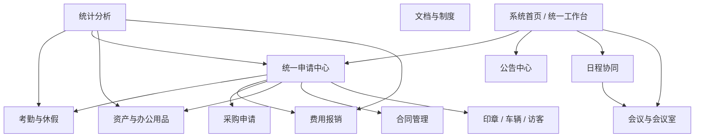
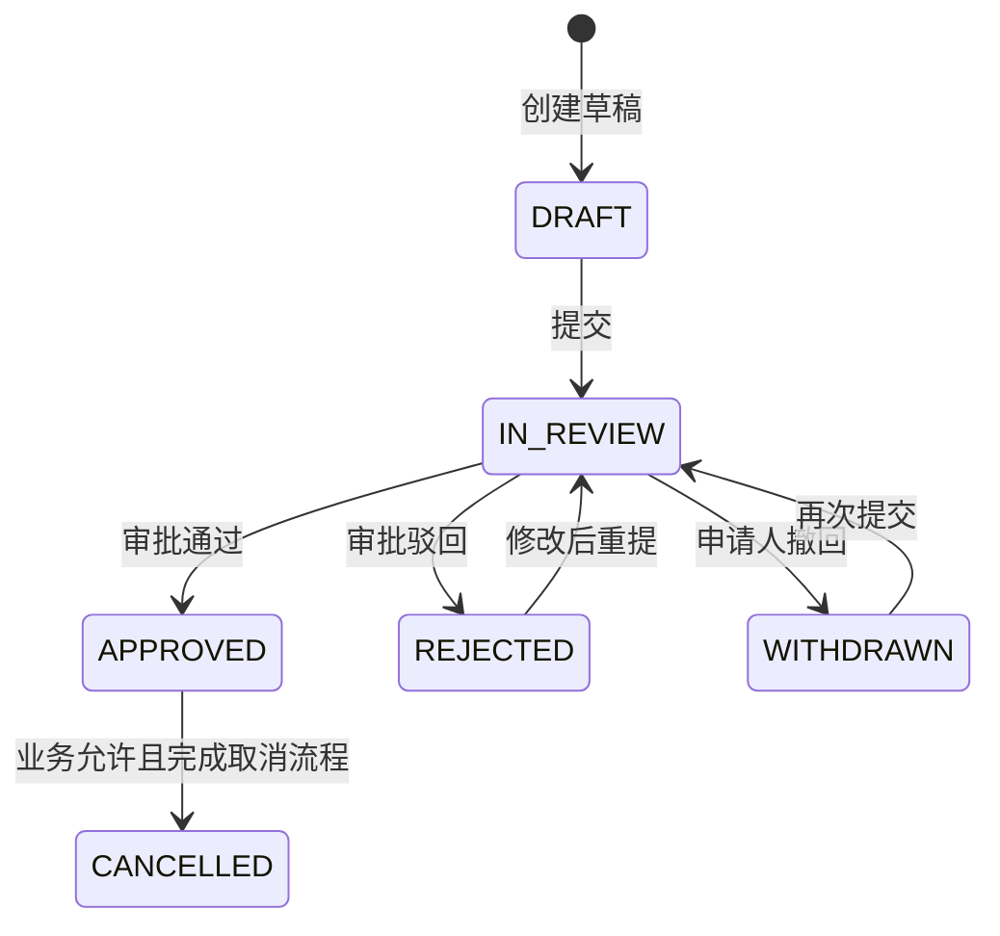
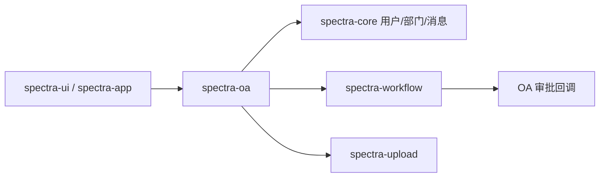

---
tags:
  - plan
  - oa
  - backend
  - frontend
  - architecture
created: 2026-08-07
updated: 2026-08-08
---

# P-通用 OA 业务建设总计划

## 状态

**P0 阶段 0、阶段 1 和阶段 2 已完成首版；阶段 3（报销、采购、资产、办公用品与部门统计首版纵切）进入财务增强收尾；阶段 4 已补齐文档/合同权限、版本、归档和履约提醒；阶段 5 已启动申请类型配置；审批中心三级菜单阶段 1 后端、阶段 2 Web、阶段 3 App 与阶段 4 集成验收已完成，其他运营能力按批次推进**

本轮首版覆盖统一申请内核、请假申请后端闭环、公告发布与阅读回执、个人日程、会议冲突/参会响应、工作台聚合、费用报销、采购申请、资产管理、办公用品库存和部门维度统计首版纵切、Web/移动端高频入口以及建表 SQL 和知识库同步。定时发布后台调度、公告附件、完整角色化卡片、消息深链、报销财务增强、跨域高级分析和集成/E2E 测试仍列为后续补齐项。

> 本计划是 OA 建设的唯一总控计划，已经吸收 2026-07-17 时点的旧版对标分析与路线图。

## 一、目标与结论

### 1.1 建设目标

Spectra 的 OA 不追求一次性复刻大型商业 OA，而是建设一套中小组织可直接使用、又能持续扩展的通用办公平台，并以真实 OA 业务闭环推动整个项目走向完整：

1. 用真实业务验证用户、部门、角色、权限和数据隔离。
2. 用申请审批验证表单、流程定义、流程实例、任务和业务回调。
3. 用公告、待办和提醒验证消息中心与事件机制。
4. 用附件、制度文档和报销凭证验证文件上传、预览和权限。
5. 用会议室、资产领用等场景验证并发冲突和状态机。
6. 用工作台和统计验证跨模块查询、缓存、导出与性能。
7. 同时交付 Web 管理端和移动端高频入口，形成可演示、可回归的产品闭环。

### 1.2 核心建设策略

- **先闭环、后铺量**：第一条纵切选择“请假申请”，完整做到草稿、提交、审批、通知、销假/撤回、查询和统计，再复制到其他申请类型。
- **业务归 OA，流程归 Workflow**：OA 保存业务事实和业务状态；`spectra-workflow` 负责编排、待办、审批意见和流程历史。
- **统一申请外壳，保留强类型业务表**：共用申请编号、申请人、流程状态、附件和审批关联；金额、日期、资产等核心字段仍存入专用表，不把所有业务塞进 JSON。
- **基础能力只复用不复制**：用户/部门来自 Core，附件来自 Upload，消息来自 Notification，审批来自 Workflow。
- **空壳模块不等于既定边界**：现有 9 个包只是脚手架，可以合并、改名或移除，不以保持旧目录为设计目标。
- **复用现有系统首页**：直接将 `spectra-ui/src/views/Dashboard/index.vue` 演进为统一工作台，保留 `/` 首页路由，不新增 `/oa/workbench` 页面。

### 1.3 首个可用版本范围

首个可用版本只要求以下五个入口，但每个入口必须形成完整业务闭环：

1. 系统首页（统一工作台）：在现有 Dashboard 中展示我的待办、我的申请、未读公告和今日日程。
2. 申请中心：请假、加班、出差、补卡四类申请。
3. 公告中心：草稿、发布、目标范围、已读回执。
4. 日程与会议：个人日程、会议邀请、会议室冲突检测。
5. 管理能力：流程配置、基础规则、权限、统计和审计。

报销、采购、资产、文档、合同等放在后续阶段，避免首期横向铺开后没有任何模块真正可用。当前已在阶段 3 完成报销、采购、资产和办公用品首版纵切，形成行政、费用与物资闭环的可用业务基线。

## 二、现状基线

### 2.1 已有能力

| 能力 | 当前基础 | OA 建设中的用途 |
|---|---|---|
| 用户/部门/RBAC | `spectra-core` 已有用户、部门、角色、权限和数据范围 | 申请人、审批人、可见范围、组织通讯录 |
| 工作流 | `spectra-workflow` 已有表单定义、流程定义、实例、任务和回调机制 | 审批编排、待办/已办、审批历史 |
| 文件 | `spectra-upload` 支持本地/S3、分片、预览和下载 | 公告附件、报销凭证、合同与文档版本 |
| 消息 | Core 已有 `sys_notification` 与消息设置基础 | 待办、审批结果、公告、日程和到期提醒 |
| 数据权限 | OA 实体已有 `@DataScope` 使用基础 | 本人、部门、指定人员和管理员范围隔离 |
| Web/移动端 | Web 已有会议页面，移动端具备统一 API 接入基础 | OA 工作台和高频移动审批 |

### 2.2 现有 OA 代码成熟度

| 现有子模块 | 当前状态 | 本计划处理方式 |
|---|---|---|
| `meeting` | 有创建、分页、参会人和纪要模型，业务尚未闭环 | 保留并重构，补会议室、冲突检测、邀请、签到和纪要 |
| `asset` | 已完成资产台账、分类与生命周期首版 | 后续补齐盘点、审批和统计导出 |
| `attendance` | 仅部门字段与分页查询 | 拆分为考勤规则、打卡记录、考勤结果与考勤申请 |
| `calendar` | 仅部门字段与分页查询 | 重建为事件、参与人、提醒和重复规则 |
| `document` | 仅部门字段与分页查询 | 重建为目录、文档、版本、权限和文件关联 |
| `notice` | 仅部门字段与分页查询 | 重建为公告、发布范围、阅读记录和附件 |
| `contract` | 仅部门字段与分页查询 | 延后到 P2，按合同生命周期重建 |
| `contact` | 与 Core 用户/部门重复 | 不保留业务表，改为组织通讯录查询视图 |
| `report` | 仅部门字段与分页查询 | 不保留通用“报表实体”，改为各域统计 + 跨域查询服务 |

当前 `spectra_oa` Schema 共 11 张表，其中除会议相关 3 张表外，其余表基本只有审计字段和 `department_id`。实施新模块前应先确认本地数据库是否有有效业务数据；无有效数据时优先重建表结构，有数据时编写显式迁移脚本。

## 三、目标模块全景



模块分成四类：

| 类型 | 模块 | 说明 |
|---|---|---|
| 聚合入口 | 工作台、统计分析、通讯录查询 | 聚合其他模块，不拥有重复主数据 |
| 通用内核 | 统一申请中心 | 所有需要审批的 OA 业务共用 |
| 高频协同 | 考勤、公告、日程、会议、文档 | 大多数组织都会使用 |
| 行政扩展 | 资产、报销、采购、合同、印章、车辆、访客 | 按实际组织需要启用 |

## 四、各子模块功能设计

### 4.1 系统首页 / OA 工作台（P0）

工作台直接复用现有前端首页 `spectra-ui/src/views/Dashboard/index.vue`。保留 `/` 路由和 `Dashboard` 路由名称，不再新增独立的 `/oa/workbench` 路由，也不要求用户进入 OA 菜单后再次打开工作台。

工作台是整个 Spectra 的统一入口，不由 OA 模块独占。OA 提供待办、申请、公告、日程和会议等主要业务数据；Core、Workflow 和系统管理能力也可以按角色提供卡片和快捷入口。工作台本身是聚合展示层，不单独保存业务主数据。

#### 前端页面决策

| 决策项 | 方案 |
|---|---|
| 页面与路由 | 复用 `views/Dashboard/index.vue` 和 `/`，不创建新的 OA 工作台页面 |
| 页面名称 | 菜单可继续显示“首页”，页面语义统一为“工作台” |
| 普通员工 | 默认展示快捷申请、我的待办、我的申请、日程、会议、公告 |
| 部门负责人 | 增加部门审批、超时任务和部门异常摘要 |
| 行政/财务人员 | 增加会议室、资产、采购、报销等业务提醒 |
| 系统管理员 | 保留用户、角色、菜单、流程配置和系统配置快捷入口 |
| 审计员 | 展示跨模块只读统计和异常摘要，不提供业务写入口 |
| 组件结构 | 将统计卡片、快捷入口、待办、申请、日程、公告拆为 `Dashboard/components/` 下的独立组件 |
| 数据替换 | 移除现有 `todos`、`notices` 等静态数组，改用真实聚合接口和领域详情接口 |

现有日历和待办需要解除错误联动：选择日期只影响日程/会议列表；Workflow 待办独立展示，按到达时间或超时时间排序，不能按日历选中日期过滤。

| 功能组 | 具体功能 |
|---|---|
| 我的任务 | 待我审批、我已审批、即将超时、抄送我的 |
| 我的申请 | 草稿、审批中、已通过、已驳回、已撤回 |
| 今日办公 | 今日日程、待参加会议、签到提醒、截止事项 |
| 信息触达 | 未读公告、未读消息、公告必读提示 |
| 快捷发起 | 请假、加班、出差、补卡、报销、采购等可配置入口 |
| 聚合接口 | 一次请求返回数量摘要和有限条目；详情仍走各领域接口 |

建议接口：`GET /oa/workbench/summary`。该接口是现有系统首页的数据聚合接口，不代表新增 OA 页面。接口必须只查询当前用户可见数据，并对各卡片设置独立超时/降级，避免一个统计失败拖垮整个工作台。卡片详情、分页和操作仍跳转到各自的 OA、Workflow、Notification 或系统管理页面。

### 4.2 统一申请中心（P0，OA 内核）

| 功能组 | 具体功能 |
|---|---|
| 类型配置 | 申请类型编码、名称、图标、表单定义、流程定义 Key、是否启用、排序 |
| 草稿 | 新建、编辑、保存草稿、删除草稿、附件维护 |
| 提交 | 业务校验、生成申请编号、锁定关键字段、以业务 ID 启动流程 |
| 流转 | 查询进度、审批记录、当前节点、预计处理人 |
| 申请人操作 | 撤回、重新提交、取消；仅在业务规则允许时执行 |
| 协同 | 抄送、评论、催办；催办需限频并记录操作日志 |
| 管理查询 | 按类型、状态、申请人、部门、时间范围查询和导出 |
| 一致性 | Workflow 回调幂等、重复提交防护、业务状态与流程状态对账 |

统一状态建议：



状态码统一使用大写稳定值：`DRAFT`、`IN_REVIEW`、`APPROVED`、`REJECTED`、`WITHDRAWN`、`CANCELLED`。业务域可以增加自己的执行状态，但不能改写审批状态含义。

### 4.3 考勤与休假（P0）

考勤需要把“原始记录、计算结果、审批申请”分开，不继续使用一张 `oa_attendance` 承担所有职责。

| 功能组 | 具体功能 |
|---|---|
| 规则 | 班次、工作日历、节假日、迟到/早退规则、打卡时间窗口 |
| 排班 | 用户/部门排班、临时调班、生效区间；首期可只支持固定班次 |
| 打卡 | 上班/下班打卡、来源、设备、位置、备注；首期不做复杂防作弊 |
| 日结果 | 正常、迟到、早退、缺卡、旷工、请假、出差等日结果 |
| 请假 | 请假类型、起止时间、时长、交接人、原因、附件、审批 |
| 加班 | 起止时间、时长、补偿方式、原因、审批 |
| 出差 | 出差地、起止时间、事由、同行人、审批 |
| 补卡 | 缺卡日期与时段、原因、审批，批准后重算日结果 |
| 统计 | 个人月度汇总、部门汇总、异常清单、Excel 导出 |

首期只完成请假闭环和固定班次；打卡定位、复杂排班和薪资核算不作为 P0 范围。

### 4.4 公告中心（P0）

| 功能组 | 具体功能 |
|---|---|
| 编辑 | 标题、摘要、富文本内容、分类、封面、附件、重要级别 |
| 生命周期 | 草稿、定时发布、立即发布、撤回、归档、过期 |
| 发布范围 | 全员、部门、角色、指定用户；保存发布时的范围快照 |
| 阅读 | 已读/未读、首次阅读时间、阅读率、必读确认 |
| 展示 | 置顶、有效期、列表筛选、详情、最新公告 |
| 通知 | 发布后通过消息中心通知目标用户，避免 OA 自建消息表 |
| 管理 | 阅读统计、未读人员导出、权限和操作审计 |

系统通知和业务消息属于 Core Notification；OA Notice 只管理正式公告内容和阅读回执，两者不能合并成同一张表。

### 4.5 日程协同（P1）

| 功能组 | 具体功能 |
|---|---|
| 个人日程 | 创建、编辑、删除、全天事件、颜色/标签、忙闲状态 |
| 参与者 | 邀请用户、接受/拒绝、参与人变更通知 |
| 共享 | 私有、仅参与人、部门可见；只共享忙闲或共享详情 |
| 重复规则 | 每日、每周、每月、截止日期；按规则生成实例视图 |
| 提醒 | 站内消息提醒，后续扩展邮件/短信 |
| 关联业务 | 关联会议、出差、请假、合同节点等业务对象 |
| 查询 | 日/周/月范围查询，按用户和部门查询忙闲 |

### 4.6 会议与会议室（P1）

| 功能组 | 具体功能 |
|---|---|
| 会议室 | 名称、位置、容量、设备、开放时间、启用状态、管理人 |
| 预定 | 时间段预定、重复预定、取消；数据库层保证同会议室时间不重叠 |
| 会议 | 主题、议程、组织人、参会人、地点/线上链接、附件 |
| 邀请 | 接受、拒绝、待定、变更通知，并同步个人日程 |
| 审批 | 仅特殊会议室或超时段预定需要审批，普通会议不强制走流程 |
| 签到 | 签到码/手工签到、迟到标记；二维码作为后续增强 |
| 纪要 | 纪要编辑、发布、附件、参会人确认、行动项 |
| 行动项 | 负责人、截止时间、状态、完成提醒；可进入工作台待办 |
| 统计 | 会议室利用率、取消率、会议时长和行动项完成率 |

现有 `Meeting`、`MeetingParticipant`、`MeetingRecord` 可作为迁移起点，但需要统一状态、补会议室资源，并移除“所有会议都审批”的隐含假设。

### 4.7 文档与制度（P1）

| 功能组 | 具体功能 |
|---|---|
| 目录 | 树形目录、排序、移动、部门空间和公共空间 |
| 文档 | 标题、摘要、分类、标签、负责人、状态、关联文件 |
| 版本 | 上传新版本、版本说明、历史版本、回滚、当前版本 |
| 权限 | 所有人/部门/角色/指定用户的查看、下载、编辑、管理权限 |
| 发布 | 草稿、审批、发布、撤回、废止；制度类文档可要求审批 |
| 检索 | 标题、标签、正文元数据检索；全文检索延后 |
| 操作 | 预览、下载、水印策略、收藏、最近访问、操作审计 |

文件内容继续由 `spectra-upload` 管理；OA 只保存目录、业务元数据、版本关系和 ACL，不复制物理文件信息。

### 4.8 资产与办公用品（P1）

| 功能组 | 具体功能 |
|---|---|
| 基础资料 | 资产分类、品牌型号、存放地点、供应商、状态字典 |
| 资产台账 | 资产编号、序列号、价值、购入日期、保修期、责任部门 |
| 入库 | 批量入库、二维码/条码、附件、入库记录 |
| 领用/借用 | 申请、审批、发放、保管人变更、预计归还时间 |
| 归还 | 归还验收、状态更新、损坏说明 |
| 调拨 | 部门/地点/责任人变更和完整履历 |
| 维修/报废 | 维修登记、费用、结果；报废申请、审批和处置 |
| 盘点 | 创建盘点任务、快照、盘盈盘亏、差异确认 |
| 办公用品 | SKU、库存、领用、退库、最低库存提醒；与固定资产分开管理 |
| 统计 | 状态分布、部门占用、即将过保、库存预警 |

当前首版已完成固定资产与办公用品两条纵切：固定资产使用 `oa_asset`、`oa_asset_category` 和 `oa_asset_operation` 支持建账、采购收货转草稿、领用、归还、调拨、维修、报废及履历查询；办公用品使用 `oa_supply_item` 和 `oa_supply_operation` 支持 SKU 台账、入库、领用、退库、库存调整、最低库存查询和流水追溯。盘点任务、二维码、采购自动入库和资产审批流作为后续增强。

### 4.9 费用报销（P1）

#### 当前实施进度：报销首版纵切已完成

首版已覆盖报销草稿、费用明细、凭证附件关联、明细合计校验、同单/跨单发票号码去重、提交审批、撤回/取消、审批回调和付款登记。后续继续补充财务审核多级路由、预算校验、发票 OCR、付款失败重试和统计导出。

| 功能组 | 具体功能 |
|---|---|
| 报销单 | 报销类型、事由、费用归属部门/项目、收款信息、总金额 |
| 明细 | 日期、费用类别、金额、税额、说明、关联出差申请 |
| 凭证 | 发票/收据附件、重复文件提示；OCR 识别作为后续增强 |
| 校验 | 明细合计、金额精度、日期范围、附件必填、预算规则预留 |
| 审批 | 部门负责人、财务审核、付款确认等可配置流程 |
| 支付状态 | 待付款、已付款、付款失败、付款凭证；不在首期直连银行 |
| 统计 | 个人、部门、费用类别、月份统计与导出 |

金额统一使用 `BigDecimal` 和明确币种，禁止用浮点数。付款状态属于财务执行状态，与审批状态分开。

### 4.10 采购申请（P1）

#### 当前实施进度：采购首版纵切已完成

首版已覆盖采购草稿、物品/服务明细、预算与估价校验、提交审批、撤回/取消、审批回调、执行登记、订单号和分批收货；收货批次记录验收结果与差异原因，采购主单独立维护执行状态。固定资产入库草稿、费用类关联报销、附件和统计导出列为后续增强。

| 功能组 | 具体功能 |
|---|---|
| 申请 | 采购事由、期望日期、预算、供应商建议、采购明细 |
| 明细 | 物品/服务、规格、数量、估价、用途 |
| 审批 | 按金额、部门或采购类型选择流程 |
| 执行 | 审批后生成采购执行单，记录采购人、订单号和状态 |
| 收货 | 分批收货、验收、差异、附件 |
| 联动 | 固定资产类收货后可生成资产入库草稿；费用类可关联报销 |
| 统计 | 采购周期、金额、供应商和未完成事项 |

该模块只做内部申请与执行跟踪，不在通用 OA 阶段实现完整供应链、库存成本和应付账款。

### 4.11 合同管理（P2）

| 功能组 | 具体功能 |
|---|---|
| 台账 | 合同编号、类型、相对方、负责人、部门、金额、期限、状态 |
| 起草 | 模板、正文/附件版本、协作修改、审批 |
| 签署 | 纸质/电子签署状态、签署日期、归档文件 |
| 履约 | 付款/收款节点、交付节点、负责人、完成凭证 |
| 变更 | 补充协议、金额或期限变更、续签和终止 |
| 提醒 | 到期、履约节点、续签窗口提醒 |
| 权限 | 按负责人、部门、法务角色和指定人员限制可见范围 |
| 统计 | 合同金额、状态、到期、履约和相对方统计 |

电子签章、法务条款库和财务总账集成不属于首轮通用 OA 范围。

### 4.12 行政资源扩展（P2）

以下能力遵循“资源台账 + 使用申请 + 审批 + 归还/核销 + 统计”的相同模式，可按需求逐个启用：

| 子模块 | 具体功能 |
|---|---|
| 印章 | 印章台账、用印申请、材料附件、审批、用印登记、归还、审计 |
| 车辆 | 车辆台账、用车申请、派车、驾驶员、里程/油耗、归还、维修保养 |
| 访客 | 预约、被访人确认、来访时间、证件脱敏、签到签离、访客统计 |
| 工单 | 类别、受理组、指派、处理、评价、SLA；成熟后可独立为服务台模块 |

### 4.13 通讯录与统计的定位

- **通讯录**：不建 `oa_contact` 主数据表。通过 Core 的用户、部门和岗位信息形成只读接口，提供组织树、模糊搜索、常用联系人；个人外部联系人若未来需要，再单独建私有联系人域。
- **统计**：不建只有“报表名称”的 `oa_report` 万能表。各业务域提供自己的统计查询，跨域数据由 `analytics`/`workbench` 查询服务聚合；固定报表配置和导出任务确有需求时再建表。

## 五、领域与数据设计

### 5.1 统一申请模型

建议新增以下内核表，具体字段在实施阶段通过 ER 设计确认：

| 表 | 关键字段 | 说明 |
|---|---|---|
| `oa_application_type` | `code`、`name`、`form_definition_id`、`process_definition_key`、`enabled` | 申请类型与表单/流程映射 |
| `oa_application` | `application_no`、`type_code`、`biz_id`、`applicant_id`、`department_id`、`title`、`status`、`process_instance_id` | 所有审批业务的统一外壳 |
| `oa_application_attachment` | `application_id`、`file_id`、`category`、`sort` | 申请附件关系 |
| `oa_application_cc` | `application_id`、`user_id`、`read_at` | 抄送及阅读状态 |
| 各业务明细表 | `application_id` + 强类型业务字段 | 请假、报销、采购等专用数据 |

关键约束：

1. `application_no` 全局唯一且不可修改。
2. `application_id` 与业务明细一对一时建立唯一索引。
3. `process_instance_id` 唯一，Workflow 的 `businessKey` 使用申请 ID。
4. 保存流程定义 Key 和实际启动版本快照，避免配置变化影响历史解释。
5. 状态迁移必须经过领域 Service；Controller 不直接更新状态字段。
6. Workflow 回调按“流程实例 + 事件类型”幂等处理。
7. 审批意见和节点历史以 Workflow 为唯一事实来源，OA 不重复维护审批日志。

### 5.2 动态表单与强类型数据边界

- Workflow 表单定义负责页面布局、控件配置和流程发起时的展示。
- OA 专用表保存需要检索、统计、校验、关联和约束的核心字段。
- 可扩展但非关键的小字段可使用 `jsonb`，并按后端规范使用 `PgJsonbTypeHandler`。
- 禁止以单个 `form_data jsonb` 代替请假时长、报销金额、资产 ID 等业务模型。

### 5.3 数据权限

每个领域在开发前必须列出“所有者、参与者、部门管理员、业务管理员、审计员”五类访问者：

| 访问者 | 默认权限 |
|---|---|
| 申请人/创建人 | 查看和操作本人数据，操作范围受状态限制 |
| 参与者/抄送人 | 查看明确关联的数据，不自动获得修改权限 |
| 审批人 | 通过 Workflow 任务获得办理权限，不等同于永久业务可见 |
| 部门管理员 | 在数据范围内查询和管理本部门数据 |
| 业务管理员/审计员 | 按角色和数据范围管理或只读审计 |

敏感字段（收款账号、证件号、合同金额等）需要 VO 脱敏，不能仅依靠前端隐藏。

### 5.4 模块依赖方向



- OA 可以依赖 Core、Workflow 和 Upload 的公开 Service/DTO。
- Workflow 不直接依赖具体 OA 业务实现；通过回调接口或领域事件反向通知。
- 消息由 Notification Service 统一发送，业务事件中只携带接收人、模板参数和跳转目标。
- 跨模块写操作避免互相直接改表，使用公开 Service，并明确事务边界。

## 六、API 与工程约束

### 6.1 API 形态

业务资源采用一致动作语义，但不为追求 REST 纯度牺牲业务清晰度：

| 场景 | 示例 |
|---|---|
| 分页 | `GET /oa/applications`、`GET /oa/notices` |
| 详情 | `GET /oa/applications/{id}` |
| 创建草稿 | `POST /oa/applications` |
| 修改草稿 | `PUT /oa/applications/{id}` |
| 提交 | `POST /oa/applications/{id}/submit` |
| 撤回 | `POST /oa/applications/{id}/withdraw` |
| 业务取消 | `POST /oa/applications/{id}/cancel` |
| 阅读公告 | `POST /oa/notices/{id}/read` |
| 会议响应 | `POST /oa/meetings/{id}/response` |

所有端点继续遵循项目的版本、`@ULog`、`@PreAuthorize`、`@Validated`、From/VO 和 Converter 规范。禁止 Controller 返回 Entity。

### 6.2 事件与通知

第一阶段可使用 Spring 领域事件解耦以下行为：

- 申请提交 → 启动流程、发送待办消息。
- 审批完成 → 更新申请与业务状态、通知申请人。
- 公告发布 → 生成目标用户消息。
- 日程/会议变更 → 通知参与者。
- 合同/资产到期 → 定时任务生成提醒。

事件处理必须具备幂等键和失败日志。涉及“业务状态已提交但流程未启动”等跨模块一致性问题时，优先使用同库事务；无法同事务时再引入事务消息/outbox，不在第一阶段提前建设复杂消息中间件。

### 6.3 编号、时间和金额

- 申请、资产、采购、合同等使用可读业务编号，UUID 仍作为数据库主键。
- 数据库存 UTC 时间，展示层按用户时区转换；全天日程与工作日历使用 `LocalDate` 语义。
- 金额使用 `BigDecimal`，明确精度、舍入规则和币种。
- 时间区间统一使用左闭右开 `[start, end)` 规则，便于会议室冲突检测。

## 七、分阶段实施路线

### 阶段 0：整理基线与 OA 内核（1 个迭代，P0）

**目标**：建立可以承载所有申请类业务的骨架，并清理旧脚手架造成的错误边界。

任务：

- [ ] 核对现有 11 张 OA 表是否存在有效数据，确定重建或迁移策略。
- [ ] 建立 `application` 包和统一申请状态机。
- [ ] 建立申请类型、申请主表、附件、抄送表及唯一索引。
- [ ] 统一 Workflow `businessKey`、回调、撤回/终止和幂等约定。
- [ ] 打通 Notification Service，定义 OA 消息类型与跳转参数。
- [ ] 提供组织通讯录只读查询，停止扩展 `oa_contact`。
- [ ] 提供工作台聚合接口的空实现框架与降级策略。
- [ ] 明确复用现有 `Dashboard` 和 `/` 路由，规划角色化卡片及 `Dashboard/components/` 组件边界。
- [ ] 统一 OA 权限编码和菜单规划。

验收：

- [ ] 能配置一种申请类型并关联表单定义和流程定义。
- [ ] 能创建、修改、删除草稿，提交后生成唯一编号和流程实例。
- [ ] 重复点击提交不会创建两个流程实例。
- [ ] 流程回调重复到达不会重复改变业务或发送消息。
- [ ] 本人、审批人、部门管理员的数据可见范围符合设计。

### 阶段 1：请假申请端到端纵切（2 个迭代，P0）

**目标**：交付第一条真正可用的业务闭环，作为后续审批业务模板。

任务：

- [ ] 建立请假类型、固定班次、工作日历和请假明细模型。
- [ ] 实现时长计算、重叠校验、余额规则预留和附件校验。
- [ ] 实现草稿、提交、审批、驳回、撤回、重新提交和取消。
- [ ] 审批通过后生成考勤影响记录，并同步个人日程忙闲状态。
- [ ] 申请提交、待审批、审批结果通过消息中心通知。
- [ ] Web 完成申请、审批和管理员查询页面。
- [ ] 移动端完成发起、待办、审批进度和消息跳转。
- [ ] 建立集成测试和至少一条浏览器端到端测试。

验收场景：

1. 员工保存半天年假草稿并上传附件。
2. 员工提交，部门负责人收到待办和消息。
3. 审批人同意，申请状态变为 `APPROVED`。
4. 员工收到结果通知，日历显示请假，考勤日结果不判缺勤。
5. 无权限用户无法读取该申请，管理员只能读取数据范围内申请。
6. 并发重复提交、重复回调、越权审批均被测试覆盖。

### 阶段 2：协同办公 MVP（2 个迭代，P0-P1）

**目标**：让工作台每天都有内容，让 OA 从审批工具变成日常办公入口。

任务：

- [ ] 公告：发布范围、定时发布、阅读回执、必读确认、附件。
- [ ] 日程：个人事件、参与者、提醒、共享范围、月/周查询。
- [ ] 会议：会议室、预定冲突、邀请响应、签到、纪要和行动项。
- [ ] 现有 Dashboard：移除模拟数据，接入待办、申请、公告、日程、会议与未读数。
- [ ] 工作台角色化：根据菜单、权限和角色展示对应卡片与快捷入口，不硬编码为管理员首页或员工首页。
- [ ] 消息深链：从消息直接进入对应公告、申请或会议详情。
- [ ] Web 完整页面；移动端优先公告、日程和会议响应。

验收：

- [ ] 公告发布到指定部门后，只有目标用户可见并能统计阅读率。
- [ ] 同一会议室的重叠预定在并发请求下只能成功一个。
- [ ] 会议变更会通知参与人并更新其日程。
- [ ] 工作台在单个下游统计失败时仍可返回其他卡片。

### 阶段 3：行政与费用闭环（2-3 个迭代，P1）

**目标**：验证多明细、金额、库存/保管关系和跨业务联动。

任务：

- [x] 报销单、费用明细、凭证、审批和付款状态（首版纵切已完成）。
- [x] 采购申请、采购明细、审批、执行和收货（首版纵切已完成）。
- [x] 资产分类、台账、入库、领用、归还、调拨、维修、报废（首版纵切已完成）。
- [x] 采购收货可生成固定资产入库草稿。
- [x] 办公用品库存和最低库存提醒（首版纵切已完成）。
- [x] 部门维度统计与 Excel 导出（首版已完成，复用 OA_REPORT:QUERY 数据权限）。

验收：

- [x] 报销明细合计与总金额始终一致，金额统一按 2 位小数半舍五入校验并落库。
- [x] 已报废资产不能领用，已领用资产不能被另一人重复领用。
- [x] 采购、收货、资产入库之间可追溯但不存在跨模块直接改表。
- [x] 部门统计导出复用查询数据权限，只导出部门级聚合字段，不输出个人账号等敏感字段。

### 阶段 4：文档与合同（2-3 个迭代，P1-P2）

> 当前进度：文档目录、文档元数据、文件版本链、草稿/发布/归档、版本恢复、检索和受鉴权预览下载已完成；合同台账、文件版本、签署/生效/终止/归档状态、履约节点和一次性到期提醒已完成。ACL 明细授权、审批发布、电子签署和水印策略待后续迭代。

**目标**：验证大文件、版本、细粒度权限、到期任务和敏感数据管理。

任务：

- [x] 文档目录、版本、草稿/发布、预览下载首版（ACL 明细授权、发布审批和审计待增强）。
- [x] 制度发布后向公开、部门或私有目标用户发送站内通知，并携带文档深链。
- [x] 合同台账、相对方字段、文件版本、签署/生效/终止状态和履约节点首版（审批、电子签署和到期提醒待增强）。
- [x] 下载/预览按负责人、公开或部门范围鉴权；报销付款账号已脱敏，水印策略保留为后续扩展点。
- [x] 文档/合同支持关键词检索和归档，归档后禁止继续发布、签署、生效或新增版本。

验收：

- [x] 无文档权限的用户即使知道文件 ID 也无法预览或下载。
- [x] 文档新版本不覆盖历史文件，可查看版本链并回滚当前版本。
- [x] 合同节点临近到期提醒使用 `reminder_sent_at` 条件更新，只发送一次且可追踪处理时间。

### 阶段 5：通用化与运营（持续，P2）

**目标**：从“项目内置 OA”演进为可配置、可运营的通用 OA。

任务：

- [x] 申请类型后台配置首版已提供（编码、名称、表单/流程关联、启停和排序），并补充 Web 配置页；表单、流程、编号规则和消息模板配置待继续接入。
- [ ] 印章、车辆、访客等行政资源按统一模式逐步接入。
- [ ] 跨域统计看板、异步导出任务和操作审计。
- [ ] 审批耗时、超时任务、流程瓶颈和业务完成率分析。
- [ ] 全文检索、OCR、AI 摘要/制度问答等增强能力按需求启用。
- [ ] 性能压测、归档策略、备份恢复和可观测性完善。

### 2026-08-08 通用 OA 完整度审计

本轮按“是否有真实数据来源、是否有业务动作、流程是否闭环、前端是否可操作”重新审计全部 OA 能力，不再以存在 Controller/Entity/菜单名称作为保留依据。

| 分类 | 结论 |
|---|---|
| 保留的申请闭环 | 通用申请、请假、费用报销、采购申请、Workflow 审批中心 |
| 保留的协同办公 | 公告、日程、会议、现有 Dashboard 工作台 |
| 保留的行政能力 | 资产、办公用品、文档、合同、部门统计与导出 |
| 通讯录 | 保留页面和查询服务，数据改为复用 Core 用户/部门，不保留 `oa_contact` 主数据 |
| 考勤 | 删除无业务行为的旧考勤 CRUD；保留请假审批通过后生成的 `oa_attendance_record` |
| 报表 | 删除通用 `Report` 实体和旧分页；保留直接聚合各业务表的部门统计/导出 |
| 流程资源 | 删除旧 `leave.bpmn20.xml` 及未被业务引用的单级/多级示例 BPMN；历史定义保持挂起，当前只部署三个 `oa_*_approval` KEY |

页面完整性：

- Web：保留 Dashboard 作为工作台；新增 `/oa/approval` 审批中心和真实通讯录；请假、报销、采购支持审批人选择、草稿/驳回态编辑、提交、撤回、取消及各自后置动作；删除考勤占位页面和无效 Dashboard 跳转。
- 移动端：工作台只展示真实页面；补齐审批中心、真实通讯录，以及请假/报销/采购完整生命周期；采购可执行和收货，报销可查看付款状态。
- Workflow：待办/已办返回流程 KEY 和业务 KEY；审批写操作校验当前办理人；业务详情允许当前/历史审批人查看；已结束流程的重复终止幂等。

真实闭环验收（使用项目根目录 `.mise.local.toml` 的数据库/Redis 配置）：

| 场景 | 结果 |
|---|---|
| 请假提交 → 同意 | `APPROVED`；生成 1 条 `oa_attendance_record` |
| 请假提交 → 撤回 → 取消 | `CANCELLED` |
| 报销提交 → 驳回 → 取消 | `REJECTED → CANCELLED` |
| 报销提交 → 同意 → 登记付款 | `APPROVED / PAID` |
| 采购提交 → 同意 → 执行 → 收货 | `APPROVED / RECEIVED` |

上述 5 个申请均对应 1 条已结束历史流程、0 条运行中流程，验收账号剩余待办为 0。数据库已确认 `oa_attendance`、`oa_contact`、`oa_report` 不存在，`oa_attendance_record` 正常保留；最终结构已直接体现在 `docs/sql/spectra_oa/建表.sql` 中。

质量验证：spectra-admin 生产包构建成功；spectra-ui 的 format/type-check/lint/build 全部通过；spectra-app 的 format/type-check/H5 build 通过，lint 为 0 error（17 条既有 warning）。仓库全量 Maven test 在 `spectra-framework` 的既有 `GuoMiUtilTest` 处因测试类路径缺少 `org.postgresql.Driver` 中止，发生在 OA 模块之前；OA 真实接口/数据库闭环和生产构建不受该测试基础设施问题影响。

## 八、每个子模块的完成定义

一个子模块只有同时满足下列条件才算完成，不以“已有 Entity/Controller”为完成标志：

- [ ] 业务状态、允许操作和异常路径有明确状态图或规则表。
- [ ] 数据库约束、索引、唯一性和软删除策略已设计。
- [ ] Controller、Service、Mapper、Entity、From、VO、Converter 分层完整。
- [ ] 接口权限、数据范围、敏感字段脱敏经过测试。
- [ ] 关键写操作有事务、幂等和并发控制。
- [ ] 需要审批时已完成 Workflow 全链路和回调对账。
- [ ] 需要附件时已完成上传、预览、下载和删除引用管理。
- [ ] 需要通知时已完成消息生成、跳转和用户设置处理。
- [ ] Web 页面可用；高频个人业务同时具备移动端入口。
- [ ] 单元测试、集成测试和关键端到端用例通过。
- [ ] 操作日志、错误日志和关键指标可观察。
- [ ] API、实体、SQL、权限和模块笔记已同步到 `docs/`。

## 九、测试与质量基线

### 9.1 必测类型

| 类型 | 重点 |
|---|---|
| 状态机测试 | 非法状态迁移、撤回边界、重复回调 |
| 权限测试 | 本人/他人、同部门/跨部门、审批人、管理员、审计员 |
| 数据隔离测试 | 分页、详情、导出、聚合接口均不能越权 |
| 并发测试 | 重复提交、会议室冲突、资产重复领用、库存扣减 |
| 事务测试 | 业务保存失败、流程启动失败、通知失败后的状态一致性 |
| 文件安全测试 | 类型、大小、越权预览下载、引用删除 |
| 时间测试 | 跨天、时区、节假日、夏令时、时间区间边界 |
| 金额测试 | 精度、舍入、负数、合计和币种 |
| 端到端测试 | 发起申请 → 审批 → 通知 → 业务生效 |

### 9.2 建议演示数据

建立一套可重复初始化的演示组织：公司、研发部、行政部、财务部；包含普通员工、部门负责人、行政管理员、财务和审计员。演示数据至少覆盖一条通过、一条驳回、一条撤回和一条超时流程，便于开发、截图、回归和产品演示。

## 十、明确不做与常见误区

### 10.1 首轮不做

- 不做完整 ERP、财务总账、薪资核算、供应链和客户管理。
- 不做即时聊天系统，消息中心只承担通知和站内信。
- 不做复杂考勤防作弊、智能排班和第三方考勤机适配。
- 不做电子签章、银行付款、发票验真等强外部依赖。
- 不先建设低代码万能表单平台，再寻找业务使用场景。

### 10.2 必须避免

- 为每种申请复制一套提交、撤回、流程回调代码。
- 把流程任务状态和业务状态混成一个字段。
- 只在列表接口使用数据权限，详情、导出和文件下载漏鉴权。
- 用定时任务扫描所有表发送提醒，却没有幂等记录。
- 在 OA 复制用户、部门、文件或审批历史主数据。
- 先实现全部模块 CRUD，最后才尝试串联业务流程。
- 使用一个万能 JSON 表承载所有业务，导致无法统计、校验和建立约束。

## 十一、计划看板

| 优先级 | 里程碑 | 状态 | 依赖 |
|---|---|---|---|
| P0 | 阶段 0：OA 内核 | 已完成首版 | Core、Workflow、Notification、Upload |
| P0 | 阶段 1：请假纵切 | 已完成首版 | 阶段 0 |
| P0-P1 | 阶段 2：协同办公 MVP | 已完成首版 | 阶段 1 |
| P1 | 阶段 3：行政与费用 | 首版与金额校验、部门聚合导出已完成；发票查重/OCR、预算和财务多级审核待实施 | 阶段 1，可与阶段 2 后半并行 |
| P1-P2 | 阶段 4：文档与合同 | 权限、版本回滚、检索、归档、发布通知和履约节点一次性提醒已完成；ACL 明细授权、审批发布和水印待增强 | Upload、Notification 完整可用 |
| P2 | 阶段 5：通用化与运营 | 申请类型配置首版已完成；表单/流程/编号/消息模板及运营分析待启动 | 前述业务已有稳定数据 |
| P1 | 阶段 6：审批中心三级菜单 | 阶段 1 后端、阶段 2 Web、阶段 3 App 与阶段 4 集成验收已完成 | 阶段 1、阶段 3 的请假/报销/采购审批流程 |

建议每完成一个阶段就独立更新状态、ER 图、实体清单、API 总览、权限种子和测试报告，不等待整个 OA 全部完成后再补文档。

## 十二、审批中心三级菜单建设计划

### 12.1 建设目标

将现有混合展示请假、费用报销和采购任务的单页审批中心，升级为独立的顶部业务模块。申请入口继续保留在 OA，审批入口统一进入审批中心；不新增审批任务表，继续复用 Workflow 待办、已办、详情和审批动作。

### 12.2 菜单与路由结构

系统菜单采用 `DIRECTORY → DIRECTORY → MENU` 三层结构。目录节点不填写 `route_name`，具体页面节点使用 Vue Router 路由名。首版只挂载已有真实流程，不创建空壳菜单。

```text
审批中心                         一级：顶部导航
├─ 综合审批                     二级：左侧目录
│  └─ 全部审批                  三级：全部流程待办/已办
├─ 财务相关                     二级：左侧目录
│  └─ 费用报销审批              三级：oa_reimbursement_approval
├─ 资产相关                     二级：左侧目录
│  └─ 采购申请审批              三级：oa_purchase_approval
└─ 行政人事                     二级：左侧目录
   └─ 请假审批                  三级：oa_leave_approval
```

建议路由名为 `OAApproval`、`OAApprovalReimbursement`、`OAApprovalPurchase` 和 `OAApprovalLeave`，原 `/oa/approval` 保留兼容重定向，避免工作台快捷入口失效。移动端不复制 Web 侧边栏，使用审批中心内的“全部、财务、资产、行政人事”分类入口。

### 12.3 页面与接口约定

- 所有审批类型复用同一个审批容器，通过 `process_definition_key` 配置当前流程类型。
- 每个类型页面提供“待我审批/我已审批”、数量统计、申请人/部门/时间/编号筛选、详情查看、同意和驳回；转办/委派按现有 Workflow 权限接入。
- 后端待办和已办分页接口增加可选的 `process_definition_key` 过滤；必要时返回 OA 申请摘要，避免前端逐条请求详情。
- 详情按类型渲染请假、报销和采购字段及附件，审批动作仍由 Workflow 任务所有权校验保护。
- 菜单权限只控制入口可见性，不能替代“当前用户必须是任务办理人”的后端鉴权。可能被选为审批人的 OA 用户应能看到审批中心入口。

### 12.4 分阶段实施与验收

| 阶段 | 范围 | 主要交付 | 验收与提交 |
|---|---|---|---|
| 0 | 计划与基线 | 将本方案写入计划，整理上一轮 OA 完整度审计的已验证改动 | 文档审查、敏感信息检查后提交 |
| 1 | 后端 | Workflow 任务流程类型过滤（沿用现有 TaskVO 业务 KEY）、权限与 API 文档同步 | Maven 构建、后端单元/接口检查通过后提交 |
| 2 | Web | 顶部审批中心、三级菜单路由、全部/报销/采购/请假审批页面和旧路由兼容 | format、type-check、lint、build 通过后提交 |
| 3 | App | 工作台审批中心入口、分类筛选、待办/已办和详情/审批动作复用 | format、type-check、lint、H5 build 通过后提交 |
| 4 | 集成验收 | 菜单 SQL、角色授权、文档、三条流程端到端回归 | 启动前后端与 H5，验证提交→待办→审批→业务回写→已办闭环后提交 |

每一阶段必须在检查无误后独立 Git 提交，再开始下一阶段；只提交明确的代码、文档和 SQL 文件，不提交 `.mise.local.toml`、`.env*`、证书或其他凭据。

当前执行记录：阶段 0 已完成根文档、后端、Web、App 基线提交；阶段 1 后端已完成 `process_definition_key` 可选过滤并通过 `spectra-workflow` Maven 构建；阶段 2 Web 已完成审批类型路由、筛选参数和审批容器复用，并通过 type-check、lint、build；阶段 3 App 已完成审批分类入口并通过 type-check、lint、H5 build；阶段 4 已应用并验证菜单 SQL，重建后端启动包成功，浏览器确认审批中心三级菜单、全部审批和费用报销审批页面可达，集成验收完成。

## 十三、文档同步清单

实施过程中按变更同步以下文档：

- [[40-OA模块]]：模块边界、关键文件和当前成熟度。
- [[60-工作流]]：OA 接入协议、业务 Key、回调与撤回约定。
- [[20-用户与权限]]：OA 权限编码、角色边界和数据范围。
- [[50-文件上传]]：业务附件引用、下载鉴权和引用计数规则。
- [[10-ER图]]、[[20-实体清单]]、`docs/70-AI速查/03-实体字典.md`：实体与关系。
- [[90-API总览]]、`docs/70-AI速查/04-API端点.md`：新增 Controller 和端点。
- `docs/sql/spectra_oa/建表.sql`：所有表、约束、索引和注释。
- [[00-项目总览]]：模块导航和 Entity/Controller 数量。

## 相关计划

- [[90-计划/spectra-admin/P-工作流模块完整实现计划]] — 工作流平台总控计划。
- [[10-后端/15-spectra-core模块#消息中心]] — OA 通知与提醒依赖。
- [[90-计划/spectra-admin/P-数据权限与数据隔离重构计划]] — OA 多角色数据可见性依赖。
