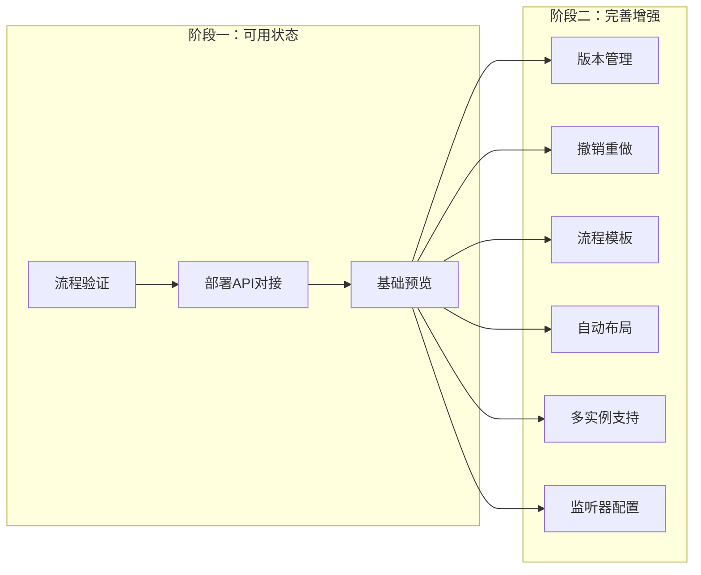

---
tags:
  - plan
  - logicflow
  - frontend
---

# P-LogicFlow插件完善计划

## 状态

**待启动**

> 状态变更时间：2026-07-17

## 问题背景

`logicflow-plugin-flowable`是一个基于LogicFlow的BPMN 2.0流程设计器插件，需要评估其当前状态是否能支撑OA审批流的流程设计需求。

### 当前状态

| 功能 | 状态 | 说明 |
|---|---|---|
| BPMN节点支持 | ✅ 完成 | 开始/结束事件、任务（用户/脚本/服务/接收）、网关（排他/包容/并行）、子流程、调用活动 |
| 导出BPMN XML | ✅ 完成 | `toBpmnXml()` 生成Flowable兼容的BPMN 2.0 XML |
| 导入BPMN XML | ✅ 完成 | `fromBpmnXml()` 解析并渲染流程图 |
| DND面板 | ✅ 完成 | 拖拽面板，支持节点拖拽添加 |
| 属性面板 | ✅ 完成 | 支持流程/节点/边属性编辑，使用Element Plus表单 |
| 右键菜单 | ✅ 完成 | 节点/边右键操作 |
| 子流程支持 | ✅ 完成 | DynamicGroup容器支持 |
| 连接规则 | ✅ 完成 | BPMN连接约束验证 |

### Flowable特定属性支持（UserTaskSchema）

| 属性 | 说明 | 组件类型 |
|---|---|---|
| `flowable:assignee` | 指定审批人 | string |
| `flowable:candidateUsers` | 候选人 | string |
| `flowable:candidateGroups` | 候选组 | string |
| `flowable:formKey` | 表单Key | string |
| `flowable:dueDate` | 到期日 | string |
| `flowable:priority` | 优先级 | string |
| `flowable:category` | 分类 | string |
| `flowable:async` | 异步执行 | boolean |
| `flowable:skipExpression` | 跳过表达式 | expression |
| `document` | 说明 | textarea |

### 缺失功能

| 缺失功能    | 优先级 | 说明                             |
| ------- | --- | ------------------------------ |
| 流程验证    | P1  | 保存前验证流程完整性（是否有开始/结束节点、连线是否完整等） |
| 流程版本管理  | P1  | 版本号自增、历史版本查看                   |
| 流程部署集成  | P1  | 与后端Flowable引擎的部署API对接          |
| 流程在线预览  | P2  | 只读模式查看流程图                      |
| 流程图美化   | P2  | 自动布局、对齐辅助                      |
| 撤销/重做   | P2  | 编辑历史管理                         |
| 流程复制/模板 | P2  | 常用流程模板                         |
| 多实例支持   | P2  | 会签/或签场景                        |
| 监听器配置   | P2  | 任务监听器/执行监听器配置                  |

## 目标

1. 明确插件的开发策略：先做到可用状态，再逐步完善
2. 制定分阶段开发路线图
3. 为OA审批流提供流程设计能力支撑

---

## 一、开发策略：先可用，再完善



### 阶段一：可用状态（最小可用功能集）

**目标**：能画图、能部署、能跑起来

| 功能 | 说明 | 工作量 |
|---|---|---|
| 流程验证 | 保存前验证流程完整性 | 小 |
| 部署API对接 | 与后端spectra-workflow的部署API集成 | 中 |
| 基础预览 | 只读模式查看流程图 | 小 |

### 阶段二：完善增强（生产级功能）

**目标**：生产级体验

| 功能 | 说明 | 工作量 |
|---|---|---|
| 版本管理 | 版本号自增、历史版本查看 | 中 |
| 撤销/重做 | 编辑历史管理 | 中 |
| 流程模板 | 常用流程模板库 | 大 |
| 自动布局 | 流程图自动对齐美化 | 大 |
| 多实例支持 | 会签/或签场景 | 中 |
| 监听器配置 | 任务监听器/执行监听器 | 中 |

---

## 二、详细实现步骤

### 阶段一：可用状态

#### 1.1 流程验证

**操作**：
- 实现`validate()`方法，验证流程完整性
- 验证规则：必须有开始/结束节点、所有节点必须连接、不能有孤立节点
- 保存前自动调用验证

**文件**：
- `logicflow-plugin-flowable/src/features/validation/index.ts` — 新建验证模块
- `logicflow-plugin-flowable/src/features/validation/rules.ts` — 验证规则定义

**验证规则**：
```typescript
const rules = [
  { id: 'has-start', message: '流程必须有开始节点', validate: hasStartEvent },
  { id: 'has-end', message: '流程必须有结束节点', validate: hasEndEvent },
  { id: 'all-connected', message: '所有节点必须连接', validate: allNodesConnected },
  { id: 'no-孤立', message: '不能有孤立节点', validate: noIsolatedNodes },
  { id: 'valid-gateway', message: '网关必须有分支', validate: gatewayHasBranches }
];
```

#### 1.2 部署API对接

**操作**：
- 在spectra-ui中实现流程部署功能
- 调用`/workflow/model/deploy` API部署流程
- 部署前自动验证

**文件**：
- `spectra-ui/src/views/workflow/` — 流程管理页面
- `spectra-ui/src/api/workflow.ts` — 工作流API封装

**API端点**：
| 方法 | 端点 | 说明 |
|---|---|---|
| POST | `/workflow/model/deploy` | 部署流程定义 |
| GET | `/workflow/model/list` | 查询流程模型列表 |
| GET | `/workflow/model/{id}` | 查询流程模型详情 |

#### 1.3 基础预览

**操作**：
- 实现只读模式，禁止编辑
- 保留流程图渲染能力
- 支持缩放、平移

**文件**：
- `logicflow-plugin-flowable/src/features/preview/index.ts` — 新建预览模块

---

### 阶段二：完善增强

#### 2.1 版本管理

**操作**：
- 版本号自动递增
- 保存时自动生成新版本
- 支持查看历史版本

**文件**：
- `logicflow-plugin-flowable/src/features/version/index.ts` — 新建版本管理模块

#### 2.2 撤销/重做

**操作**：
- 使用LogicFlow内置的undo/redo能力
- 添加快捷键支持（Ctrl+Z/Ctrl+Y）

**文件**：
- `logicflow-plugin-flowable/src/features/history/index.ts` — 新建历史管理模块

#### 2.3 流程模板

**操作**：
- 定义常用流程模板（请假审批、报销审批、合同审批等）
- 支持从模板创建流程
- 支持保存为模板

**文件**：
- `logicflow-plugin-flowable/src/features/template/index.ts` — 新建模板模块
- `logicflow-plugin-flowable/src/features/template/defaults/` — 默认模板目录

**默认模板**：
| 模板名 | 说明 |
|---|---|
| 单级审批 | 申请人 → 审批人 → 结束 |
| 多级审批 | 申请人 → 部门主管 → 总监 → 总经理 → 结束 |
| 会签审批 | 申请人 → 多人会签 → 结束 |

#### 2.4 自动布局

**操作**：
- 实现自动对齐算法
- 支持水平/垂直布局
- 支持节点间距调整

**文件**：
- `logicflow-plugin-flowable/src/features/layout/index.ts` — 新建布局模块

#### 2.5 多实例支持

**操作**：
- 支持会签（多实例并行）
- 支持或签（多实例串行）
- 配置实例数量、完成条件

**文件**：
- `logicflow-plugin-flowable/src/features/multi-instance/index.ts` — 新建多实例模块

#### 2.6 监听器配置

**操作**：
- 支持任务监听器配置
- 支持执行监听器配置
- 配置触发事件、监听器类

**文件**：
- `logicflow-plugin-flowable/src/features/listener/index.ts` — 新建监听器模块

---

## 三、验证方案

### 阶段一验证

- [ ] 能验证流程完整性（缺少开始/结束节点时提示）
- [ ] 能将流程部署到后端Flowable引擎
- [ ] 能以只读模式查看流程图

### 阶段二验证

- [ ] 能查看流程历史版本
- [ ] 能撤销/重做编辑操作
- [ ] 能从模板创建流程
- [ ] 能自动对齐流程图
- [ ] 能配置会签/或签
- [ ] 能配置任务监听器

---

## 四、影响范围

| 模块 | 影响 |
|---|---|
| `logicflow-plugin-flowable` | 新增验证、预览、版本、历史、模板、布局、多实例、监听器模块 |
| `spectra-ui` | 新增流程管理页面、部署功能 |
| `spectra-workflow` | 需要提供部署API（已部分实现） |

---

## 相关

- [[30-流程建模插件]] — LogicFlow插件文档
- [[60-工作流]] — Flowable工作流模块文档
- [[98-计划/spectra-admin/P-Workflow审批流完善计划]] — Workflow审批流完善计划
- [[98-计划/spectra-admin/P-工作流模块完整实现计划]] — 工作流模块完整实现计划（总控计划，本计划阶段一将被整合）
