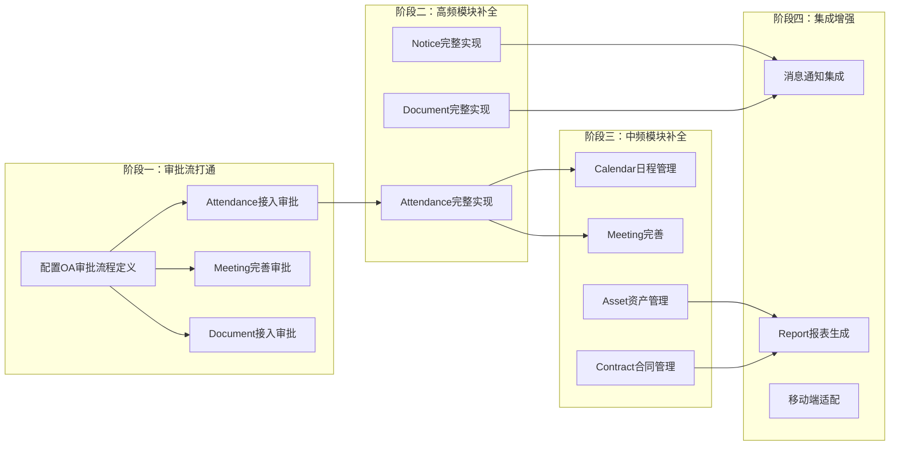

---
tags:
  - plan
  - oa
  - backend
---

# P-OA模块对标分析与开发计划

## 状态

**待启动**

> 状态变更时间：2026-07-17

## 问题背景

OA模块当前处于"脚手架+1个半成品模块"状态，与生产可用的OA系统差距巨大。需要明确缺什么、多了什么、有什么偏差，为后续开发提供方向。

## 目标

1. 完成OA模块与标准OA系统的功能对标分析
2. 制定分阶段开发路线图
3. 明确每个阶段的依赖关系和验证标准

---

## 一、现状分析

### 1.1 模块现状

Spectra OA模块包含9个子模块：

| 子模块 | 成熟度 | API数量 | 业务字段 |
|---|---|---|---|
| Asset（资产管理） | 脚手架 | 1（分页查询） | `departmentId` |
| Attendance（考勤） | 脚手架 | 1（分页查询） | `departmentId` |
| Calendar（日历） | 脚手架 | 1（分页查询） | `departmentId` |
| Contact（通讯录） | 脚手架 | 1（分页查询） | `departmentId` |
| Contract（合同管理） | 脚手架 | 1（分页查询） | `departmentId` |
| Document（文档管理） | 脚手架 | 1（分页查询） | `departmentId` |
| Meeting（会议管理） | **半成品** | 2（创建+分页查询） | 完整业务字段 |
| Notice（公告通知） | 脚手架 | 1（分页查询） | `departmentId` |
| Report（报表） | 脚手架 | 1（分页查询） | `departmentId` |

**关键发现**：
- 7/9子模块仅有分页查询API，Entity只有`departmentId`一个业务字段
- Meeting模块是唯一有实质业务逻辑的子模块（3个实体、VO/From/Converter/Status全套）
- Meeting的工作流集成未完成（`processKey`为空字符串`TODO`）
- 所有实体均有`@DataScope`数据权限注解

### 1.2 与标准OA对比：少了什么

#### 核心缺失模块

| 缺失模块 | 说明 | 优先级 |
|---|---|---|
| **流程审批** | OA灵魂。请假/报销/采购/出差/离职等审批流完全缺失。虽然有`spectra-workflow`模块（Flowable），但OA端没有审批场景接入 | P0 |
| **公文管理** | 发文、收文、签批、归档 | P1 |
| **车辆管理** | 用车申请、派车调度、里程统计 | P2 |
| **通讯/消息** | 站内信、通知推送（邮件/短信/钉钉/企微）、即时通讯 | P1 |
| **日程协同** | Calendar仅有分页查询，无日程创建/共享/提醒/订阅 | P2 |
| **会议室预定** | Meeting只管会议本身，没有会议室资源管理和预定冲突检测 | P1 |

#### 已有模块业务逻辑严重不足

| 模块 | 缺少的业务逻辑 |
|---|---|
| **Asset** | 资产入库、领用、归还、报废、盘点、折旧 |
| **Attendance** | 打卡、请假申请、加班申请、出差、补卡、考勤统计 |
| **Calendar** | 日程CRUD、提醒、共享、周期事件 |
| **Contract** | 合同起草、审批、签署、到期提醒、续签 |
| **Document** | 文件上传/下载、版本控制、目录管理、文档权限 |
| **Notice** | 公告发布、已读/未读状态管理、置顶、分类 |
| **Report** | 报表生成、数据导出、可视化图表 |

### 1.3 与标准OA对比：多了什么

| 内容 | 说明 |
|---|---|
| **独立的Contract（合同管理）** | 传统OA通常不包含合同管理，属于法务/ERP范畴。放在OA里说明项目偏向企业综合管理 |
| **独立的Report（报表）** | 传统OA的报表是附属功能（考勤报表、审批统计等），Spectra将其独立为子模块 |
| **独立的workflow模块** | 传统OA把审批流嵌入OA内部，Spectra把Flowable独立为`spectra-workflow`模块 — 架构更好，但集成未完成 |

### 1.4 偏差与架构问题

#### 1. OA与Core边界模糊

- **Contact（通讯录）**与`spectra-core`的`User`/`Department`高度重叠
- 通讯录本质是Core的查询能力，不应该是OA子模块

#### 2. Meeting工作流集成未完成

- `processInstanceId`字段和`approvalStatus`字段已预留
- `ProcessInstanceService`已注入
- **但`processKey`为空字符串（`TODO`）**，流程定义未配置

#### 3. 成熟度严重不均

- 仅Meeting模块有实质业务逻辑
- 其余8个模块全是空壳，无法支撑任何真实业务

#### 4. 缺少关键横切能力

- 无消息通知机制（审批后通知谁？公告发布后推送给谁？）
- 无数据导入导出能力

#### 5. 小问题

- `ReportController`的`bindService`字段缺少`final`，与其他模块构造器注入模式不一致

---

## 二、开发路线图

### 2.1 阶段划分

### 2.2 依赖关系

| 阶段 | 依赖 | 前置条件 |
|---|---|---|
| 阶段一 | spectra-workflow模块 | 需要先配置OA相关的流程定义（BPMN） |
| 阶段二 | 阶段一完成 | 至少一个审批流程可用 |
| 阶段三 | 阶段二中的Attendance完成 | 考勤是日程和会议的基础 |
| 阶段四 | 阶段二、三完成 | 需要有业务数据才能做报表和通知 |

---

## 三、详细实现步骤

### 阶段一：审批流打通（P0）

#### 1.1 配置OA审批流程定义

**操作**：
- 设计通用OA审批流程BPMN模型
- 在`spectra-workflow`模块中部署流程定义
- 配置流程变量（申请人、审批人、审批结果等）

**文件**：
- `spectra-admin/spectra-modules/spectra-workflow/` — 新增流程定义

#### 1.2 Attendance接入审批

**操作**：
- Attendance实体新增`processInstanceId`和`approvalStatus`字段
- 实现请假/加班/出差申请 → 启动审批流程
- 审批通过后自动更新考勤状态

**文件**：
- `spectra-modules/spectra-oa/src/main/java/com/devops00/spectra/oa/attendance/entity/Attendance.java` — 新增审批字段
- `spectra-modules/spectra-oa/src/main/java/com/devops00/spectra/oa/attendance/service/impl/AttendanceServiceImpl.java` — 接入审批流

#### 1.3 Meeting完善审批

**操作**：
- 配置Meeting的`processKey`（替换TODO空字符串）
- 完善审批回调逻辑（审批通过/驳回后更新Meeting状态）

**文件**：
- `spectra-modules/spectra-oa/src/main/java/com/devops00/spectra/oa/meeting/service/impl/MeetingServiceImpl.java` — 完善processKey配置

#### 1.4 Document接入审批

**操作**：
- Document实体新增审批字段
- 实现重要文档发布需审批的流程

**文件**：
- `spectra-modules/spectra-oa/src/main/java/com/devops00/spectra/oa/document/` — 新增审批字段和逻辑

---

### 阶段二：高频模块补全（P0-P1）

#### 2.1 Attendance完整实现

**操作**：
- 实现打卡API（签到/签退）
- 实现请假申请API
- 实现加班申请API
- 实现出差申请API
- 实现补卡申请API
- 实现考勤统计API（按日/周/月）
- 完善Entity字段（打卡时间、请假类型、请假天数等）

**文件**：
- `spectra-modules/spectra-oa/src/main/java/com/devops00/spectra/oa/attendance/` — 全模块改造

#### 2.2 Notice完整实现

**操作**：
- 实现公告发布API（含草稿/发布状态）
- 实现公告已读/未读状态管理
- 实现公告置顶、分类、有效期
- 完善Entity字段（标题、内容、发布人、已读状态等）

**文件**：
- `spectra-modules/spectra-oa/src/main/java/com/devops00/spectra/oa/notice/` — 全模块改造

#### 2.3 Document完整实现

**操作**：
- 实现文档上传API（对接spectra-upload模块）
- 实现文档下载API
- 实现目录管理API（文件夹树形结构）
- 实现文档版本控制
- 实现文档权限管理（查看/编辑/下载权限）

**文件**：
- `spectra-modules/spectra-oa/src/main/java/com/devops00/spectra/oa/document/` — 全模块改造

---

### 阶段三：中频模块补全（P1-P2）

#### 3.1 Calendar日程管理

**操作**：
- 实现日程创建/编辑/删除API
- 实现日程共享（可见他人日程）
- 实现日程提醒（定时任务推送）
- 实现周期性日程（每日/每周/每月）

**文件**：
- `spectra-modules/spectra-oa/src/main/java/com/devops00/spectra/oa/calendar/` — 全模块改造

#### 3.2 Meeting完善

**操作**：
- 实现会议室资源管理API
- 实现会议室预定API（含冲突检测）
- 实现会议通知API（自动通知参会人）
- 实现会议签到API
- 完善会议纪要API（编辑/查看）

**文件**：
- `spectra-modules/spectra-oa/src/main/java/com/devops00/spectra/oa/meeting/` — 完善现有逻辑

#### 3.3 Asset资产管理

**操作**：
- 实现资产入库API
- 实现资产领用/归还API
- 实现资产报废API
- 实现资产盘点API
- 完善Entity字段（资产名称、型号、价值、状态等）

**文件**：
- `spectra-modules/spectra-oa/src/main/java/com/devops00/spectra/oa/asset/` — 全模块改造

#### 3.4 Contract合同管理

**操作**：
- 实现合同起草API
- 实现合同审批API（接入workflow）
- 实现合同签署状态管理
- 实现合同到期提醒（定时任务）
- 实现合同续签API

**文件**：
- `spectra-modules/spectra-oa/src/main/java/com/devops00/spectra/oa/contract/` — 全模块改造

---

### 阶段四：集成增强（P2）

#### 4.1 消息通知集成

**操作**：
- 实现站内信服务
- 实现邮件通知集成
- 实现短信通知集成
- 对接钉钉/企微推送（可选）

**文件**：
- 新增`spectra-modules/spectra-notify/`模块（或在spectra-core中扩展）

#### 4.2 Report报表生成

**操作**：
- 实现考勤报表（出勤率、迟到早退统计）
- 实现审批报表（审批数量、平均耗时）
- 实现数据导出（Excel）
- 可选：集成图表可视化（ECharts）

**文件**：
- `spectra-modules/spectra-oa/src/main/java/com/devops00/spectra/oa/report/` — 全模块改造

#### 4.3 移动端适配

**操作**：
- 在`spectra-app`中实现OA模块H5页面
- 重点：打卡、审批、公告、会议

**文件**：
- `spectra-app/src/pages/oa/` — 新增OA相关页面

---

## 四、架构优化

### 4.1 Contact模块归属调整

**操作**：
- 将`Contact`模块从`spectra-oa`迁移到`spectra-core`
- Contact的本质是User/Department的查询视图，不是OA业务
- 或者直接废弃Contact模块，通过Core的User/Department API提供通讯录能力

**文件**：
- `spectra-modules/spectra-core/` — 接收Contact模块（如迁移）
- `spectra-modules/spectra-oa/` — 移除Contact模块（如迁移）

### 4.2 Report模块定位调整

**操作**：
- Report作为OA各模块的附属统计功能，而非独立子模块
- 各OA模块（Attendance、Meeting等）自带统计API
- 独立的Report模块负责跨模块的综合报表

**文件**：
- 各OA子模块的Service层 — 新增统计方法

### 4.3 ReportController修复

**操作**：
- 为`bindService`字段添加`final`修饰符
- 与其他模块保持一致的构造器注入模式

**文件**：
- `spectra-modules/spectra-oa/src/main/java/com/devops00/spectra/oa/report/controller/ReportController.java` — 添加`final`

---

## 五、验证方案

### 阶段一验证

- [ ] 能通过API创建一个请假申请并启动审批流程
- [ ] 审批通过后，Attendance状态自动更新
- [ ] Meeting的processKey不再是空字符串

### 阶段二验证

- [ ] Attendance：能完成打卡、请假、加班、出差的完整CRUD
- [ ] Notice：能发布公告，查询已读/未读状态
- [ ] Document：能上传/下载文档，管理目录结构

### 阶段三验证

- [ ] Calendar：能创建日程并设置提醒
- [ ] Meeting：能预定会议室并检测冲突
- [ ] Asset：能完成资产入库→领用→归还→报废全流程
- [ ] Contract：能完成合同起草→审批→签署→到期提醒全流程

### 阶段四验证

- [ ] 审批完成后自动发送站内信通知
- [ ] 能导出考勤报表Excel
- [ ] 移动端能完成打卡和审批操作

---

## 六、影响范围

| 模块 | 影响 |
|---|---|
| `spectra-oa` | 全模块改造，新增大量业务逻辑 |
| `spectra-workflow` | 需要新增OA相关的流程定义 |
| `spectra-core` | 可能接收Contact模块 |
| `spectra-app` | 新增OA移动端页面 |
| 数据库 | 大量表结构变更（新增字段、新增表） |

---

## 相关

- [[40-OA模块]] — OA模块现状文档
- [[90-API总览]] — API端点速查
- [[20-实体清单]] — 实体字段字典
- [[60-工作流]] — Flowable工作流集成
- [[98-计划/spectra-admin/P-工作流模块完整实现计划]] — 工作流模块完整实现计划（总控计划，本计划阶段一将被整合）
