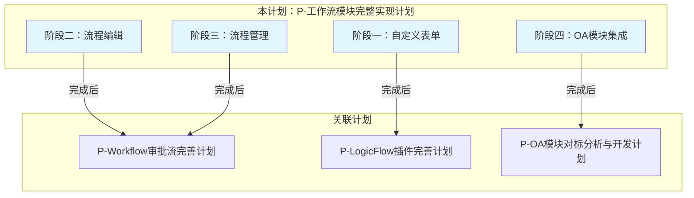

---
tags:
  - plan
  - workflow
  - backend
  - frontend
---

# P-工作流模块完整实现计划

## 状态

**阶段一已完成，阶段二待启动**

> 状态变更时间：2026-07-17

## 问题背景

工作流模块是OA审批流的核心基础设施，当前状态：

### 后端现状

| Controller | 状态 | 缺失功能 |
|---|---|---|
| `ModelController` | 空壳 | 流程模型CRUD、草稿保存 |
| `ProcessDefinitionController` | 部分实现 | 只有查询列表，缺少部署/激活/挂起 |
| `ProcessInstanceController` | 空壳 | 只有start()空方法 |
| `TaskController` | 空壳 | 待办/已办/完成/驳回/转办 |
| `ProcessInstanceService` | 部分实现 | 只有start()方法 |

### 前端现状

| 组件 | 状态 | 说明 |
|---|---|---|
| `WorkflowFormDesigner` | ✅ 已有 | 使用`@form-create/designer`的表单设计器 |
| 流程设计器页面 | ❌ 缺失 | 需要集成logicflow-plugin-flowable |
| 流程管理页面 | ❌ 缺失 | 流程模型/定义/实例管理 |

## 目标

1. 完成工作流模块的完整实现（后端API + 前端页面）
2. 实现自定义表单、流程编辑、流程管理三大功能
3. 完成后，以下计划可自动关闭：
   - P-Workflow审批流完善计划
   - P-LogicFlow插件完善计划（阶段一）
   - P-OA模块对标分析与开发计划（阶段一）

---

## 一、与现有计划关系



### 计划关闭条件

| 关联计划 | 关闭条件 | 对应本计划阶段 |
|---|---|---|
| P-LogicFlow插件完善计划（阶段一） | 流程验证 + 部署API对接完成 | 阶段二 |
| P-Workflow审批流完善计划（阶段一-三） | TaskController + ProcessInstanceController完成 | 阶段三 |
| P-Workflow审批流完善计划（阶段四-五） | 审批回调 + 流程图完成 | 阶段三-四 |
| P-OA模块对标分析与开发计划（阶段一） | Meeting接入审批流完成 | 阶段四 |

---

## 二、详细实现步骤

### 阶段一：自定义表单

> 后端先行，前端跟进
> 状态：**已完成** ✅

#### 设计决策

| 决策项 | 选择 | 说明 |
|---|---|---|
| JSON存储 | 三字段（ruleJson + optionsJson + formJson） | 分开存储便于独立查询，冗余存储便于渲染 |
| 版本管理 | 完整版本管理 | 双表设计：主表 + 版本表，每次保存生成新版本 |
| 实施范围 | 仅阶段一：表单CRUD | 不含流程模型关联 |

#### 1.1 数据库：建表SQL

**文件**：`docs/60-知识库/30-数据模型/34-工作流建表SQL.sql`

**表结构**：

```sql
-- 表单定义主表
CREATE TABLE spectra_core.wf_form_definition (
    id              UUID PRIMARY KEY,
    name            VARCHAR(200) NOT NULL,
    code            VARCHAR(100) NOT NULL UNIQUE,
    current_version INTEGER DEFAULT 1,
    active          BOOLEAN DEFAULT TRUE,
    description     TEXT,
    created_by      UUID,
    created_at      TIMESTAMP(6) WITH TIME ZONE NOT NULL,
    updated_by      UUID,
    updated_at      TIMESTAMP(6) WITH TIME ZONE NOT NULL,
    deleted         TIMESTAMP(6) WITH TIME ZONE,
    version         BIGINT DEFAULT 0
);

-- 表单版本表
CREATE TABLE spectra_core.wf_form_version (
    id                 UUID PRIMARY KEY,
    form_definition_id UUID NOT NULL,
    version            INTEGER NOT NULL,
    rule_json          TEXT,
    options_json       TEXT,
    form_json          TEXT,
    created_by         UUID,
    created_at         TIMESTAMP(6) WITH TIME ZONE NOT NULL,
    updated_by         UUID,
    updated_at         TIMESTAMP(6) WITH TIME ZONE NOT NULL,
    deleted            TIMESTAMP(6) WITH TIME ZONE,
    version            BIGINT DEFAULT 0,
    UNIQUE(form_definition_id, version)
);
```

#### 1.2 后端：实体与Mapper

**文件**：
- `spectra-modules/spectra-workflow/src/main/java/com/devops00/spectra/workflow/javabean/entity/FormDefinition.java` — 新建
- `spectra-modules/spectra-workflow/src/main/java/com/devops00/spectra/workflow/javabean/entity/FormVersion.java` — 新建
- `spectra-modules/spectra-workflow/src/main/java/com/devops00/spectra/workflow/mapper/FormDefinitionMapper.java` — 新建
- `spectra-modules/spectra-workflow/src/main/java/com/devops00/spectra/workflow/mapper/FormVersionMapper.java` — 新建

**FormDefinition 实体设计**：
```java
@Getter @Setter @ToString
@TableName("wf_form_definition")
public class FormDefinition extends BaseEntity {
    /// 表单名称
    @TableField("name")
    private String name;
    /// 表单编码（唯一）
    @TableField("code")
    private String code;
    /// 当前版本号
    @TableField("current_version")
    private Integer currentVersion;
    /// 是否启用
    @TableField("active")
    private Boolean active;
    /// 描述
    @TableField("description")
    private String description;
}
```

**FormVersion 实体设计**：
```java
@Getter @Setter @ToString
@TableName("wf_form_version")
public class FormVersion extends BaseEntity {
    /// 关联表单定义ID
    @TableField("form_definition_id")
    private UUID formDefinitionId;
    /// 版本号
    @TableField("version")
    private Integer version;
    /// form-create规则JSON
    @TableField("rule_json")
    private String ruleJson;
    /// form-create配置JSON
    @TableField("options_json")
    private String optionsJson;
    /// form-create完整输出
    @TableField("form_json")
    private String formJson;
}
```

#### 1.3 后端：Service与Controller

**文件**：
- `spectra-modules/spectra-workflow/src/main/java/com/devops00/spectra/workflow/service/FormDefinitionService.java` — 新建
- `spectra-modules/spectra-workflow/src/main/java/com/devops00/spectra/workflow/service/impl/FormDefinitionServiceImpl.java` — 新建
- `spectra-modules/spectra-workflow/src/main/java/com/devops00/spectra/workflow/controller/FormDefinitionController.java` — 新建

**API端点**：
| 方法 | 端点 | 说明 |
|---|---|---|
| GET | `/workflow/form-definitions` | 分页查询表单列表 |
| GET | `/workflow/form-definitions/{id}` | 查询表单详情（含当前版本内容） |
| POST | `/workflow/form-definitions` | 创建表单（自动创建版本1） |
| PUT | `/workflow/form-definitions/{id}` | 更新表单元数据 |
| DELETE | `/workflow/form-definitions/{id}` | 删除表单（级联删除版本） |
| POST | `/workflow/form-definitions/{id}/versions` | 保存新版本（设计器调用） |
| GET | `/workflow/form-definitions/{id}/versions` | 查询版本历史 |
| GET | `/workflow/form-definitions/{id}/versions/{version}` | 查询指定版本 |

#### 1.4 后端：DTO

**文件**：
- `spectra-modules/spectra-workflow/src/main/java/com/devops00/spectra/workflow/javabean/from/FormDefinitionSaveFrom.java` — 新建
- `spectra-modules/spectra-workflow/src/main/java/com/devops00/spectra/workflow/javabean/from/FormVersionSaveFrom.java` — 新建
- `spectra-modules/spectra-workflow/src/main/java/com/devops00/spectra/workflow/javabean/from/FormPageFrom.java` — 新建
- `spectra-modules/spectra-workflow/src/main/java/com/devops00/spectra/workflow/javabean/vo/FormDefinitionVO.java` — 新建
- `spectra-modules/spectra-workflow/src/main/java/com/devops00/spectra/workflow/javabean/vo/FormVersionVO.java` — 新建

#### 1.5 前端：API层

**文件**：
- `spectra-ui/src/api/workflow/form-api.ts` — 新建

**接口定义**：
```typescript
export const FormApi = {
    page(params: FormPageFrom): Promise<IPage<FormDefinitionVO>>
    getById(id: string): Promise<FormDefinitionVO>
    create(data: FormDefinitionSaveFrom): Promise<void>
    update(id: string, data: FormDefinitionSaveFrom): Promise<void>
    delete(id: string): Promise<void>
    saveVersion(id: string, data: FormVersionSaveFrom): Promise<void>
    getVersions(id: string): Promise<FormVersionVO[]>
    getVersion(id: string, version: number): Promise<FormVersionVO>
}
```

#### 1.6 前端：页面组件

**操作**：
- 将Workflow/index.vue改为el-tabs容器
- 提取现有工作流列表到WorkflowList组件
- 新建FormList组件

**文件**：
- `spectra-ui/src/views/System/Workflow/index.vue` — 修改（改为el-tabs）
- `spectra-ui/src/views/System/Workflow/components/WorkflowList/index.vue` — 新建（迁移现有列表）
- `spectra-ui/src/views/System/Workflow/components/FormList/index.vue` — 新建

**Workflow/index.vue 结构**：
```vue
<template>
    <el-tabs v-model="activeTab">
        <el-tab-pane label="自定义表单" name="form">
            <FormList />
        </el-tab-pane>
        <el-tab-pane label="工作流定义" name="workflow">
            <WorkflowList />
        </el-tab-pane>
    </el-tabs>
</template>
```

**FormList 组件功能**：
- 搜索区：表单名称、状态筛选
- 表格：名称、编码、当前版本、状态、创建时间、操作
- 操作：新增（跳转表单设计器路由）、编辑、查看版本历史、删除

---

### 阶段二：流程编辑

> 后端先行，前端跟进

#### 2.1 后端：Model CRUD + 部署

**操作**：
- 实现`ModelController`（流程模型CRUD）
- 实现`ModelService`（保存、部署）
- 完善`ProcessDefinitionController`（激活、挂起）

**文件**：
- `spectra-modules/spectra-workflow/src/main/java/com/devops00/spectra/workflow/javabean/entity/ProcessModel.java` — 新建
- `spectra-modules/spectra-workflow/src/main/java/com/devops00/spectra/workflow/controller/ModelController.java` — 实现
- `spectra-modules/spectra-workflow/src/main/java/com/devops00/spectra/workflow/service/ModelService.java` — 新建
- `spectra-modules/spectra-workflow/src/main/java/com/devops00/spectra/workflow/service/impl/ModelServiceImpl.java` — 新建
- `spectra-modules/spectra-workflow/src/main/java/com/devops00/spectra/workflow/mapper/ProcessModelMapper.java` — 新建

**实体设计**：
```java
@Entity
@Table(name = "wf_model")
public class ProcessModel extends BaseEntity {
    /// 模型名称
    private String name;
    /// 流程Key
    private String key;
    /// 描述
    private String description;
    /// BPMN XML内容
    @Column(columnDefinition = "TEXT")
    private String bpmnXml;
    /// 关联的表单定义ID
    private String formDefinitionId;
    /// 版本号
    private Integer version;
    /// 是否已部署
    private Boolean deployed;
}
```

**API端点**：
| 方法 | 端点 | 说明 |
|---|---|---|
| POST | `/workflow/models` | 创建流程模型 |
| PUT | `/workflow/models/{id}` | 更新流程模型 |
| GET | `/workflow/models/{id}` | 查询流程模型详情 |
| GET | `/workflow/models` | 查询流程模型列表 |
| DELETE | `/workflow/models/{id}` | 删除流程模型 |
| POST | `/workflow/models/{id}/deploy` | 部署流程模型 |
| POST | `/workflow/process-definitions/{id}/activate` | 激活流程定义 |
| POST | `/workflow/process-definitions/{id}/suspend` | 挂起流程定义 |

#### 2.2 前端：流程设计器页面

**操作**：
- 创建流程设计器页面（集成logicflow-plugin-flowable）
- 实现流程保存、部署功能

**文件**：
- `spectra-ui/src/views/System/Workflow/Designer/index.vue` — 新建
- `spectra-ui/src/api/workflow/model-api.ts` — 新建

#### 2.3 前端：路由配置

**操作**：
- 在系统管理菜单下添加流程设计器路由

**文件**：
- `spectra-ui/src/router/modules/system.ts` — 添加路由

---

### 阶段三：流程管理

> 后端先行，前端跟进

#### 3.1 后端：Task + ProcessInstance API

**操作**：
- 实现`TaskService`（待办/已办/完成/驳回/转办）
- 实现`TaskController`
- 完善`ProcessInstanceController`（查询、终止、流程图）

**文件**：
- `spectra-modules/spectra-workflow/src/main/java/com/devops00/spectra/workflow/service/TaskService.java` — 新建
- `spectra-modules/spectra-workflow/src/main/java/com/devops00/spectra/workflow/service/impl/TaskServiceImpl.java` — 新建
- `spectra-modules/spectra-workflow/src/main/java/com/devops00/spectra/workflow/controller/TaskController.java` — 实现
- `spectra-modules/spectra-workflow/src/main/java/com/devops00/spectra/workflow/controller/ProcessInstanceController.java` — 完善

**TaskService接口**：
```java
public interface TaskService {
    /// 查询待办任务
    IPage<TaskVO> todo(PageFrom page, String assignee);
    
    /// 查询已办任务
    IPage<TaskVO> done(PageFrom page, String assignee);
    
    /// 完成任务（审批通过）
    void complete(String taskId, boolean approved, String comment);
    
    /// 驳回任务
    void reject(String taskId, String comment);
    
    /// 转办任务
    void transfer(String taskId, String targetUserId);
}
```

**API端点**：
| 方法 | 端点 | 说明 |
|---|---|---|
| GET | `/workflow/tasks/todo` | 查询待办任务 |
| GET | `/workflow/tasks/done` | 查询已办任务 |
| POST | `/workflow/tasks/{id}/complete` | 完成任务（审批通过） |
| POST | `/workflow/tasks/{id}/reject` | 驳回任务 |
| POST | `/workflow/tasks/{id}/transfer` | 转办任务 |
| GET | `/workflow/process-instances/{id}` | 查询流程实例状态 |
| GET | `/workflow/process-instances/{id}/diagram` | 获取流程图 |

#### 3.2 前端：流程管理页面

**操作**：
- 创建流程管理页面（模型列表、定义列表、实例列表）
- 创建待办/已办任务列表页面

**文件**：
- `spectra-ui/src/views/System/Workflow/ModelList/index.vue` — 新建
- `spectra-ui/src/views/System/Workflow/ProcessInstanceList/index.vue` — 新建
- `spectra-ui/src/views/System/Workflow/TaskList/index.vue` — 新建
- `spectra-ui/src/api/workflow/task-api.ts` — 新建
- `spectra-ui/src/api/workflow/process-api.ts` — 新建

#### 3.3 前端：路由配置

**操作**：
- 在系统管理菜单下添加流程管理、任务管理路由

**文件**：
- `spectra-ui/src/router/modules/system.ts` — 添加路由

---

### 阶段四：OA模块集成

> 将工作流与OA模块打通

#### 4.1 OA审批回调机制

**操作**：
- 实现`ApprovalCallback`接口
- OA模块实现回调处理审批结果

**文件**：
- `spectra-modules/spectra-workflow/src/main/java/com/devops00/spectra/workflow/service/ApprovalCallback.java` — 新建
- `spectra-modules/spectra-oa/src/main/java/com/devops00/spectra/oa/workflow/OaApprovalCallback.java` — 新建

#### 4.2 Meeting模块接入审批流

**操作**：
- 配置Meeting的processKey（替换TODO空字符串）
- 完善审批回调逻辑

**文件**：
- `spectra-modules/spectra-oa/src/main/java/com/devops00/spectra/oa/meeting/service/impl/MeetingServiceImpl.java` — 完善

#### 4.3 Attendance模块接入审批流

**操作**：
- Attendance实体新增审批字段
- 实现请假/加班/出差申请 → 启动审批流程

**文件**：
- `spectra-modules/spectra-oa/src/main/java/com/devops00/spectra/oa/attendance/` — 接入审批流

---

## 三、验证方案

### 阶段一验证

- [x] 建表SQL已执行，wf_form_definition和wf_form_version表已创建
- [x] 能通过API创建/查询/更新/删除表单定义
- [x] 能通过API保存表单版本（版本号自增）
- [x] 能通过API查询版本历史
- [x] 前端Workflow页面tabs切换正常（FormList + WorkflowList）
- [x] 前端FormList列表正常显示、搜索、删除
- [x] 能在前端表单设计器中保存表单（对接后端API）
- [x] 表单预览功能正常（FormPreview组件，只读渲染历史版本）
- [x] 表单编码由后端自动生成（UUID前8位）

### 阶段二验证

- [ ] 能通过API创建/查询/更新/删除流程模型
- [ ] 能在前端流程设计器中保存流程
- [ ] 能将流程模型部署到Flowable引擎
- [ ] 能激活/挂起流程定义

### 阶段三验证

- [ ] 能查询当前用户的待办任务
- [ ] 能完成任务（审批通过）
- [ ] 能驳回任务
- [ ] 能查询流程实例状态
- [ ] 能获取流程图

### 阶段四验证

- [ ] Meeting创建后能启动审批流程
- [ ] 审批通过后Meeting状态自动更新
- [ ] 审批驳回后Meeting状态自动更新

---

## 四、影响范围

| 模块 | 影响 |
|---|---|
| `spectra-workflow` | 全模块改造，新增大量业务逻辑 |
| `spectra-oa` | Meeting、Attendance接入审批流 |
| `spectra-ui` | 新增多个页面（表单管理、流程设计器、流程管理、任务管理） |
| 数据库 | 新增wf_form_definition、wf_form_version、wf_model表 |
| 知识库 | 新增34-工作流建表SQL.sql |

---

## 五、计划关闭条件

### P-Workflow审批流完善计划

当以下条件全部满足时，该计划可关闭：

- [ ] TaskController实现完成（待办/已办/完成/驳回/转办）
- [ ] ProcessInstanceController实现完成（查询/终止/流程图）
- [ ] 流程变量传递功能完成
- [ ] OA审批流程定义部署完成
- [ ] 审批回调机制实现完成

### P-LogicFlow插件完善计划（阶段一）

当以下条件全部满足时，该计划阶段一可关闭：

- [ ] 流程验证功能完成（保存前验证）
- [ ] 部署API对接完成（与后端ModelController集成）

### P-OA模块对标分析与开发计划（阶段一）

当以下条件全部满足时，该计划阶段一可关闭：

- [ ] Meeting的processKey配置完成（替换TODO）
- [ ] Meeting审批回调实现完成
- [ ] Attendance接入审批流完成

---

## 相关

- [[98-计划/spectra-admin/P-Workflow审批流完善计划]] — Workflow审批流完善计划（将被本计划整合）
- [[98-计划/logicflow-plugin-flowable/P-LogicFlow插件完善计划]] — LogicFlow插件完善计划（将被本计划整合）
- [[98-计划/spectra-admin/P-OA模块对标分析与开发计划]] — OA模块对标分析与开发计划（阶段一将被本计划完成）
- [[60-工作流]] — 工作流模块文档
- [[40-OA模块]] — OA模块文档
