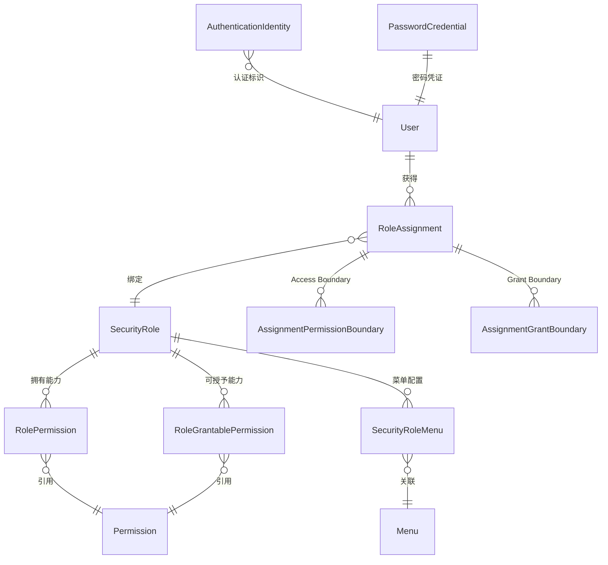

---
tags:
  - backend
  - security
  - domain
---

# 用户与权限

> 基于目标 Role/Permission/RoleAssignment 模型的用户认证与授权体系，模块路径：`spectra-core`。

## 当前实现状态与版本边界

当前安全认证授权以 `spectra_security` 目标模型为唯一事实源，干净数据库由 Flyway 单一 `V1__init_db.sql` 初始化。所有 API 版本统一为 `1.0.0`，不提供兼容层、双写逻辑或第二套授权写入入口。

当前模型的强制不变量如下：

- `RoleAssignment` 是用户获得角色和授权的唯一运行时入口；角色能力、可授予能力、Access Boundary 和 Grant Boundary 分离维护。
- Boundary 必须绑定到 `(RoleAssignment, Permission)`；不同 Permission、不同 Assignment 不得借用范围。
- 认证 Token 为 Opaque Token，Redis 只保存摘要和安全运行态；安全 Redis 不可用时认证、刷新和会话操作 fail-closed。
- `ROLE_DEV_OPS` 由 Root 治理策略管理，最后有效 Root 和 `maxDevOpsUsers` 约束继续生效。
- 前端菜单和按钮只负责展示，后端独立执行 Permission、authorityLevel、Boundary、账号状态和 Session 校验。
- 安全表统一使用 `id UUID`、`created_by`、`created_at`、`updated_by`、`updated_at`、`deleted`、`version` 公共字段；关系表保留业务唯一键，审计表保留分区追加写入例外。

本地 PostgreSQL/Redis 故障注入、cross-assignment、Flyway 迁移基线和 HTTPS 运行时检查均有自动化验证；浏览器、并发和完整业务流程使用人工验收入口。CI、备份恢复、生产 CORS/代理和 break-glass 演练属于 `1.0.0` 发布及生产运维门禁，详见 [[../../部署运维/04-生产环境部署说明]]。

## `core.security` 包结构

认证和授权属于同一安全能力边界，但保持独立子域，避免认证凭证与授权决策相互耦合：

- `core/security/authentication`：认证身份、密码凭证、登录 Provider 和认证身份绑定；按 `application`、`context`、`crypto`、`identity`、`controller`、`javabean`、`mapper`、`service`、`service/impl` 组织，认证组装和摘要能力使用语义包名。
- `core/security/authorization`：角色、Permission Catalog、RoleAssignment、Access/Grant Boundary、Scope 和授权变更 Preview/Apply；内部按 `controller`、`javabean`、`mapper`、`service`、`service/impl`、`domain` 组织。
- `core/audit`：统一审计记录、写入、失败留痕和分类查询；安全类查询继续执行高风险及操作者/目标可见性约束。
- `core/security/policy`：登录端 Session 策略和密码策略；内部按 `controller`、`javabean`、`service`、`service/impl`、`repository` 组织。
- `core/security/change`、`root`：变更治理和 Root 治理等横向安全能力；实现类按 `service/impl` 或 `repository` 归位。
- `core/security/initialization`：首次系统初始化状态、DEV_OPS 用户创建和首个 RoleAssignment。

因此，代码统一位于 `com.devops00.spectra.core.security` 命名空间下，但认证与授权仍按职责分开演进；每个子域内部遵循统一分层包结构，禁止将 Controller、DTO/VO、Service 实现或持久化适配器直接堆放在子域根包。

## 领域模型

## 核心实体

### AuthenticationIdentity / PasswordCredential（认证身份与凭证）

| 字段 | 类型 | 说明 |
|---|---|---|
| `identifierHash` | String | 规范化登录标识摘要，不保存原始标识 |
| `methodCode` / `providerCode` | String | 认证因子与提供方；密码为 `PASSWORD` / `LOCAL` |
| `state` | String | 身份状态 |
| `passwordHash` | String | 密码哈希 |
| `changedAt` | Instant | 最近设置或修改密码的时刻；启用 `maxAgeDays` 时作为最长密码年龄的起点 |
| `expiresAt` | Instant | 密码凭证的显式到期时间；与 `changedAt + maxAgeDays` 同时生效，任一到期即拒绝认证 |
| `mustChange` | Boolean | 是否必须修改密码 |
| `failedAttempts` / `lockedUntil` | Integer / Instant | 凭证失败锁定信息 |

`SecurityUserAssembler` 使用注入的 UTC `Clock` 检查密码、邮箱、短信登录，以及 Session 从数据库重新加载的主体。达到显式到期时间或最长年龄边界即拒绝；启用最长年龄时，缺少 `changedAt` 或时间晚于当前时刻同样拒绝。密码策略无法确认时拒绝认证。`maxAgeDays=null` 表示不限制最长年龄，仍检查显式 `expiresAt`；`mustChange` 的强制改密语义独立保留。

登录失败锁定使用 `AuthenticationIdentifierHash.digest` 生成的规范身份桶：输入先 `trim`、按 `Locale.ROOT` 小写化，再做 SHA-256。登录前锁定检查、失败累加、成功清理和运维定向清理使用同一摘要；邮箱或手机登录成功时清理本次提交的身份桶，不以账户用户名替代。大小写及首尾空格不能分散同一标识的失败预算。

旧 `Account/sys_account` 仅作为一次性迁移输入，目标 V1 运行时不再读取。

### User（用户）

| 字段 | 类型 | 说明 |
|---|---|---|
| `id` | UUID | 主键 |
| `employeeNo` | String | 工号/员工编号，企业内唯一 |
| `avatar` | String | 头像 URL |
| `status` | UserStatus | `ACTIVE`、`LOCKED`、`DISABLED`、`DEPARTED` |
| `statusReason` | String | 最近一次生命周期变更原因 |
| `departedAt` | Instant | 离职时间 |
| `realName` | String | 姓名 |
| `username` | String | 独立登录用户名；承接迁移前 `email` 的登录用途，大小写不敏感且唯一 |
| `language` / `timezone` | String | 用户语言和时区 |
| `primaryDepartmentId` | UUID | 唯一主部门；用户可另有多个关联部门 |
| `securityVersion` | Long | 安全相关变化版本 |

只有 `ACTIVE` 用户可以创建新的认证 Session。`LOCKED` 是安全策略临时锁定，`DISABLED` 是管理员停用，`DEPARTED` 是离职终态；重新入职不自动恢复历史授权。用户管理页面的新增/编辑通过用户开通提交接口同时保存资料、多角色 RoleAssignment 以及被移除的授权实例，任一环节失败都会回滚本次事务。用户列表的授权状态只评估当前未撤销的 RoleAssignment，角色替换或移除后保留的 `REVOKED` 历史记录不会使当前完整授权显示为“部分失效”。角色删除后仍保留的历史 RoleAssignment 不参与运行时授权视图。

#### 用户部门成员关系

`sys_user.primary_department_id` 保存唯一主部门；`sys_user_department_membership` 只保存零个或多个关联部门。用户开通请求使用必填 `primary_department_id` 和可选 `associated_department_ids`；缺省关联列表按空列表处理。主部门不能重复出现在关联列表中，部门关系写入同时校验部门存在且未逻辑删除。用户新增、编辑和关联关系替换在同一事务中完成，审计记录变更前后的主部门及关联部门。

用户分页、详情、个人资料、在线用户和通讯录返回主部门与关联部门摘要。用户和在线用户的 `department_id` 参数是部门筛选条件，用户命中主部门或关联部门时均可匹配；一个用户命中多个筛选部门时只返回一次。目录和通知受众查询也将主部门、关联部门视为部门成员关系。新建 OA 业务记录的默认归属部门仍为主部门。

用户导入的 `associated_department_codes` 是可选的分号分隔编码列表。导入校验关联部门编码有效、去重且不同于主部门；用户开通和导入 Apply 使用相同的部门关系写入服务。部门成员关系不会授予 Action Permission，也不会改写用户的 RoleAssignment 或 Access/Grant Boundary。

部门成员关系参与数据范围计算：每个 Permission 的 `RULES` 部门集合与用户主/关联部门集合求交；启用包含下级时两侧分别扩展到下级部门。`ALL`、`SELF` 和显式用户关系维度保持既有语义。部门合并与部分拆分对成员关系的变更规则见 [[06-系统管理|系统管理]]，其对 `RULES` 范围的影响见 [[05-数据权限设计|数据权限设计]]。

新建、导入和管理员重置统一使用 `spectra_core.sys_config` 中 `user.default-password` 秘密配置；仅保存符合当前密码策略的 BCrypt 哈希，配置接口不回显哈希。应用启动时仅在配置项不存在时创建空值，不覆盖已有设置。该配置未设置时，新建用户、导入 Apply 和管理员重置均 fail-closed；导入会在消费 Preview 前失败，并在 Apply 开始时固定本批次使用的哈希。新建、导入和管理员重置均设置 `mustChange=true` 且 `expiresAt=null`，必须改密表示立即要求修改，不设置定时到期。管理员重置不向响应返回密码，仍记录审计并撤销目标用户的全部 Session。

默认密码会在密码认证成功后将 Session 标记为必须改密。此类 Session 仅允许读取密码规则、读取客户端私钥、修改密码和退出；个人资料、菜单、安全上下文、系统引导及其他业务请求均被拒绝。用户修改成功后撤销该用户全部 Session，再以新密码重新登录。管理员需要在系统配置中设置默认密码；已存在用户不受默认密码设置影响。

用户通过 `PUT /user/password` 修改密码时，后端以 `SecurityPasswordPolicyProvider` 返回的当前系统策略为准，按配置的最小长度、大小写、数字和特殊字符要求校验；修改密码最大长度为 20 位，策略最小长度也限制在 8–20 位。个人中心先读取 `GET /security/policy/password` 展示相同规则，普通已认证用户可读取该非敏感策略，策略修改仍仅允许 `security:password-policy:update` 权限。

### SecurityRole（目标角色）

| 字段 | 类型 | 说明 |
|---|---|---|
| `id` | UUID | 主键 |
| `name` | String | 角色名称，角色目录内唯一 |
| `code` | String | 稳定角色编码（ROLE_xxx）；新增未指定时生成 `ROLE_` 加 8 位大写十六进制后缀，编辑不可修改 |
| `authorityLevel` | Integer | 管理边界等级；用于限制授权操作者可授予的目标角色，不代表业务角色级别或排序 |
| `roleKind` | String | 角色种类：`BUSINESS`、`DEV_OPS`、`SYSTEM_ADMIN`、`AUDITOR`；系统内置角色包括四个固定角色，普通业务角色可创建多个 |
| `state` | String | `ACTIVE` 或 `DISABLED` |
| `systemManaged` | Boolean | 是否系统托管 |
| `remark` | String | 角色备注 |
| `version` | Long | 并发版本 |

角色名称由服务层和数据库共同保证唯一；新增角色固定为 `BUSINESS` 类型、管理边界等级 `1`、非内置，业务角色可以创建多个。`ROLE_DEV_OPS`、`ROLE_ADMIN_SYSTEM`、`ROLE_AUDIT` 和 `ROLE_USER` 是四个固定内置角色，类型、编码、名称、等级和生命周期不可修改；其中 `ROLE_USER` 是每个用户自动拥有的基础角色，不参与业务角色选择和移除。管理边界等级越高，越有资格为更低等级的目标角色授予权限；Root 运维角色基线为 `1000`，普通业务角色为 `1~999`。普通角色的等级在角色授权 Preview/Apply 流程中调整，必须经过等级权限、Grant Boundary、版本校验、影响预览、审计和会话撤销；角色编辑页只允许普通业务角色修改名称和备注。角色状态通过独立的启用/禁用接口变更，禁用前必须确认没有活动授权实例；删除使用逻辑删除，内置角色不可编辑、启用、禁用或删除。

### Permission（Permission Catalog）

| 字段 | 类型 | 说明 |
|---|---|---|
| `id` | UUID | 主键 |
| `resource` | String | 资源标识 |
| `action` | String | 动作标识 |
| `code` | String | 稳定权限编码 |
| `allowedScopeModes` | Set | 该 Permission 允许的 Scope 模式 |

### RoleAssignment / Boundary

`RoleAssignment` 是用户获得角色和权限的唯一运行时授权入口。角色能力、可授予能力、Access Boundary 和 Grant Boundary 分开维护；授权写入必须经过 Impact Preview/Apply、版本校验和安全变更审计。

`AuthorizationProfile` 是可复用的授权方案模板，不是运行时授权对象。方案使用稳定的 Role/Permission 编码、Role version 和部门业务编码保存配置；应用到用户时仍必须重新通过 RoleAssignment Preview/Apply、目标用户安全版本和 Grant Boundary 校验。方案版本变化不会修改已经生成的 RoleAssignment，启用/停用只控制模板是否可被应用，删除方案模板也不会撤销已经生成的 RoleAssignment。

用户批量导入是独立的 Preview/Apply 任务：Preview 只保存固定模板行、文件摘要和校验结果，工号由后端按任务幂等键和行号生成并写入规范化暂存行，Apply 校验通过后立即返回 `APPLYING` 任务，并在有界后台执行器中逐行复用用户创建及 RoleAssignment Preview/Apply；前端通过任务详情查询已处理行数和最终状态。任务使用操作人 + 幂等键、规范化请求摘要、授权方案版本摘要和一次性短时 token 防止重复应用；后端不接受内部 Role、Assignment、Permission 或 Scope UUID。

用户开通已收口为连续流程：Web 新增和编辑分别使用完整页面路由，按“基本信息 → 授权方案 → 角色授权”组织；`ROLE_USER` 由后端在创建、编辑和导入用户时自动补齐，前端不允许手工移除，业务角色可以不选。已有业务角色在授权方案步骤加载，角色新增和移除只在该步骤完成，角色授权步骤用 `3.1`、`3.2` 等子节点逐个配置 Boundary。步骤切换只保存在页面状态，最终由用户开通接口一次性提交用户资料、多角色授权和移除列表，失败时由事务回滚，不留下半成品用户。仅有基础角色的用户可以正常登录，列表授权状态显示为 `BASIC_ONLY`（仅基础权限）。

`SecurityRoleMenu` 只负责菜单 UX 配置，不代替接口上的 `@PreAuthorize` 与 Permission 校验。当前用户菜单从活动 RoleAssignment 和角色菜单关系合并，并自动补齐导航所需祖先目录。

## 内置角色权限基线

权限判断使用 Permission Catalog 中稳定的小写叶子编码（例如 `user:read`、`oa:calendar:update`）；目录父节点仅用于分组展示。V8 将四个内置角色的直接授权和菜单关系固定为版本化基线。有效授权仍须经过活动 RoleAssignment 与每个 Permission 自己的 Access Boundary；因此角色授予某个 `RULES` Permission 不代表其用户已经拥有部门数据访问。

| 角色 | 角色直接授予 | 自动继承 | 默认数据范围 |
|---|---|---|---|
| `ROLE_DEV_OPS` | 隐式通配符 `*`，不依赖 `sec_role_permission` | 不依赖 `ROLE_USER` 扩大 Root 权限 | `GLOBAL`；Root 治理、Break-glass、脱敏、审计和受控系统绕过仍生效 |
| `ROLE_ADMIN_SYSTEM` | 66 个 Permission：`user:{create,read,update,disable,reset-password,unlock,assign-role}`；`role:{assign,create,read,update,delete,disable,grant,authority-level:update}`；`permission:read`；`menu:{create,read,update,disable}`；`department:{create,read,update}`；`dictionary:{create,read,update,disable}`；`region:read`；`oa:application:{read,update}`、`oa:asset:{create,read,update}`、`oa:contact:read`、`oa:contract:{create,delete,read,update}`、`oa:document:{create,read,update}`、`oa:leave:{read,update}`、`oa:meeting:{create,read,update}`、`oa:notice:{create,read,update}`、`oa:purchase:{create,read,update}`、`oa:reimbursement:{read,update}`、`oa:report:read`、`oa:application-type:{create,read,update,disable}`；`workflow:process:{create,read,update}`、`workflow:instance:{read,update}`、`workflow:task:{read,update}` | `ROLE_USER` 的 13 项个人能力 | 管理和 OA / Workflow 业务 Permission 使用 `RULES` 且默认无部门规则；仅目录类 `NONE` 边界可用，禁止 `ALL` |
| `ROLE_AUDIT` | 27 项：`audit:{read,export}`；`user:read`、`role:read`、`permission:read`、`menu:read`、`department:read`、`dictionary:read`、`region:read`、`file:read`；`oa:{application,asset,contact,contract,document,leave,meeting,notice,purchase,reimbursement,report,application-type}:read`；`workflow:{process,instance,task}:read`；`notification:{provider,template}:read` | `ROLE_USER` 的 13 项个人能力，包含本人日历 CRUD | 审计域由专用策略提供全系统非高风险可见性；业务 `RULES` 默认无部门规则；元数据和审计使用 `NONE` 授权语义，不授予通用 `ALL` |
| `ROLE_USER` | 13 项：`account:{read,update}`；`notification-setting:{read,update}`；`notification:{read,update,delete}`；`oa:calendar:{create,read,update,delete}`；`oa:workbench:read`；`workflow:instance:create` | 每个普通账号创建、编辑和导入时自动补齐 | 所有个人数据 Boundary 为 `SELF`；不得扩大到其他主体 |

V8 后端矩阵仅包含 Permission Catalog 仍存在的代码：不授予已废弃的 `department:disable` 或已移除的 `workflow:form:*`。创建的 Admin / Audit Assignment 没有 `RULES` 边界时，该角色直接授予的 `RULES` Permission 不进入有效安全上下文；配置部门规则后，才可调用相应 API，记录仍受用户部门成员范围求交。开发库验收账号在无 RULES 的基线下分别得到 34（Admin）和 23（Audit）项有效 Permission；这两个数量是该具体边界快照的结果，不是固定角色码数量。

### 菜单、路由和页面

菜单只决定导航可见性；静态路由还要求 `meta.requiredMenu` 在授权菜单中。没有注册页面的旧菜单会在前端过滤，不进入侧栏。V8 菜单叶子（英文 route name）如下，当前用户接口会递归补齐父目录：

| 角色 | 菜单叶子 | 数量（含继承） |
|---|---|---:|
| `ROLE_DEV_OPS` | 全部有效、已注册的页面菜单；运行时还过滤无注册路由项 | 52 个已注册菜单路由（本次开发库验收） |
| `ROLE_ADMIN_SYSTEM` | `Dashboard`、`SystemUser`、`SystemRoleManagement`、`SystemDept`、`SystemDict`、`SystemMenu`、`SystemWorkflow`、`SystemRegion`、`OAAsset`、`OASupply`、`OALeave`、`OAApplicationTypes`、`OAContact`、`OAContract`、`OADocument`、`OAMeeting`、`OANotice`、`OAPurchase`、`OAReimbursement`、`OAReport`、`OAApproval`、`OAApprovalReimbursement`、`OAApprovalPurchase`、`OAApprovalLeave`，以及继承的 `OACalendar` | 25 |
| `ROLE_AUDIT` | `Dashboard`、`SystemUser`、`SystemRoleManagement`、`SystemDept`、`SystemDict`、`SystemMenu`、`SystemWorkflow`、`SystemRegion`、`DevopsAuditLog`、`DevopsNotificationTemplate`、`DevopsNotificationProvider`、`OAAsset`、`OASupply`、`OALeave`、`OAApplicationTypes`、`OAContact`、`OAContract`、`OADocument`、`OAMeeting`、`OANotice`、`OAPurchase`、`OAReimbursement`、`OAReport`、`OAApproval`、`OAApprovalReimbursement`、`OAApprovalPurchase`、`OAApprovalLeave`，以及继承的 `OACalendar` | 28 |
| `ROLE_USER` | `Dashboard`、`OACalendar` | 2 |

菜单存在不等同于每个 API 可用：如 Admin / Audit 页面对应的业务 Permission 依赖 `RULES`，无部门授权时请求会被拒绝或查询为空；每个页面操作按钮继续使用 `v-permission`，直接 HTTP 调用仍由 Controller / Service 的授权与数据范围门禁检查。Audit 的跨用户写操作不开放；继承自 `ROLE_USER` 的本人账户、通知设置、个人通知和日历操作仍只作用于本人。Root 的菜单目录及 Root 专属运维路由不能仅凭 `*` 以外角色访问。

### API 门禁及例外

| Controller 门禁 | 适用角色 | 评估方式 |
|---|---|---|
| `hasRole('ROLE_DEV_OPS')` | 仅 Root | 显式高风险接口，例如 Quartz 全部 12 个方法、密钥治理和安全运维；不转译为普通 Permission grant |
| `hasPermission(null, '<code>')` | 按角色直接授权和用户 Access Boundary 共同决定 | 先检查有效 Permission，再按 `NONE` / `SELF` / `RULES` / Root `ALL` 判定资源；前端菜单和按钮不能代替这一判断 |
| `isAuthenticated()` | 所有成功登录主体 | 只用于个人资料、当前菜单、当前安全上下文等自服务入口，服务层必须以认证主体身份限制资源 |
| `permitAll` | 匿名及已认证用户 | 仅限登录、刷新、公共启动与回调等契约；需另外检查验证码、Refresh Cookie、签名和幂等条件 |

四角色逐 Permission、逐菜单的自动化快照位于 `BuiltinRoleAuthorizationDefaultsTest` 与前端 `builtin-role-authorization-visibility.test.ts`；Quartz Root 门禁有独立 Controller 授权测试。完整 HTTP 路径、方法与资源说明见 [[16-API总览]]，端点上的实际注解和服务级资源门禁是最终契约。当前实现已将角色种子、Scope、菜单、静态路由过滤和 `/security/context` 接入同一授权模型。

## OA 权限点

通用申请与请假接口使用独立权限域，保持与既有 `MODULE:ACTION` 约定一致：

| 权限 | 用途 |
|---|---|
| `OA_APPLICATION:QUERY` | 申请分页、详情、类型和工作台摘要查询 |
| `OA_APPLICATION:UPDATE` | 通用申请撤回、取消 |
| `OA_LEAVE:QUERY` | 请假分页与详情 |
| `OA_LEAVE:INSERT` | 新建请假草稿 |
| `OA_LEAVE:UPDATE` | 修改、提交、撤回、取消请假 |
| `OA_WORKBENCH:QUERY` | Dashboard 工作台摘要 |
| `OA_NOTICE:QUERY` | 公告分页、详情和可见范围查询 |
| `OA_NOTICE:INSERT` | 创建公告草稿 |
| `OA_NOTICE:UPDATE` | 发布、撤回、标记已读 |
| `OA_CALENDAR:QUERY` | 查询本人及共享日程 |
| `OA_CALENDAR:INSERT` | 创建个人日程 |
| `OA_CALENDAR:UPDATE` | 修改个人日程 |
| `OA_CALENDAR:DELETE` | 删除个人日程 |
| `OA_MEETING:QUERY` | 查询会议 |
| `OA_MEETING:INSERT` | 创建会议和参会邀请 |
| `OA_MEETING:UPDATE` | 参会响应、签到和纪要 |
| `OA_REIMBURSEMENT:QUERY` | 报销分页、详情和状态查询 |
| `OA_REIMBURSEMENT:INSERT` | 新建报销草稿 |
| `OA_REIMBURSEMENT:UPDATE` | 修改、提交、撤回和取消报销 |
| `OA_REIMBURSEMENT:PAYMENT` | 审批通过后登记付款 |

报销、采购权限树和内置角色授权已经完成迁移，并包含在当前 Flyway 数据基线的 `spectra_core` schema 中；数据库结构和固定种子只通过 Flyway 管理，不再维护或重复执行独立建表 SQL。未从数据基线初始化的环境如缺少菜单节点，应通过菜单和角色管理功能补齐授权。

敏感接口统一使用 `hasRole('ROLE_DEV_OPS')`：服务监控、系统配置、RSA 密钥读写、权限树增删改、文件信息删除、内部消息发送、区域基础数据写入，以及 Web 加密 nonce 的定向/全局失效。用户密码重置由 `user:reset-password` Permission 控制，并在服务层校验目标用户是否处于调用者的数据范围内；普通接口按模块动作 Permission 校验，个人资料/菜单当前用户等自服务接口仅要求已认证。

缓存监控与安全运行态维护的权限边界如下：

| 权限 | 用途 |
|---|---|
| `system:cache:read` | 查看普通缓存区域和脱敏安全运行态 |
| `system:cache:clear` | 预览、清理显式注册的普通缓存区域 |
| `security:verification:manage` | 按受控类型维护验证码及登录验证码尝试计数 |
| `security:login-failure:manage` | 清理账号登录失败计数；不改变用户生命周期状态 |
| `security:replay:manage` | 标识 Web 防重放维护能力；实际 nonce API 仍额外要求 `ROLE_DEV_OPS` |
| `session:revoke` | 复用既有会话撤销能力，按用户/客户端、稳定会话句柄或用户全部撤销 Session |

缓存维护页面不接收明文 Access/Refresh Token、验证码、nonce 或安全 Redis Key。普通缓存清理只接受后端注册表区域；安全 Redis 故障时所有安全状态操作 fail-closed。

在线用户页面使用 `GET /user/online` 查询当前有效会话，按用户而非设备分页，并支持账号、姓名和部门（含下级部门）筛选。用户记录带有当前资料、有效会话数、最近登录时间及可展开的会话摘要。每个 Refresh Token Family 对应一个安全 Redis 随机句柄；Access/Refresh Token 刷新轮换不会改变句柄，升级前的有效会话会在首次查询时补齐句柄。句柄只用于具有 `session:revoke` 权限的管理员操作，列表不会返回 Token、Token 摘要、Family ID 或 Redis Key。

单会话下线调用 `POST /cache/admin/security/session/revoke-one`，只提交 `session_id`、原因和确认状态；后端会拒绝撤销发起当前请求的会话，但允许撤销同账号的其他客户端会话。全部下线针对当前管理员账号时保留当前 Access Token 并撤销其余会话，针对其他用户仍撤销全部会话；按用户/客户端批量操作也会拒绝撤销当前客户端会话。所有操作都要求非空且不超过 200 字的理由、显式确认和 `@Audit` 审计。安全 Redis 连接、命令或句柄映射无法确认时，操作 fail-closed；无数据库迁移。

按用户或客户端撤销会遍历 Refresh 生命周期内的会话索引，覆盖 Access 已到期但 Refresh 仍有效的会话；同端允许并发时撤销全部匹配会话，踢旧和并发上限也将有效 Refresh 计入。缺少用户索引的旧 Refresh 不能再轮换，需重新登录。当前 Web 的 Refresh 失败路径清理本地会话并停止继续使用旧 Access，协议和端点未变；页面级身份失效验收仍归 B08，BASE-003 的隔离 Redis 证据及边界见 [[开发指南/工程治理/2026-10-09-B02会话撤销生命周期验证|会话撤销专项验证]]。

## 认证流程

支持 **三种登录方式**：

| Provider | 类名 | 说明 |
|---|---|---|
| 用户名密码 | `LoginUsernamePasswordProvider` | 标准账号密码登录 |
| 邮箱验证码 | `LoginEmailProvider` | 邮箱验证码登录 |
| 短信验证码 | `LoginSmsProvider` | 手机短信验证码登录 |

认证入口：`core.security.authentication.controller.AuthenticationController` → `LoginServiceImpl` → Provider 策略；验证码发送由同一认证子域的 `VerificationCodeServiceImpl` 负责。

主认证成功后由安全认证端口直接签发正式 Token 和 Session；密码、短信验证码和邮箱验证码登录均遵循同一会话创建路径，不再有二阶段挑战或额外认证因子。

## Controller

| 类 | 路径 |
|---|---|
| `AuthenticationController` | `spectra-core/.../security/authentication/controller/AuthenticationController.java` |
| `UserController` | `spectra-core/.../user/controller/UserController.java` |
| `UserImportController` | `spectra-core/.../user/imports/controller/UserImportController.java` |
| `RoleController` | `spectra-core/.../user/controller/RoleController.java` |
| `AuthenticationIdentityController` | `spectra-core/.../security/authentication/controller/AuthenticationIdentityController.java` |
| `AuthorizationController` | `spectra-core/.../security/authorization/controller/AuthorizationController.java` |
| `AuthorizationProfileController` | `spectra-core/.../security/authorization/controller/AuthorizationProfileController.java` |
| `SecurityContextController` | `spectra-core/.../security/authorization/controller/SecurityContextController.java` |
| `AuthorityController` | `spectra-core/.../user/controller/AuthorityController.java`（Permission Catalog 只读树） |

## Service

| 类 | 路径 |
|---|---|
| `AuthenticationIdentityServiceImpl` | `core/security/authentication/service/impl/AuthenticationIdentityServiceImpl.java` |
| `AuthenticationIdentityBindingServiceImpl` | `core/security/authentication/service/impl/AuthenticationIdentityBindingServiceImpl.java` |
| `PasswordCredentialServiceImpl` | `core/security/authentication/service/impl/PasswordCredentialServiceImpl.java` |
| `UserServiceImpl` | `core/user/service/impl/UserServiceImpl.java` |
| `UserOnboardingServiceImpl` | `core/user/service/impl/UserOnboardingServiceImpl.java`（用户资料和 RoleAssignment 一次性提交） |
| `RoleServiceImpl` | `core/user/service/impl/RoleServiceImpl.java`（目标 Role 目录） |
| `RoleAuthorizationChangeServiceImpl` | `core/security/authorization/service/impl/RoleAuthorizationChangeServiceImpl.java` |
| `AuthorizationAssignmentChangeServiceImpl` | `core/security/authorization/service/impl/AuthorizationAssignmentChangeServiceImpl.java` |
| `PermissionCatalogServiceImpl` | `core/security/authorization/service/impl/PermissionCatalogServiceImpl.java` |
| `AuthorizationProfileServiceImpl` | `core/security/authorization/service/impl/AuthorizationProfileServiceImpl.java` |

## 关键文件路径

| 文件 | 路径 |
|---|---|
| AuthenticationController | `spectra-modules/spectra-core/src/main/java/com/devops00/spectra/core/security/authentication/controller/AuthenticationController.java` |
| User 实体 | `spectra-modules/spectra-core/src/main/java/com/devops00/spectra/core/user/javabean/entity/User.java` |
| AuthenticationIdentity 实体 | `spectra-modules/spectra-core/src/main/java/com/devops00/spectra/core/security/authentication/javabean/entity/AuthenticationIdentity.java` |
| PasswordCredential 实体 | `spectra-modules/spectra-core/src/main/java/com/devops00/spectra/core/security/authentication/javabean/entity/PasswordCredential.java` |
| SecurityRole 实体 | `spectra-modules/spectra-core/src/main/java/com/devops00/spectra/core/security/authorization/entity/SecurityRole.java` |
| RoleAssignment 实体 | `spectra-modules/spectra-core/src/main/java/com/devops00/spectra/core/security/authorization/entity/RoleAssignment.java` |
| Permission 实体 | `spectra-modules/spectra-core/src/main/java/com/devops00/spectra/core/security/authorization/entity/Permission.java` |
| AuthorizationProfile 实体 | `spectra-modules/spectra-core/src/main/java/com/devops00/spectra/core/security/authorization/entity/AuthorizationProfile.java` |
| AuthorizationProfileAssignment 实体 | `spectra-modules/spectra-core/src/main/java/com/devops00/spectra/core/security/authorization/entity/AuthorizationProfileAssignment.java` |
| AuthorizationProfileBoundary 实体 | `spectra-modules/spectra-core/src/main/java/com/devops00/spectra/core/security/authorization/entity/AuthorizationProfileBoundary.java` |

## 相关笔记

- [[06-系统管理]] — 菜单、部门管理
- [[12-基础设施]] — Spring Security 集成
- [[16-API总览]] — 认证相关 API
- [[00-实体关系图]] — 完整 ER 关系
- [[05-数据权限设计]] — 二维数据权限过滤框架
- [[03-数据库命名规范]] — SYS_ 表约定
