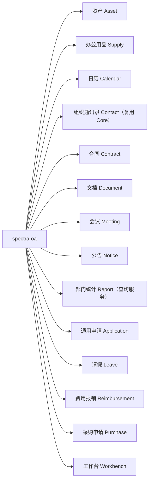

---
tags:
  - backend
  - domain
---

# OA 模块

> 办公自动化（Office Automation），路径：`spectra-oa`。模块包含通用申请、请假、审批、协同办公、报销、采购、资产、办公用品、文档、合同和部门统计能力；组织通讯录复用 Core 用户与部门数据，请假考勤影响使用 `AttendanceRecord` 记录。本页按子模块记录实体、API、业务闭环和当前边界，源码与 SQL 是实现事实来源。

> OA 是可选业务模块，由 `spectra-launch` 在 `spectra.modules.oa.enabled=true` 时装配；它依赖 Workflow、Upload、Notification 适配器，但不要求修改 `spectra-core` 才能启用。OA 不引入租户上下文或 SaaS 隔离。

## 子模块一览



## 各模块详情

### Asset（资产管理）

| 项目 | 内容 |
|---|---|
| Controller | `AssetController` |
| Service | `AssetServiceImpl` |
| Entity | `Asset`、`AssetCategory`、`AssetOperation` |
| API | `/oa/assets/page`、`/oa/assets/{id}`、`/oa/assets/categories`、`/oa/assets/{id}/assign`、`return`、`transfer`、`maintenance`、`scrap`、`/oa/assets/from-purchase` |
| 能力 | 资产分类、台账、采购收货转草稿、入库履历、领用、归还、调拨、维修、报废及生命周期记录 |

### Supply（办公用品库存）

办公用品与固定资产分开建模，围绕 SKU、库存数量和领用记录形成轻量库存闭环。支持手工建档、入库、领用、退库、库存调整和最低库存查询；数量变动统一写入操作流水，避免直接修改历史记录。

| 项目 | 内容 |
|---|---|
| Controller | `SupplyController` |
| Service | `SupplyServiceImpl` |
| Entity | `SupplyItem`、`SupplyOperation` |
| API | `/oa/supplies/page`、`/{id}`、`/{id}/inbound`、`/{id}/issue`、`/{id}/return`、`/{id}/adjust`、`/low-stock` |
| 权限 | 复用 `OA_ASSET:QUERY/INSERT/UPDATE` |
| 能力 | SKU 台账、当前库存、最低库存提醒、入库、领用、退库、盘点调整和库存流水 |

### Calendar（日历）

| 项目 | 内容 |
|---|---|
| Controller | `CalendarController` |
| Service | `CalendarServiceImpl` |
| Entity | `Calendar` |
| API | `/oa/calendar/page`、`/oa/calendar`、`/{id}` |
| 能力 | 个人日程、全员/部门共享、时间范围查询、创建/更新/删除 |

### Contact（通讯录）

| 项目 | 内容 |
|---|---|
| Controller | `ContactController` |
| Service | `ContactServiceImpl` |
| 数据来源 | 复用 Core 的 `User`、`Department`，不复制 OA 联系人主数据 |
| API | `/oa/contact/page` |
| 能力 | 按姓名、用户名、手机号、邮箱搜索组织员工，返回所属部门；只展示启用且未删除用户 |

### Contract（合同管理）

| 项目 | 内容 |
|---|---|
| Controller | `ContractController` |
| Service | `ContractServiceImpl` |
| Entity | `Contract`、`ContractVersion`、`ContractMilestone` |
| API | `/oa/contract/page`、`/{id}`、`/{id}/versions`、`/{id}/milestones`、`/{id}/sign`、`/{id}/activate`、`/{id}/terminate`、`/{id}/archive`、`/reminders/run` |
| 能力 | 合同编号、相对方、金额/期限、部门可见范围、签署/生效/终止/归档状态、文件版本链、履约节点、临期一次性提醒 |
| 当前边界 | 未接入审批流、电子签章、相对方独立主数据和合同全文检索；预览/下载、分页检索按负责人/公开/部门范围鉴权 |

### Document（文档管理）

| 项目 | 内容 |
|---|---|
| Controller | `DocumentController` |
| Service | `DocumentServiceImpl` |
| Entity | `Document`、`DocumentFolder`、`DocumentVersion` |
| API | `/oa/document/page`、`/{id}`、`/{id}/versions`、`/{id}/publish`、`/{id}/archive`、`/{id}/versions/{versionId}/current`、`/folders`、`/{id}/versions/{versionId}/preview`、`download` |
| 能力 | 文档元数据、部门目录、文件版本链、当前版本恢复、草稿/发布/归档、文件引用计数；预览和下载经过文档可见范围校验，发布向目标用户发送通知 |
| 当前边界 | 支持 PUBLIC/DEPARTMENT/PRIVATE 三种范围和标题检索；未提供 ACL 明细授权、审批发布、敏感字段/水印策略和全文检索 |

### Meeting（会议管理）

最复杂的 OA 子模块，涉及三个实体。

| 项目 | 内容 |
|---|---|
| Controller | `MeetingController` |
| Service | `MeetingServiceImpl` |
| Entity | `Meeting` — 会议基本信息 |
| Entity | `MeetingParticipant` — 参会人员 |
| Entity | `MeetingRecord` — 会议纪要 |
| API | `/oa/meeting/page`、`/{id}/response`、`/{id}/check-in`、`/{id}/record` |
| 能力 | 以地点作为会议室键进行时间重叠校验、邀请响应、签到、纪要 |

### Notice（公告通知）

| 项目 | 内容 |
|---|---|
| Controller | `NoticeController` |
| Service | `NoticeServiceImpl` |
| Entity | `Notice` |
| Entity | `NoticeReader` — 阅读回执 |
| API | `/oa/notice/page`、`/`、`/{id}/publish`、`/{id}/revoke`、`/{id}/read` |
| 能力 | 全员/部门范围、发布/撤回、站内通知、已读回执 |

### Report（部门统计与导出）

| 项目 | 内容 |
|---|---|
| Controller | `ReportController` |
| Service | `DepartmentStatsServiceImpl`（跨域只读聚合与导出） |
| 数据来源 | 资产、办公用品、报销和采购业务表，不维护“万能报表”实体 |
| API | `/oa/report/department`、`/oa/report/department/export` |
| 能力 | 按部门聚合资产、办公用品、报销和采购数据，支持查询与 Excel 导出；复用 `OA_REPORT:QUERY` 权限和各业务实体的数据范围 |
| 当前边界 | 未提供跨域高级指标、异步导出任务、图表看板和更多字段脱敏策略 |

### Application（通用申请内核）

统一承载 OA 申请单的编号、类型、业务明细、申请人、组织归属、工作流实例和生命周期状态。

| 项目 | 内容 |
|---|---|
| Controller | `ApplicationController` |
| Service | `ApplicationServiceImpl` |
| Entity | `Application`、`ApplicationType` |
| 状态 | `DRAFT` → `IN_REVIEW` → `APPROVED` / `REJECTED`；支持 `WITHDRAWN`、`CANCELLED` |
| API | `/oa/applications/page`、`/{id}`、`/types`、`/types/all`、`/types`（POST）、`/types/{id}`（PUT/DELETE）、`/{id}/withdraw`、`/{id}/cancel` |
| Web 页面 | `/oa/application-types`（`OAApplicationTypes`），维护编码、名称、表单/流程 Key、启停和排序 |

申请主表只保存通用字段，业务字段进入类型明细表；流程 `businessKey` 固定使用 `oa_application.id`。

### Leave（请假闭环）

请假流程覆盖申请、审批、额度和考勤联动。请假明细按固定班次（09:00-12:00、13:00-18:00）计算工作时长，周末不计入；若配置了年度额度，则提交时预占、审批通过转已用、驳回/撤回/取消释放。审批通过后按工作日写入 `oa_attendance_record`，回调按申请状态保证幂等。

| 项目 | 内容 |
|---|---|
| Controller | `LeaveController` |
| Service | `LeaveServiceImpl` |
| Entity | `LeaveType`、`LeaveApplication`、`LeaveBalance`、`AttendanceRecord` |
| API | `/oa/leave`、`/oa/leave/page`、`/{id}`、`/{id}/submit`、`/{id}/withdraw`、`/{id}/cancel` |
| 流程 KEY | `oa_leave_approval` |
| 闭环 | 草稿/驳回态可编辑，提交时选择审批人；审批通过生成 `oa_attendance_record`，撤回后可取消且重复终止幂等 |

### Reimbursement（费用报销闭环）

费用报销复用通用申请外壳，业务明细和付款执行状态独立持久化。支持草稿、费用明细、发票/收据附件、提交审批、撤回/取消、审批回调和登记付款；审批状态与付款状态分离，金额统一使用 `BigDecimal`。

| 项目 | 内容 |
|---|---|
| Controller | `ReimbursementController` |
| Service | `ReimbursementServiceImpl` |
| Entity | `Reimbursement`、`ReimbursementItem` |
| API | `/oa/reimbursements`、`/oa/reimbursements/page`、`/{id}`、`/{id}/submit`、`/{id}/withdraw`、`/{id}/cancel`、`/{id}/payment` |
| 流程 KEY | `oa_reimbursement_approval` |
| 附件 | 复用 `oa_application_attachment`，业务表使用 `file_asset_id`；引用登记后按 OA 业务权限预览/下载 |
| 闭环 | 草稿/驳回态可编辑，支持审批同意/驳回、撤回/取消；审批通过后独立登记付款并进入 `PAID` |
| 当前边界 | 未提供财务多级审核、预算校验、发票 OCR、付款失败重试和统计导出；已校验同单及跨报销单发票号码不可重复 |

### Purchase（采购申请闭环）

采购申请复用通用申请外壳，采购明细、执行单和收货批次独立持久化。支持草稿、物品/服务明细、审批、采购执行登记、订单号、分批收货、验收差异和执行状态回写；不包含完整供应链、库存成本或应付账款能力。

| 项目 | 内容 |
|---|---|
| Controller | `PurchaseController` |
| Service | `PurchaseServiceImpl` |
| Entity | `Purchase`、`PurchaseItem`、`PurchaseReceipt`、`PurchaseReceiptItem` |
| API | `/oa/purchases`、`/oa/purchases/page`、`/{id}`、`/{id}/submit`、`/{id}/withdraw`、`/{id}/cancel`、`/{id}/execute`、`/{id}/receipts` |
| 流程 KEY | `oa_purchase_approval` |
| 执行状态 | `NOT_STARTED`、`ORDERED`、`PARTIAL_RECEIVED`、`RECEIVED`、`CANCELLED` |
| 闭环 | 草稿/驳回态可编辑，支持审批同意/驳回、撤回/取消；审批通过后登记执行并按批次收货至 `RECEIVED` |
| 当前边界 | 未提供固定资产入库草稿、费用类关联报销、供应商统计、附件和 Excel 导出 |

### Workbench（工作台摘要）

不新增 `/oa/workbench` 前端页面，复用现有 Dashboard；后端提供 `GET /oa/workbench/summary`，聚合待办、申请、未读通知、公告、今日日程和会议摘要。

摘要接口按卡片隔离数据源异常：待办、消息、申请统计、公告、日程或会议任一依赖不可用时记录告警并返回其余摘要，避免单个数据源故障导致整个工作台返回 500。

### Approval（审批中心，复用 Workflow）

审批中心不复制任务和审批历史表。Web 直接消费 Workflow 待办/已办接口，任务详情携带 `processDefinitionKey` 和 `businessKey`，据此打开对应 OA 申请。审批、驳回、转办等写操作校验当前用户必须是任务办理人；申请详情对申请人、同部门用户、当前/历史审批人开放，避免审批人拿到任务却无法查看业务数据。

### 审批中心三级菜单

审批中心复用 Workflow 待办/已办接口，通过可选 `process_definition_key` 按流程类型筛选。当前 `spectra_core` 数据基线包含“审批中心 → 综合审批/财务相关/资产相关/行政人事 → 全部审批/费用报销审批/采购申请审批/请假审批”三级树及内置角色的叶子菜单授权；Web 路由名为 `OAApproval`、`OAApprovalReimbursement`、`OAApprovalPurchase`、`OAApprovalLeave`。

### 业务闭环事实

- 请假：提交 → 同意 → `APPROVED`，历史流程结束，生成 1 条请假考勤影响记录。
- 请假：提交 → 撤回 → 取消 → `CANCELLED`，重复终止流程不会返回 404。
- 报销：提交 → 驳回 → 取消 → `CANCELLED`；提交 → 同意 → 登记付款 → `APPROVED/PAID`。
- 采购：提交 → 同意 → 执行登记 → 收货 → `APPROVED/RECEIVED`。
- 运行中的流程实例和历史流程实例分别由 Flowable 运行表和历史表管理，审批中心只查询当前用户可见的任务。
- 组织通讯录复用 Core 的 `User`、`Department`；请假对考勤的实际影响写入 `oa_attendance_record`，不存在独立的 `oa_attendance` 业务实体。

## 包结构

```
spectra-modules/spectra-oa/
└── src/main/java/com/devops00/spectra/oa/
    ├── asset/
    │   ├── controller/AssetController.java
    │   ├── service/AssetService.java
    │   ├── service/impl/AssetServiceImpl.java
    │   ├── javabean/entity/Asset.java、AssetCategory.java、AssetOperation.java
    │   ├── javabean/from/、vo/、converter/
    │   └── mapper/AssetMapper.java、AssetCategoryMapper.java、AssetOperationMapper.java
    ├── supply/
    │   ├── controller/SupplyController.java
    │   ├── service/SupplyService.java
    │   ├── service/impl/SupplyServiceImpl.java
    │   ├── javabean/entity/SupplyItem.java、SupplyOperation.java
    │   ├── javabean/from/、vo/、converter/
    │   └── mapper/SupplyItemMapper.java、SupplyOperationMapper.java
    ├── calendar/
    ├── contact/
    ├── contract/
    ├── document/
    ├── meeting/
    ├── notice/
    ├── report/
    ├── application/
    ├── leave/
    ├── reimbursement/
    ├── purchase/
    └── workbench/
```

持久化业务遵循 Controller → Service → Mapper → Entity 分层；组织通讯录和部门统计属于跨域只读查询服务，不为满足形式分层而复制主数据或创建空实体。

## 相关笔记

- [[00-架构分层]]
- [[16-API总览]]
- [[00-实体关系图]]
- [[01-实体清单]]
